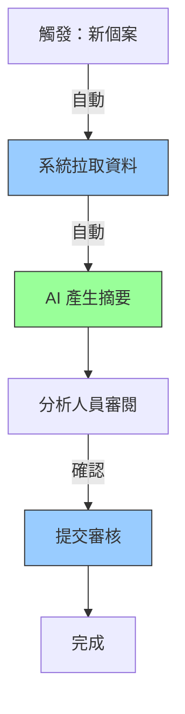

## 使用者輸入

```text
$ARGUMENTS
```

觸發 `/speckit.process` 時使用者在命令後所輸入的文本即為流程描述或改善需求。

## 流程總覽

此命令用於定義**業務流程的現況與目標**，是 Bank Profile 需求對齊層的核心文件之一。應在 `/speckit.business` 之後執行，為技術規格提供流程上下文。

## 目標定位

**20_system_flow-template.md,30_network_arch-template.md, 40_hardware_arch-template.md, 50_software_arch-template.md 關注**：
- AS-IS：當前流程如何運作（步驟、角色、痛點）
- TO-BE：目標流程如何改善（自動化、優化、整合）
- HOW：資料如何流動、角色如何協作
- WHAT-IF：例外與邊界如何處理

**NOT in scope**：
- 技術實作細節（屬於 plan.md）
- 系統架構設計（屬於 plan.md）
- 具體程式碼邏輯（屬於 implementation）

## 執行步驟

### 1. 初始設定與上下文載入

1. **檢查專案環境**：
   - 執行 `git rev-parse --show-toplevel` 取得 repo root
   - 確認是否已有相關文件：
     - `project/meta/00_meta.md`（專案元資料）
     - `project/business/10_business.md`（業務目標）
   - 設定 PROCESS_DIR = `$REPO_ROOT/project/process`

2. **載入上下文**：
   - 若 10_business.md 存在：
     - 讀取使用者角色定義
     - 讀取業務目標與痛點
     - 讀取使用者故事（推導流程步驟）
   - 若 00_meta.md 存在：
     - 讀取涉及系統清單
     - 讀取利害關係人（推導 RACI）

3. **檢查既有文件**：
   - 若 `$PROCESS_DIR/20_system_flow-template.md,30_network_arch-template.md, 40_hardware_arch-template.md, 50_software_arch-template.md` 已存在，詢問：
     - 「發現既有 20_system_flow-template.md,30_network_arch-template.md, 40_hardware_arch-template.md, 50_software_arch-template.md，是否要更新？(yes/no/merge)」
     - `yes`: 完全覆寫
     - `no`: 中止執行
     - `merge`: 保留 As-Is，更新 To-Be 流程
   - 若不存在，則建立新檔案

### 2. 資訊收集階段（智能問答）

**目標**：透過最多 **7 個精準問題**，收集 As-Is 流程、To-Be 改善點、例外處理等資訊。

**問答策略**：
- 從 `$ARGUMENTS`、`10_business.md`、`00_meta.md` 中擷取已知資訊
- 僅詢問流程相關的關鍵資訊
- 每題提供推薦答案或流程骨架

#### 問題分類

**第 1 層：As-Is 流程 (P0 - 必問)**

1. **Q1: 當前流程主要步驟確認**
   ```
   當前流程的主要步驟是什麼？（3-8 個主要步驟）

   **從輸入推導的流程**:
   [從 $ARGUMENTS 和 10_business.md 推導的流程骨架]

   格式：逐行列出步驟
   範例：
   1. 分析人員從核心系統匯出個案資料
   2. 人工閱讀交易明細（平均 30 分鐘）
   3. 手動撰寫摘要（平均 15 分鐘）
   4. 提交法遵審核（1-2 天）
   5. 修改後歸檔

   請確認或補充（回答 'yes' 接受推薦，或提供實際步驟）
   ```

2. **Q2: 各步驟執行者與耗時**
   ```
   各步驟由誰執行？平均耗時多久？

   **推薦 RACI 分配**（從 10_business.md 角色推導）:
   | 步驟 | 執行者 | 平均耗時 |
   |------|--------|----------|
   | 步驟 1 | [角色] | [推測時間] |
   | 步驟 2 | [角色] | [推測時間] |

   請確認或修改（回答 'yes' 接受，或提供實際數據）

   提示：耗時可提供範圍（例如：10-15 分鐘）
   ```

**第 2 層：痛點與改善機會 (P1 - 高優先)**

3. **Q3: 流程痛點定位**
   ```
   哪些步驟最耗時/最容易出錯/最不效率？

   **從 10_business.md 識別的痛點**:
   - [痛點 1] → 影響步驟 [X]
   - [痛點 2] → 影響步驟 [Y]

   請確認痛點與步驟的對應（回答 'yes' 接受，或補充說明）

   提示：好的痛點定位包含：
   - 發生在哪個步驟
   - 為什麼痛（原因）
   - 造成什麼後果
   ```

4. **Q4: To-Be 改善方式**
   ```
   計畫如何改善這些步驟？

   **推薦改善方式**（根據痛點推導）:
   | 步驟 | As-Is 方式 | To-Be 改善 | 改善類型 |
   |------|-----------|-----------|----------|
   | 步驟 2 | 人工閱讀 30 分鐘 | AI 自動摘要 30 秒 | 自動化 |
   | 步驟 3 | 手動撰寫 15 分鐘 | 審閱 AI 建議 5 分鐘 | AI 輔助 |

   請確認或調整（回答 'yes' 接受推薦，或說明您的改善規劃）
   ```

**第 3 層：例外與邊界 (P2 - 中優先)**

5. **Q5: 主要例外情境**
   ```
   流程中有哪些常見的例外情況？（2-4 個）

   範例：
   - E1: AI 模型無法產生有效摘要
   - E2: 上游資料來源異常或缺失
   - E3: 審核退回需重新處理

   **從 10_business.md 推導的例外**:
   - [例外 1]
   - [例外 2]

   請確認或補充（回答 'yes' 接受，或提供實際例外情況）
   ```

6. **Q6: 例外處理方式**
   ```
   這些例外發生時如何處理？

   對於每個例外情境，請說明：
   - 如何偵測到
   - 誰負責處理
   - 如何回復正常流程

   （或回答 'later' 稍後手動補充）
   ```

**第 4 層：整合與資料流 (P3 - 可選)**

7. **Q7: 上下游系統整合**
   ```
   此流程需要與哪些系統整合？資料如何流動？

   **從 00_meta.md 識別的系統**:
   - 上游：[系統 A] → 提供 [資料類型]
   - 下游：[系統 B] → 接收 [資料類型]

   請確認或補充（回答 'yes' 接受，或說明實際整合需求）

   提示：說明資料格式（API/CSV/資料庫）和頻率（即時/批次）
   ```

#### 問答規則

- **最多 7 題**，若上下文已提供足夠資訊可少於 7 題
- 每題提供推薦答案或骨架
- 使用者可回答：
  - 具體答案（表格/列表格式）
  - `yes` / `ok`（接受推薦）
  - `skip` / `later`（稍後手動補充）
  - `stop` / `done`（終止問答，生成草稿）

### 3. 流程圖自動生成

根據收集的步驟資訊，自動生成 Mermaid 流程圖：

**生成規則**：

1. **As-Is 流程圖**：
   - 線性流程 → 使用 `graph TD`
   - 有決策點 → 使用菱形節點 `{決策}`
   - 標註痛點步驟（紅色標記）

2. **To-Be 流程圖**：
   - 自動化步驟 → 藍色填充
   - AI 輔助步驟 → 綠色填充
   - 人工步驟 → 白色填充
   - 標註改善點

3. **泳道圖（Swimlane）**：
   - 若涉及 3+ 角色，自動生成 `sequenceDiagram`
   - 區分人/系統/AI 的職責

**生成範例**：

從步驟清單：
```
1. 系統自動拉取個案（系統, 30秒）
2. AI 產生摘要（AI, 30秒）
3. 分析人員審閱（人, 5分鐘）
4. 提交審核（系統, 即時）
```

自動生成：


### 4. RACI 矩陣自動生成

根據步驟與執行者資訊，生成 RACI 矩陣：

**生成規則**：
- 執行者 → R (Responsible)
- 若步驟涉及審核 → A (Accountable) 分配給審核者
- 需被通知的角色 → I (Informed)
- 需諮詢的角色 → C (Consulted)

### 5. 內容補充與推導

**自動推導規則**：

1. **流程效能指標**：
   - 從 As-Is 與 To-Be 耗時差異，計算改善幅度
   - 範例：As-Is 45分鐘 → To-Be 10分鐘 = 節省 78%

2. **例外處理骨架**：
   - 為每個例外生成處理流程骨架：
     - 偵測 → 通知 → 處理 → 回復 → 記錄

3. **邊界情況識別**：
   - 從例外情境推導邊界情況
   - 範例：「資料異常」→ 推導「資料為空」、「資料格式錯誤」、「資料不完整」

4. **資料流動圖**：
   - 從整合點資訊，生成資料流動 Mermaid 圖
   - 標註資料格式與傳輸方式

5. **流程風險識別**：
   - 從痛點與例外，推導潛在風險
   - 自動評估風險等級（機率 × 影響）

### 6. 品質檢查

生成 20_system_flow-template.md,30_network_arch-template.md, 40_hardware_arch-template.md, 50_software_arch-template.md 前執行以下檢查：

**完整性檢查**：
- [ ] As-Is 流程至少 3 個步驟
- [ ] To-Be 流程至少 3 個步驟
- [ ] 至少有 1 個流程圖（As-Is 或 To-Be）
- [ ] 至少定義 2 個例外情境
- [ ] 至少識別 1 個邊界情況
- [ ] RACI 矩陣包含所有步驟

**清晰度檢查**：
- [ ] 每個步驟有明確的執行者
- [ ] 每個步驟有預期耗時（或標註待測量）
- [ ] 例外處理有明確的負責人
- [ ] 整合點有資料格式說明

**一致性檢查**：
- [ ] RACI 矩陣的角色與 10_business.md 一致
- [ ] To-Be 改善點對應 10_business.md 的痛點
- [ ] 流程步驟與使用者故事對齊

**可追溯性檢查**：
- [ ] 痛點與 10_business.md 一致或互補
- [ ] 改善效益與 10_business.md 的 KPI 對齊

若檢查未通過，回報並詢問是否補充。

### 7. 生成 20_system_flow-template.md,30_network_arch-template.md, 40_hardware_arch-template.md, 50_software_arch-template.md

1. **載入模板**：
   - 讀取 `.specify/templates/20_process-template.md`

2. **填寫內容**：
   - 替換所有 `[PLACEHOLDER]`
   - 插入自動生成的流程圖
   - 填入 RACI 矩陣
   - 對於未收集資訊：標註 `[TBD]` 或 `[推導]`

3. **流程圖優化**：
   - 確保 Mermaid 語法正確
   - 添加顏色標註（自動化/痛點/改善）

### 8. 寫入檔案

1. **建立目錄**：
   ```bash
   mkdir -p $REPO_ROOT/project/process
   ```

2. **寫入文件**：
   - 路徑：`$REPO_ROOT/project/process/20_system_flow-template.md,30_network_arch-template.md, 40_hardware_arch-template.md, 50_software_arch-template.md`
   - 若為 `merge` 模式：保留 As-Is，更新 To-Be

3. **產生記錄**：
   - 附加 session 記錄到文件末尾

### 9. 與其他文件的整合建議

完成後提示：

```
💡 20_system_flow-template.md,30_network_arch-template.md, 40_hardware_arch-template.md, 50_software_arch-template.md 已生成，下一步建議：

選項 A：直接產生技術規格
  → 執行 `/speckit.specify --from-business-and-process`
  → 系統將整合 10_business.md 和 20_system_flow-template.md,30_network_arch-template.md, 40_hardware_arch-template.md, 50_software_arch-template.md 產生 spec.md

選項 B：補充其他 Bank Profile 文件
  → `/speckit.infosec` - 資安需求 (40_infosec.md)
  → `/speckit.compliance` - 法遵需求 (60_law.md)

選項 C：直接進入實作規劃
  → 執行 `/speckit.plan --from-bank-profile`
  → 系統將從所有 Bank Profile 文件產生 plan.md
```

### 10. 輸出訊息

**成功輸出**：
```
✅ As-Is / To-Be 流程文件已生成

📄 檔案路徑: $REPO_ROOT/project/process/20_system_flow-template.md,30_network_arch-template.md, 40_hardware_arch-template.md, 50_software_arch-template.md

📊 內容摘要:
  ✓ As-Is 流程: [N] 個步驟
    - 總耗時: [X] 分鐘/小時
    - 主要痛點: [N] 個
  ✓ To-Be 流程: [N] 個步驟
    - 目標耗時: [Y] 分鐘/小時
    - 預計節省: [Z%] 或 [X-Y] 分鐘
  ✓ 流程圖: [N] 個（As-Is, To-Be, Swimlane）
  ✓ 例外情境: [N] 個
  ✓ 邊界情況: [N] 個
  ✓ RACI 矩陣: [N] 步驟 × [M] 角色

📈 改善效益預估:
  - 時間節省: [X%] ([Y] 分鐘/次)
  - 年度效益: [Z] 小時 (假設每日 [N] 次)

⚠️ 待補充項目 ([N] 項):
  - 部分步驟耗時需實際測量
  - 例外處理 SLA 待定義
  - 整合點資料格式待確認

💡 下一步建議:
  1. 與業務單位確認 As-Is 流程準確性
  2. 與 IT 確認 To-Be 流程可行性
  3. 執行 `/speckit.specify --from-business-and-process` 產生技術規格
```

**錯誤處理**：
- 若無法推導 As-Is 流程 → ERROR: 「無法產生流程，請提供至少 3 個主要步驟」
- 若 To-Be 與 As-Is 完全相同 → WARNING: 「To-Be 流程未見改善，請確認改善點」

## 與其他命令的整合

### 與 /speckit.business 的關係

- **10_business.md 定義「做什麼」**（功能、使用者故事）
- **20_system_flow-template.md,30_network_arch-template.md, 40_hardware_arch-template.md, 50_software_arch-template.md 定義「怎麼流動」**（流程、協作）
- 使用者故事 → 對應流程步驟
- 業務痛點 → 對應流程瓶頸

### 與 /speckit.specify 的關係

- **20_system_flow-template.md,30_network_arch-template.md, 40_hardware_arch-template.md, 50_software_arch-template.md 為流程層需求**
- **spec.md 為功能層規格**
- 流程步驟 → 功能需求
- 例外處理 → 邊界情況
- RACI → 權限需求

### 與其他 Bank Profile 文件的關係

- **20_system_flow-template.md,30_network_arch-template.md, 40_hardware_arch-template.md, 50_software_arch-template.md** 定義業務流程
- **40_infosec.md** 定義流程中的資安控制點
- **60_law.md** 定義流程中的法遵要求
- **60_audit.md** 定義流程中的稽核追蹤點

## 特殊模式

### 快速模式 (--quick)

- 僅問 3 個關鍵問題（Q1, Q3, Q4）
- 自動推導 RACI、例外、邊界
- 完整度約 60%

### 從 business 繼承模式 (--from-business)

若已有 10_business.md：
- 從使用者故事推導流程步驟
- 從痛點推導 As-Is 瓶頸
- 減少問答至 3-4 題

### 更新模式 (--update)

若已存在 20_system_flow-template.md,30_network_arch-template.md, 40_hardware_arch-template.md, 50_software_arch-template.md：
- 詢問要更新哪部分（As-Is/To-Be/例外/整合）
- 保留其他部分不變

## 品質標準

產出的 20_system_flow-template.md,30_network_arch-template.md, 40_hardware_arch-template.md, 50_software_arch-template.md 必須符合：
- **可執行性**: 流程步驟清晰可執行
- **可視化**: 至少 1 個 Mermaid 流程圖
- **可追溯性**: 與 10_business.md 對齊
- **可衡量性**: 改善效益可量化
- **完整性**: 涵蓋主流程、例外、邊界

## 案例情境：STR/SAR 摘要模型

若使用者輸入：
```
/speckit.process 描述 STR 摘要撰寫流程的 As-Is 與 To-Be
```

系統將：
1. 從 10_business.md 讀取角色（分析人員、法遵主管）
2. 推導 As-Is 流程：匯出資料 → 人工閱讀 → 手動撰寫 → 提交審核
3. 推導 To-Be 流程：自動拉取 → AI 產生 → 人工審閱 → 一鍵提交
4. 生成流程圖（標註自動化步驟）
5. 生成 RACI 矩陣
6. 識別例外（AI 無法產生、資料異常、審核退回）
7. 計算改善效益（從 45 分鐘 → 10 分鐘，節省 78%）

## 注意事項

1. **聚焦流程**：描述「如何流動」而非「如何實作」
2. **可視化優先**：盡量使用流程圖，勝過文字描述
3. **痛點對齊**：確保 As-Is 痛點與 10_business.md 一致
4. **改善可行**：To-Be 改善必須技術可行
5. **例外完整**：不可忽略例外處理（企業級必要）

