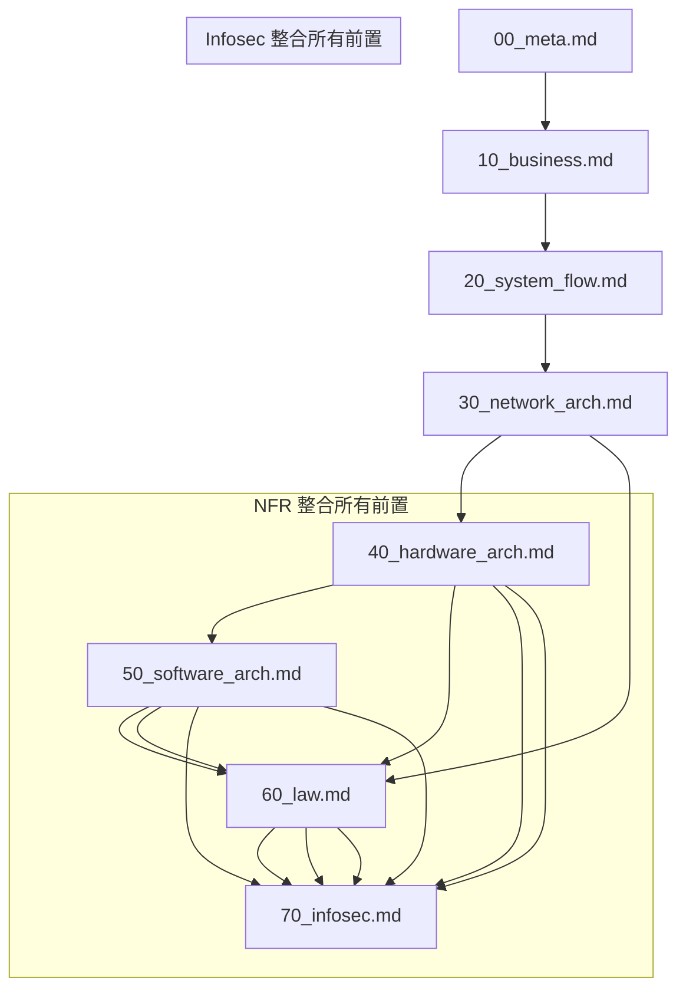

## 使用者輸入

```text
$ARGUMENTS
```

## 流程總覽

此命令用於**審核專案層級 Bank Profile 文件的完整性與邏輯一致性**,並產出專案總結文件。這是從 Bank Profile (00-90) 過渡到憲法建立與功能開發的關鍵步驟。

## 目標定位

**/speckit.review 關注**:
- **COMPLETENESS**: Bank Profile (00-90) 是否完整 (必要文件是否存在)
- **CONSISTENCY**: 文件間的邏輯一致性 (依賴關係、引用正確性)
- **COHERENCE**: 專案整體邏輯是否合理 (目標、風險、控制的連貫性)
- **SYNTHESIS**: 產出專案總結文件 (為 constitution 準備輸入)

**NOT in scope**:
- 技術實作細節驗證 (屬於 /speckit.analyze)
- 功能層級 spec.md 檢查 (屬於 /speckit.analyze)

## 執行步驟

### 1. 初始設定與路徑檢查

1. **設定專案根目錄**:
   ```bash
   REPO_ROOT=$(git rev-parse --show-toplevel)
   BANK_PROFILE_DIR="$REPO_ROOT/bank-profile"
   ```

2. **檢查 bank-profile/ 目錄是否存在**:
   - 如果不存在 → 詢問使用者: "bank-profile/ 目錄不存在,是否要建立? (yes/no)"
   - 如果存在 → 繼續檢查

### 2. 完整性檢查 (Completeness Check)

**檢查必要文件** (P0 - 必須存在):

| 檔案 | 必要性 | 若缺少的影響 |
|------|--------|------------|
| 00_meta.md | 必須 | 缺少專案背景與利害關係人定義 |
| 10_business.md | 必須 | 缺少業務目標與使用者故事 |
| 20_system_flow.md | 必須 | 缺少流程設計基礎 |
| 30_network_arch.md | 必須 | 缺少流程設計基礎 |
| 40_hardware_arch.md | 必須 | 缺少流程設計基礎 |
| 50_software_arch.md | 必須 | 缺少流程設計基礎 |

**檢查建議文件** (P1 - 強烈建議):

| 檔案 | 建議性 | 若缺少的影響 |
|------|--------|------------|

| 60_law.md | 建議 | 可能不符合法遵要求 |
| 70_infosec.md | 建議 | 缺少稽核追蹤需求 |
| 80_nfr.md | 建議 | 缺少非功能需求定義 |
| 90_audit.md | 建議 | 缺少稽核追蹤需求 |

**處理方式**:
- **P0 缺少** → ⛔ 阻擋,列出缺少檔案,建議先執行對應命令
- **P1 缺少** → ⚠️ 警告,詢問使用者: "缺少 [檔案],是否繼續? (yes/no/complete-it)"
  - yes → 繼續,標註警告
  - no → 中止
  - complete-it → 自動執行缺少的命令

### 3. 邏輯一致性檢查 (Consistency Check)

**依賴關係驗證**:



**檢查項目**:

1. **00_meta.md → 其他文件**:
   - [ ] 利害關係人在 RACI 矩陣中都有定義 (30/40/50/60)
   - [ ] 團隊成員在角色權限矩陣中都有定義 (40_infosec.md)
   - [ ] 監理要求在法遵文件中有對應 (60_law.md)

2. **10_business.md → 20_system_flow.md**:
   - [ ] 使用者故事 (10) 對應到流程步驟 (20)
   - [ ] KPI (10) 有對應的流程效率指標 (20)

3. **20_system_flow.md → 30_network_arch.md**:
   - [ ] 流程例外情境 (20) 對應到風險 (30)
   - [ ] 關鍵流程步驟有對應的控制措施 (30)

4. **30_network_arch.md → 40_hardware_arch.md**:
   - [ ] 資安風險 (30) 有對應的資安控制 (40)
   - [ ] KRI 監控指標 (30) 有對應的監控機制 (40 日誌)

5. **40_hardware_arch.md → 50_software_arch.md**:
   - [ ] 資安控制 (40) 符合法遵要求 (50)
   - [ ] 資料分級 (40) 符合個資法要求 (50)

6. **60_law.md → 60_audit.md**:
   - [ ] 法遵證據留存 (50) 有對應的稽核日誌 (60)
   - [ ] 法遵控制點 (50) 可透過稽核驗證 (60)

7. **所有前置 → 70_nfr.md**:
   - [ ] 效能需求 (70) 考量業務量 (10) 與流程時間 (20)
   - [ ] RTO/RPO (70) 符合業務中斷風險 (30) 評估
   - [ ] SLA (70) 考量法遵要求 (50) 與稽核需求 (60)

**互動式修正**:
發現不一致時:
```
⚠️ 發現邏輯不一致:
  - 10_business.md 定義了使用者角色「分析人員」
  - 但 40_infosec.md 的權限矩陣中缺少此角色

建議修正方式:
  A. 在 40_infosec.md 新增「分析人員」角色與權限
  B. 從 10_business.md 移除「分析人員」角色
  C. 手動修正 (稍後處理)

請選擇 (A/B/C):
```

### 4. 專案連貫性檢查 (Coherence Check)

**檢查整體邏輯合理性**:

1. **目標 ↔ 風險對齊**:
   - 10_business.md 的業務目標是否有對應的風險識別 (30)?
   - 範例: 業務目標「提高效率 70%」→ 風險「過度依賴 AI 導致品質下降」

2. **風險 ↔ 控制對齊**:
   - 所有高風險 (30) 是否有對應的控制措施?
   - 殘餘風險是否在可接受範圍?

3. **法遵 ↔ 實作可行性**:
   - 法遵要求 (50) 在技術上是否可實現?
   - NFR (70) 是否支援法遵要求?

4. **資源 ↔ 需求匹配**:
   - 00_meta.md 的團隊規模是否能支撐 70_nfr.md 的需求?
   - 預算是否足以支撐資安 (40) 與法遵 (50) 要求?

**產出**: 連貫性分析報告 (Coherence Analysis)

### 5. 生成專案總結文件 (PROJECT_SUMMARY.md)

**檔案位置**: `$REPO_ROOT/PROJECT_SUMMARY.md`

**內容結構**:

```markdown
# 專案總結 - [專案名稱]

> **生成時間**: [YYYY-MM-DD HH:MM]
> **審核版本**: v1.0.0
> **Bank Profile 完整度**: [X/8] 份文件完成

---

## 📋 專案概覽

### 專案背景
[從 00_meta.md 提煉]
- 專案目標
- 核心利害關係人
- 監理要求摘要

### 業務目標
[從 10_business.md 提煉]
- 關鍵 KPI (Top 3)
- 核心使用者故事 (P1 優先)
- 預期效益

### 核心流程
[從 20_process.md 提煉]
- 主要流程摘要 (As-Is → To-Be)
- 關鍵整合點
- 例外處理機制

---

## 🛡️ 風險與控制

### 高優先級風險
[從 30_risk_control.md 提煉]
- [R-XXX]: 風險描述 → 控制措施

### 資安要求摘要
[從 40_infosec.md 提煉]
- 資料分級: [高度機密 X 種, 機密 Y 種]
- 核心資安控制: [加密、存取控制、日誌]
- 關鍵角色權限: [列出主要角色]

### 法遵要求摘要
[從 60_law.md 提煉]
- 適用法規: [REG-001, REG-002...]
- 關鍵法遵控制點: [CP-XXX]
- 證據留存期限: [最長 X 年]

---

## 📊 技術約束

### 稽核要求
[從 60_audit.md 提煉]
- 必須稽核的事件: [數量]
- 日誌保留期限: [X 年]
- 關鍵稽核報表: [列出]

### 非功能需求
[從 70_nfr.md 提煉]
- SLA 目標: [99.X%]
- RTO/RPO: [X 小時 / Y 分鐘]
- 關鍵效能指標: [回應時間 < X 秒]

---

## ⚙️ 專案特定約束 (為 Constitution 準備)

### 技術約束
[從 30-70 提煉]
- 強制使用技術: [列出]
- 禁止使用技術: [列出]
- 架構約束: [列出]

### 流程約束
[從 20/30 提煉]
- 強制審核點: [列出]
- 必要的人工介入: [列出]

### 合規約束
[從 50/60 提煉]
- 不可妥協的法遵要求: [列出]
- 強制稽核項目: [列出]

---

## 🚨 審核發現

### 完整性 (Completeness)
- ✅ 完成: [列出已完成文件]
- ⚠️ 缺少: [列出缺少文件]

### 一致性 (Consistency)
- ✅ 通過: [X] 項檢查
- ⚠️ 警告: [列出警告項]
- ❌ 錯誤: [列出錯誤項]

### 連貫性 (Coherence)
- ✅ 邏輯合理
- ⚠️ 需注意: [列出需注意項]

---

## 💡 下一步建議

1. **如果審核通過**:
   - 執行 `/speckit.constitution` 建立專案憲法
   - 開始執行功能循環 SDD (`/speckit.specify`)

2. **如果有警告**:
   - 檢視警告項,評估風險
   - 決定是否補充缺少的文件

3. **如果有錯誤**:
   - 必須修正錯誤項
   - 修正後重新執行 `/speckit.review`

---

## 📁 附錄

### Bank Profile 文件清單
- [x] 00_meta.md
- [x] 10_business.md
- [x] 20_system_flow.md
- [x] 30_network_arch.md
- [x] 40_hardware_arch.md
- [x] 50_software_arch.md
- [ ] 60_law.md (缺少)
- [ ] 70_infosec.md (缺少)
- [x] 80_nfr.md
- [x] 90_audit.md

### 審核記錄
- 審核命令: `/speckit.review`
- 審核時間: [YYYY-MM-DD HH:MM]
- 審核者: [使用者/系統]
```

### 6. 輸出訊息

```
✅ Bank Profile 審核完成

📄 專案總結文件: PROJECT_SUMMARY.md

📊 審核結果摘要:
  ✓ 完整性: [8/8] 份文件完成
  ✓ 一致性: [25/28] 項檢查通過
    - ⚠️ 3 項警告 (詳見 PROJECT_SUMMARY.md)
  ✓ 連貫性: 整體邏輯合理

🎯 專案特性:
  - 專案類型: [金融/醫療/一般企業]
  - 監理等級: [高/中/低]
  - 團隊規模: [X] 人
  - 技術棧建議: [列出]

⚙️ 提煉的專案特定約束:
  - 技術約束: [3] 項
  - 流程約束: [2] 項
  - 合規約束: [5] 項

💡 下一步建議:
  1. 檢視 PROJECT_SUMMARY.md 確認專案總結正確
  2. 執行 `/speckit.constitution` 建立專案憲法
  3. 開始功能開發循環 `/speckit.specify <功能描述>`

⚠️ 需處理的警告 (3 項):
  - [W001] 40_infosec.md 缺少「分析人員」角色權限定義
  - [W002] 70_nfr.md 的 RTO 與 30_risk_control.md 建議不一致
  - [W003] 60_audit.md 的日誌保留期限與 60_law.md 法規要求不一致

是否現在處理警告? (yes/no/later)
```

## 審核規則定義

### 完整性評分

| 文件完成度 | 評級 | 說明 |
|----------|------|------|
| 8/8 | 優秀 | 所有文件完成,可直接建立 constitution |
| 5-7/8 | 良好 | 核心文件完成,可建立 constitution (會有警告) |
| 3-4/8 | 及格 | 最低要求完成,建議補充 |
| 0-2/8 | 不足 | 必須補充文件 |

### 一致性評分

| 檢查通過率 | 評級 | 說明 |
|----------|------|------|
| 100% | 優秀 | 完全一致 |
| 90-99% | 良好 | 少量警告 |
| 80-89% | 及格 | 需處理警告 |
| < 80% | 不足 | 必須修正錯誤 |

### 連貫性評估

- **邏輯合理**: 目標、風險、控制、法遵、技術形成閉環
- **需注意**: 部分邏輯跳躍,但不影響整體
- **邏輯矛盾**: 存在明顯衝突,需修正

## 與其他命令的整合

### 輸入
- `bank-profile/*.md` (00-90)

### 輸出
- `PROJECT_SUMMARY.md` (專案總結)
- 審核報告 (完整性、一致性、連貫性)

### 後續命令
- `/speckit.constitution` (讀取 PROJECT_SUMMARY.md → 建立憲法)
- `/speckit.specify` (讀取 PROJECT_SUMMARY.md → 自動整合需求)
- `/speckit.analyze` (讀取 constitution.md → 驗證功能符合憲法)

## 特殊模式

### 快速模式 (--quick)
- 僅檢查完整性
- 跳過互動式修正
- 產出簡化版 PROJECT_SUMMARY.md

### 嚴格模式 (--strict)
- 所有警告視為錯誤
- 必須 100% 通過才能繼續
- 強制修正所有不一致項

### 報告模式 (--report-only)
- 僅產出審核報告
- 不生成 PROJECT_SUMMARY.md
- 用於定期檢查

## 注意事項

1. **非破壞性**: 此命令僅讀取與分析,不修改 bank-profile/ 內容
2. **互動式**: 發現問題時會詢問使用者,不自動修正
3. **可重複執行**: 可多次執行,每次更新 PROJECT_SUMMARY.md
4. **版本記錄**: PROJECT_SUMMARY.md 包含審核時間與版本
5. **為 constitution 準備**: 提煉的約束會直接用於 constitution 建立

