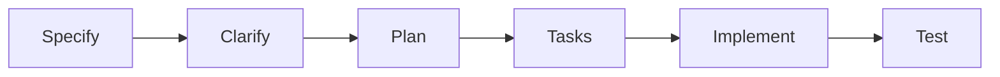

# GitHub Copilot Instructions - SDD MVP Kit

## 專案概述

這是一個 **Specification-Driven Development (SDD)** 工具包，用於將自然語言需求轉換為可執行的技術規格。專案包含兩個核心工作流程：

1. **Bank Profile 流程**：專案層級的需求分析與合規文檔（適用於金融、醫療等受監理產業）
2. **SDD 功能開發流程**：功能層級的規格、規劃、任務和實作

## 目錄結構

```
.
├── project/###-PROJECTNAME/      # Bank Profile 專案資料
│   ├── meta/00_meta.md           # 專案元資料
│   ├── business/10_business.md   # 業務需求與風險
│   ├── process/20-50_*.md        # 流程圖與架構圖
│   ├── law/60_law.md             # 法規遵循
│   ├── infosec/70_infosec.md     # 資訊安全與技術風險
│   ├── nfr/80_nfr.md             # 非功能需求
│   ├── audit/90_audit.md         # 稽核與 KRI 監控
│   ├── API/                      # API 規格
│   └── export/                   # 匯出的 PPTX/DOCX
│
├── specs/###-feature-name/       # SDD 功能規格
│   ├── spec.md                   # 功能規格（含 Gherkin 場景）
│   ├── plan.md                   # 實作規劃
│   ├── tasks.md                  # 可執行任務清單
│   └── data-model.md             # 資料模型
│
├── .specify/
│   ├── templates/                # 文件模板（15 個範本）
│   ├── scripts/bash/             # 自動化腳本
│   │   ├── create-new-project.sh    # 建立專案目錄
│   │   ├── create-new-feature.sh    # 建立功能分支
│   │   ├── common.sh                # 共用函數
│   │   └── check-prerequisites.sh   # 前置檢查
│   └── memory/constitution.md    # 專案憲法（不可妥協的原則）
│
├── .github/agents/               # GitHub Copilot Agents
│   ├── project.create.agent.md      # 建立專案
│   ├── project.context.agent.md     # 查看專案上下文
│   ├── speckit.meta.agent.md        # Bank Profile: Meta
│   ├── speckit.business.agent.md    # Bank Profile: Business
│   ├── speckit.process.agent.md     # Bank Profile: Process
│   ├── speckit.law.agent.md         # Bank Profile: Law
│   ├── speckit.infosec.agent.md     # Bank Profile: InfoSec
│   ├── speckit.audit.agent.md       # Bank Profile: Audit
│   ├── speckit.review.agent.md      # Bank Profile: Review
│   ├── speckit.specify.agent.md     # SDD: Specify
│   ├── speckit.clarify.agent.md     # SDD: Clarify
│   ├── speckit.plan.agent.md        # SDD: Plan
│   ├── speckit.tasks.agent.md       # SDD: Tasks
│   └── speckit.implement.agent.md   # SDD: Implement
│
└── .claude/commands/             # Claude 對應命令（16 個）
```

## 工作流程

### Bank Profile 流程（專案層級）

適用於新專案啟動，建立完整的需求與合規文檔：


**步驟說明**：

1. **Create Project**: `@agent project.create "專案描述" --project-name "PROJECT-NAME"`
   - 建立 `project/###-PROJECT-NAME/` 目錄結構

2. **Phase 1 - Meta**: `@agent speckit.meta`
   - 專案背景、利害關係人、RACI 矩陣
   - 輸出：`meta/00_meta.md`

3. **Phase 2 - Business**: `@agent speckit.business`
   - 業務目標、KPI、使用者故事、業務風險
   - 輸出：`business/10_business.md`

4. **Phase 3 - Process**: `@agent speckit.process`
   - 系統流程圖、網路/硬體/軟體架構
   - 輸出：`process/20_system_flow.md`, `30_network_arch.md`, `40_hardware_arch.md`, `50_software_arch.md`

5. **Phase 4 - Law & InfoSec & Audit**:
   - `@agent speckit.law` - 法規遵循，輸出：`law/60_law.md`
   - `@agent speckit.infosec` - 資訊安全與技術風險，輸出：`infosec/70_infosec.md`
   - `@agent speckit.audit` - 稽核與 KRI 監控，輸出：`audit/90_audit.md`, `nfr/80_nfr.md`

6. **Phase 5 - Review**: `@agent speckit.review`
   - 驗證所有文件的完整性、一致性、連貫性
   - 生成 `PROJECT_SUMMARY.md`

7. **Phase 6 - Constitution**: `@agent speckit.constitution`
   - 提取專案特定約束，生成 `.agent/constitution.md`
   - 作為後續 SDD 功能開發的不可變規則

### SDD 功能開發流程（功能層級）

在 Bank Profile 完成後，進入 IT 部門的功能開發階段：



**步驟說明**：

1. **Specify**: `@agent speckit.specify "功能描述"`
   - 生成功能規格，包含 Gherkin 場景
   - 輸出：`specs/###-feature-name/spec.md`

2. **Clarify**: `@agent speckit.clarify`
   - 偵測並解決規格模糊處
   - 更新：`spec.md`

3. **Plan**: `@agent speckit.plan`
   - 生成實作規劃、資料模型
   - 輸出：`plan.md`, `data-model.md`

4. **Tasks**: `@agent speckit.tasks`
   - 生成可執行的任務清單
   - 輸出：`tasks.md`

5. **Implement**: `@agent speckit.implement`
   - 執行 TDD 實作
   - 生成程式碼與測試

## 專案管理命令

### 建立新專案

```bash
@agent project.create "AI GOV XPLAIN 專案" --project-name "AI-GOV-XPLAIN"
# 輸出: project/001-AI-GOV-XPLAIN/

@agent project.create "法人財報預警模型" --project-name "FINWARN" --number 2
# 輸出: project/002-FINWARN/
```

### 查看專案上下文

```bash
@agent project.context
# 顯示當前專案目錄、編號、文件狀態
```

### 查看功能上下文

```bash
# 使用 bash 腳本
source ./.specify/scripts/bash/common.sh
get_feature_paths
```

## Claude vs GitHub Copilot 命令對照

| 功能 | Claude 命令 | GitHub Copilot 命令 |
|------|------------|---------------------|
| 建立專案 | （需手動腳本） | `@agent project.create` |
| 查看專案 | （需手動腳本） | `@agent project.context` |
| 專案元資料 | `/speckit.meta` | `@agent speckit.meta` |
| 業務需求 | `/speckit.business` | `@agent speckit.business` |
| 流程圖 | `/speckit.process` | `@agent speckit.process` |
| 法規遵循 | `/speckit.law` | `@agent speckit.law` |
| 資訊安全 | `/speckit.infosec` | `@agent speckit.infosec` |
| 稽核 | `/speckit.audit` | `@agent speckit.audit` |
| 審核 | `/speckit.review` | `@agent speckit.review` |
| 憲法 | `/speckit.constitution` | `@agent speckit.constitution` |
| 功能規格 | `/speckit.specify` | `@agent speckit.specify` |
| 釐清規格 | `/speckit.clarify` | `@agent speckit.clarify` |
| 實作規劃 | `/speckit.plan` | `@agent speckit.plan` |
| 任務清單 | `/speckit.tasks` | `@agent speckit.tasks` |
| 實作 | `/speckit.implement` | `@agent speckit.implement` |

## 專案特定約束（從 PROJECT_SUMMARY.md 提取）

### 技術約束

**強制使用技術**：
- Python 3.12.x (訓練與推論)
- XGBoost 2.0.x / RandomForest (機器學習模型)
- FastAPI 0.110.x (API 框架)
- K8s 1.25+ (部署環境)
- GitLab CI/CD 15.0+ (MLOps 流水線)
- TLS 1.2+ (傳輸加密)
- AES-256 (靜態資料加密)

**禁止使用技術**：
- TLS 1.0/1.1 (弱加密)
- GPL 授權套件 (污染風險)
- 公有雲外部服務（除非經過審查）
- 明碼儲存 Secret (必須 K8s Secret 加密)

**架構約束**：
- 內網部署（K8s 內網，無對外公開 API）
- 訓練與推論環境隔離
- 降級機制（服務故障時保留人工流程）

### 流程約束

**強制審核點**：
1. 模型重訓審核：驗證閘門（Precision ≥ 50%, Recall ≥ 70%, PSI < 0.25）
2. 模型發布審核：變更單（CR）+ SIT/UAT 測試通過 + MFA 驗證
3. 上線前審核：法遵檢核 + 資安檢核 + 稽核列席
4. 年度審核：弱掃/滲透測試 + 法遵控制點有效性評估

**必要的人工介入**：
- 模型發布與回退（需 MFA）
- 配置變更（閾值、限流，需 MFA）
- 權限授予與撤銷（需 MFA）

### 合規約束

**不可妥協的法遵要求**：
- **AI 可解釋性**: 100% 預警案例必須有 Top-N 指標解釋
- **個資保護**: SIT/UAT 100% 去識別化，Prod 日誌 100% 遮罩
- **日誌保留**: 7 年保留期限
- **RPO = 0**: 稽核日誌與推論日誌不可遺失

**強制稽核項目**：
- 所有 API 呼叫（含認證、時間戳、錯誤碼、遮罩個資）
- 所有模型版本變更（含審批記錄、變更前後值、驗證指標）
- 所有特權操作（含 MFA 驗證、操作人員、時間戳）
- 所有個資存取（含存取者、時間戳、存取範圍、遮罩確認）

## 核心原則（憲法 v2.0.0）

1. **Single Source of Truth**: 所有狀態存於 Git
2. **Test-Driven Development**: TDD 搭配 Gherkin（非協商）
3. **YAGNI**: 拒絕 spec.md 未定義的複雜度
4. **Zero Trust & Least Privilege**: 最小權限原則
5. **Grounded AI**: RAG + Source Citations

## 使用情境

### ✅ 強烈建議使用 Bank Profile

- 金融業（銀行、證券、保險）
- 醫療照護系統（HIPAA, GDPR）
- 處理個資或敏感資料的系統
- 受監理單位稽核的專案

### ✅ 可選使用 Bank Profile

- 中大型企業內部系統
- SaaS 產品（需要資安與合規文檔）

### ❌ 不建議使用 Bank Profile

- 快速原型驗證
- 內部工具（無監理要求）
- 非受監理產業

## Mermaid 語法注意事項

**重要**：所有 Mermaid 圖表的標點符號（冒號、括號、箭頭）必須使用半形（ASCII）字符，不可使用全形字符。

**正確**：


**錯誤**（使用中文輸入法的全形符號）：
```mermaid
graph LR
    A［開始］－＞B［處理］
```

## 常見問題

**Q: Bank Profile 一定要全部完成才能開始 SDD 嗎？**

A: 不用。Bank Profile 是**獨立且可選的**。可以只執行部分或直接跳到 `@agent speckit.specify`。

**Q: 如果我的專案不需要法遵怎麼辦？**

A: 跳過 Bank Profile，直接使用核心 SDD 流程（specify → clarify → plan → tasks → implement）。

**Q: 如何切換專案？**

A: 設定 `PROJECT_CONTEXT` 環境變數：
```bash
export PROJECT_CONTEXT="001-AI-GOV-XPLAIN"
```

**Q: 如何查看所有專案？**

A: 查看 `project/` 目錄：
```bash
ls -la project/
```

**Q: 如何匯出 PPTX/DOCX？**

A: 使用 `.specify/scripts/generate/` 中的生成腳本（Python + python-pptx/python-docx）。

## 下一步行動

1. **首次使用**：
   - 建立第一個專案：`@agent project.create "測試專案" --project-name "TEST"`
   - 查看專案上下文：`@agent project.context`
   
2. **完整 Bank Profile 流程**：
   - Phase 1-6: Meta → Business → Process → Law & InfoSec & Audit → Review → Constitution

3. **功能開發**：
   - 執行 SDD 流程：Specify → Clarify → Plan → Tasks → Implement

4. **深入閱讀**：
   - [README.md](../README.md) - 專案概述
   - [SETUP_GUIDE.md](../SETUP_GUIDE.md) - 設定指南（即將創建）
   - [ARCHITECTURE.md](../ARCHITECTURE.md) - 架構詳解（即將創建）

---

**讓 GitHub Copilot 協助你完成 Bank Profile 和 SDD 工作流程，確保規格驅動開發與合規性。**
