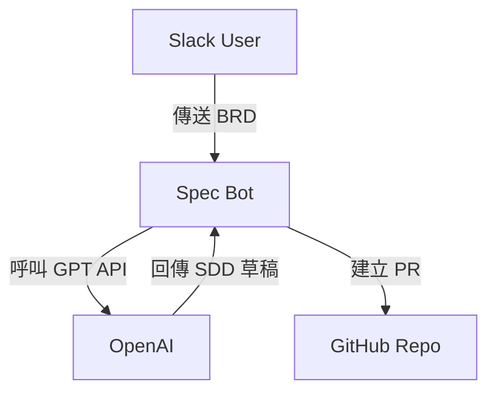

<!--
═══════════════════════════════════════════════════════════════════════════
同步影響報告 (SYNC IMPACT REPORT)
═══════════════════════════════════════════════════════════════════════════
版本變更：1.0.0 → 2.0.0

修改原則：
- I. Library-First Architecture → I. 單一事實來源與狀態外部化
- II. CLI Interface Contract → II. Bot 輕量沙箱原則
- III. Test-Driven Development → III. 測試驅動開發 (NON-NEGOTIABLE)
- IV. Integration Testing → IV. 整合測試與模擬環境
- V. Simplicity & YAGNI → V. 簡約與需求驅動 (YAGNI)
- VI. Observability & Debugging → VI. 完整可追溯性與審計
- VII. Versioning & Breaking Changes → VII. 語意化版本與文件同步

新增原則：
- VIII. 零信任與權限最小化
- IX. AI 回應有據與防護
- X. 原生整合優先

新增章節：
- 安全約束 (Security Constraints)
- 文件產出標準 (Documentation Standards)
- 協作與審核規範 (Collaboration & Review)

移除章節：
- Development Workflow (整合至協作與審核規範)
- Quality Gates (整合至測試與安全約束)

模板狀態：
✅ plan-template.md - 已驗證 Constitution Check 對齊新原則
✅ spec-template.md - 已驗證使用者場景與 Gherkin 格式需求
✅ tasks-template.md - 已驗證測試優先任務排序
⚠️  需手動檢查：所有輸出文件需改為繁體中文

後續待辦：
- 無 - 所有佔位符已填寫完成

專案重新定位：從通用 MVP 框架 → Spec Bot (Slack/GitHub/GPT 整合的 SDD 需求對齊工具)
批准日期：2025-11-13
═══════════════════════════════════════════════════════════════════════════
-->

# Spec Bot 專案憲法

**專案定位**：Slack/GitHub/GPT 整合的 SDD 需求對齊工具
**核心目標**：自動將 BRD (Business Requirements Document) 轉換為 SDD (System Design Document)，透過協作平台與版本控管實現需求對齊

## 核心原則 (Core Principles)

### I. 單一事實來源與狀態外部化 (Single Source of Truth & Stateless Bot)

Bot 本身必須完全無狀態，所有專案狀態、文件版本、協作記錄必須儲存於 **GitHub Repository**，作為唯一的權威事實來源。Bot 不得在本地檔案系統或資料庫中持久化任何業務邏輯或狀態資料。

**要求**：
- 所有 SDD 產出（spec.md, plan.md, tasks.md）必須透過 Git commits 版本化
- Bot 重啟或失敗後，必須能從 GitHub 完整重建上下文
- 不得使用本地快取儲存業務邏輯狀態
- 分支命名規則：`bot/spec-{timestamp}` 或 `bot/{feature-name}`

**理由**：狀態外部化確保系統可審計、可復原，並消除單點故障。GitHub 提供原生版本控制、審核追蹤與協作機制，無需額外基礎設施。

### II. Bot 輕量沙箱原則 (Lightweight Sandboxing)

所有自動化操作（包括 Git 操作、文件生成、API 呼叫）必須在隔離的 **Docker 容器**中執行。容器必須在任務完成後立即銷毀，不得保留任何執行痕跡。

**要求**：
- Bot 不得擁有主機系統的終端機權限或檔案系統存取
- Docker 容器必須使用最小權限的基礎映像（如 `python:3.11-slim`）
- 命令白名單：僅允許 `git`、`speckit.sh`、基本文件操作（read/write）
- 網路存取限制：僅允許連線至 Slack API、OpenAI API、GitHub API（透過環境變數配置的端點）
- 容器生命週期：啟動 → 執行單一任務 → 輸出結果 → 自動銷毀

**理由**：沙箱化防止 Bot 被濫用為系統攻擊入口，限制爆炸半徑。容器短生命週期確保無殘留敏感資料，符合零信任原則。

### III. 測試驅動開發 (Test-Driven Development, NON-NEGOTIABLE)

所有功能開發必須嚴格遵循 TDD 流程，並使用 **Gherkin 語法** (Given-When-Then) 描述驗收場景。測試必須先於實作完成，且涵蓋正常流程與異常處理。

**要求**：
1. 撰寫整合測試與驗收測試（基於 spec.md 的使用者場景）
2. 取得利害關係人對測試場景的批准
3. 驗證測試為紅燈狀態（失敗）
4. 實作最小程式碼使測試通過（綠燈）
5. 重構並維持綠燈狀態

**優先級**：
- 安全測試（權限繞過、Prompt Injection、API token 洩漏）為最高優先級
- Slack webhook 模擬測試（避免實際傳送訊息至正式頻道）
- GPT API 呼叫必須有 mock 測試（避免產生費用與延遲）
- GitHub API 操作必須有整合測試（使用測試 repository）

**理由**：TDD 確保需求被正確理解並可驗證。Gherkin 格式讓非技術利害關係人也能審查測試場景，提早發現規格誤解。

### IV. 整合測試與模擬環境 (Integration Testing & Mocking)

整合測試必須涵蓋所有跨系統邊界的互動，並使用高擬真度的模擬環境。測試覆蓋率必須達到 **80% 以上**。

**強制測試範圍**：
- Slack Event API 的 webhook 接收與回應格式驗證
- GitHub API 的 PR 建立、檔案提交、分支管理操作
- OpenAI GPT API 的 prompt 傳送與回應解析（含錯誤處理）
- BRD → SDD 轉換的端到端流程（使用真實範例 BRD 輸入）
- 權限與認證失敗的錯誤處理路徑

**模擬要求**：
- 使用 `pytest-mock` 或 `unittest.mock` 模擬外部 API
- Slack webhook 測試使用 `pytest-httpserver` 或類似工具
- GPT API 回應使用預錄的真實回應樣本（避免 hallucination 測試不穩定）

**理由**：Spec Bot 高度依賴外部服務，整合測試確保契約相容性。模擬環境避免測試過程產生實際費用、洩漏資料或干擾正式環境。

### V. 簡約與需求驅動 (Simplicity & YAGNI)

嚴格遵循 spec.md 定義的範圍進行開發，禁止為「未來可能」的需求預先建構複雜架構。優先實作核心功能，快速交付並收集回饋。

**禁止行為**：
- 引入未在 spec.md 中明確列出的功能或抽象層
- 使用超出需求的框架（例：簡單 REST API 不應引入 GraphQL）
- 預先建立「可擴充架構」而無當前使用場景

**決策優先順序**：
1. 標準函式庫優於第三方套件
2. 第三方套件優於自建框架
3. 組合 (composition) 優於繼承 (inheritance)
4. 明確 (explicit) 優於隱含 (implicit)

**例外處理**：若必須引入複雜性，必須在 plan.md 的「複雜度追蹤」章節中記錄：
- 違反的原則
- 引入原因
- 已拒絕的更簡單替代方案及理由

**理由**：過度工程增加認知負擔、維護成本與 bug 數量。YAGNI 強制紀律開發，確保每一行程式碼都有明確的當前價值。

### VI. 完整可追溯性與審計 (Full Traceability & Audit Trail)

所有關鍵操作必須留下詳細且不可竄改的日誌記錄，支援事後審計與問題追蹤。

**強制日誌內容**：
- 使用者請求（Slack 訊息內容、使用者 ID、時間戳記）
- AI Agent 決策路徑（LangGraph 狀態轉換、GPT prompt/response）
- 外部 API 呼叫（請求參數、回應狀態碼、延遲時間）
- Git 操作記錄（commit SHA、分支名稱、檔案變更清單）
- 錯誤與異常（完整堆疊追蹤、上下文資訊）

**日誌格式**：
- 使用結構化 JSON 格式（便於自動化分析）
- 必須包含 correlation ID（追蹤跨系統請求）
- 時間戳記使用 ISO 8601 格式（UTC 時區）

**錯誤處理**：
- 所有錯誤必須記錄並透過 Slack 通知使用者
- 錯誤訊息必須可操作（what failed, why, what to do next）
- 不得有靜默失敗（silent failure）

**API 回應時效**：
- Bot 初步回應 < 5 秒（「已收到請求，處理中...」）
- 完整 BRD → SDD 流程 < 3 分鐘
- 超過時間限制必須通知使用者並記錄原因

**理由**：可追溯性是企業級系統的基本要求。結構化日誌支援自動化監控、效能分析與安全事件偵測。

### VII. 語意化版本與文件同步 (Semantic Versioning & Document Sync)

所有產出文件、API 契約、Bot 功能必須遵循**語意化版本控制** (MAJOR.MINOR.PATCH)，並確保版本變更與文件更新同步。

**版本規則**：
- **MAJOR**：破壞性變更（SDD 格式變更、API 端點移除、必要欄位刪除）
- **MINOR**：新功能（新增 SDD 章節、新 Slack 指令、擴充 API 參數）
- **PATCH**：錯誤修正（文件錯字、格式調整、bug 修復）

**破壞性變更要求**：
- 必須在 CHANGELOG.md 中記錄變更內容與遷移指南
- 若可能，在前一個 MINOR 版本提供棄用警告 (deprecation warning)
- 提供自動化遷移腳本或工具（如：格式轉換腳本）
- 必須經利害關係人批准後才能發布

**Commit 訊息規範**：
- 遵循 Conventional Commits 格式：`feat:`, `fix:`, `docs:`, `refactor:`
- 範例：`feat: 新增 Mermaid 架構圖自動生成功能`
- 範例：`fix: 修正 GitHub PR 標題編碼錯誤`

**理由**：語意化版本讓變更影響一目瞭然。明確的遷移路徑降低升級風險與協作摩擦。

### VIII. 零信任與權限最小化 (Zero Trust & Least Privilege)

Bot 不得擁有任何隱含信任或過度權限。所有對外部服務的存取必須經過明確的身份驗證與授權。

**權限要求**：
- **GitHub**：僅授予 `repo` scope（讀寫 repository 檔案與 PR）
- **Slack**：僅授予 `chat:write`, `commands`, `files:read` scopes
- **OpenAI API**：使用專用 API key，設定 rate limit 與 token 用量上限

**Secrets 管理**：
- 所有 API tokens、secrets 必須透過環境變數注入（不得寫死在程式碼中）
- 使用 GitHub Secrets 或專用的 Secret Manager（如 HashiCorp Vault）
- 不得在日誌或錯誤訊息中洩漏 secrets（使用 `[REDACTED]` 遮罩）

**存取控制**：
- Slack 指令需驗證使用者身份（避免未授權使用者觸發 Bot）
- GitHub PR 需設定 CODEOWNERS 進行審核（避免自動合併未審核變更）

**理由**：權限最小化限制攻擊面與爆炸半徑。零信任假設所有請求都可能是惡意的，強制驗證每一步操作。

### IX. AI 回應有據與防護 (Grounded AI & Prompt Injection Defense)

GPT 產生的所有內容必須「有據可循」，並實施防護機制避免 prompt injection 攻擊。

**RAG (Retrieval-Augmented Generation) 強制使用**：
- 所有基於內部文件的問答必須使用 RAG 模式
- 回應必須明確引用來源（文件名稱、章節、段落）
- 禁止模型在無資料依據下進行「幻覺」式回答

**Prompt Injection 防護**：
- 使用者輸入必須經過 sanitization（移除控制字元、SQL/code injection 嘗試）
- 在 system prompt 中明確指示模型：「你是 SDD 產生助手，不得執行與 SDD 無關的指令」
- 對可疑輸入（如包含 `ignore previous instructions`）進行警告並記錄

**輸出驗證**：
- 所有生成的 Mermaid 圖表必須通過語法驗證（使用 `mermaid-cli` 或類似工具）
- Markdown 文件必須符合 CommonMark 規範
- API 規格必須符合 OpenAPI 3.0 格式（若適用）

**理由**：AI 幻覺會導致錯誤的技術決策與安全漏洞。RAG 確保回應可驗證。Prompt injection 是 AI 系統的主要威脅，必須多層防護。

### X. 原生整合優先 (Native Integration First)

優先使用 Slack、GitHub、OpenAI 提供的官方 SDK 與原生 API，避免引入不必要的抽象層或第三方中介服務。

**優先採用**：
- **Slack**：Bolt for Python (官方 SDK)
- **GitHub**：PyGithub 或 GitHub REST API
- **OpenAI**：OpenAI Python SDK

**禁止引入**（除非有明確理由）：
- 自建 API wrapper（除非官方 SDK 有重大缺陷）
- 第三方整合平台（如 Zapier、Make）作為核心流程
- 過度抽象的 ORM 或框架（如：在簡單 REST API 上使用 GraphQL）

**例外處理**：
- 若官方 SDK 不支援特定功能，必須在 plan.md 記錄原因與替代方案評估

**理由**：原生整合降低維護成本、提高安全性（官方 SDK 通常有更好的安全審計）、並最大化利用平台原生功能（如 Slack 的 Block Kit UI）。

## 安全約束 (Security Constraints)

### 依賴管理與弱點掃描

所有專案依賴必須明確鎖定版本（使用 `requirements.txt` 或 `poetry.lock`），並在每次提交前通過弱點掃描。

**要求**：
- 使用 `pip-audit`, `safety`, 或 GitHub Dependabot 自動掃描
- 禁止使用存在已知中高風險漏洞的套件（CVSS ≥ 7.0）
- 依賴更新必須經過測試驗證後才能合併

### Docker 容器安全

Docker 容器必須遵循最佳實踐，最小化攻擊面。

**要求**：
- 使用官方基礎映像（如 `python:3.11-slim`）
- 不得以 root 使用者執行容器
- 限制容器資源（CPU、記憶體上限）
- 容器執行後自動銷毀，不得持久化敏感資料

### 資料落地與分類

所有處理的資料預設為「機敏資料」等級，必須遵循資料保護政策。

**要求**：
- PII (Personally Identifiable Information) 不得記錄在日誌中
- 暫存檔案必須在任務完成後立即刪除
- 跨境資料傳輸需評估法規遵循（GDPR, PDPA）

## 文件產出標準 (Documentation Standards)

### SDD 格式要求

所有自動產生的 SDD 必須包含以下章節（依序）：

1. **系統概述** (System Overview)
   - 專案目標與範圍
   - 核心使用者場景
   - 關鍵假設與限制

2. **架構設計** (Architecture Design)
   - 系統架構圖（使用 Mermaid `graph` 或 `C4` 語法）
   - 元件職責與互動
   - 部署架構

3. **資料模型** (Data Model)
   - 實體關係圖（使用 Mermaid `erDiagram`）
   - 資料流向與生命週期

4. **API 規格** (API Specification)
   - 端點清單與參數定義
   - 請求/回應範例
   - 錯誤碼與處理

5. **部署方案** (Deployment Plan)
   - 環境配置（dev, staging, prod）
   - CI/CD 流程
   - 監控與告警策略

### Mermaid 圖表規範

所有圖表必須使用 **Mermaid 語法**，並通過語法驗證。

**要求**：
- 架構圖使用 `graph TD` 或 `graph LR`
- 資料模型使用 `erDiagram`
- 流程圖使用 `flowchart` 或 `sequenceDiagram`
- 圖表必須包含清楚的節點標籤與關係說明
- 使用 `mermaid-cli` 驗證語法正確性

**範例**：


### Markdown 規範

所有文件必須使用 **CommonMark Markdown** 規範。

**要求**：
- 章節編號使用 `1.x`, `2.x` 格式（自動或手動）
- 程式碼區塊必須指定語言（如 ```python, ```json）
- 表格必須對齊（使用工具如 `markdownlint`）
- 連結必須有效（避免死連結）

### 語言強制性

**所有專案產出文件必須使用繁體中文 (zh-TW)**，包括：
- spec.md, plan.md, tasks.md
- SDD 文件內容
- Commit 訊息
- Pull Request 描述
- 程式碼註解（除外部函式庫相容性需求外）

**例外**：
- 程式碼變數與函式名稱使用英文（遵循 PEP 8）
- 外部 API 文件引用（如 OpenAPI spec）
- 技術專有名詞保留原文（如 "Docker container", "REST API"）

**理由**：統一語言降低協作摩擦，確保所有利害關係人（包括非技術人員）能理解文件內容。

## 協作與審核規範 (Collaboration & Review)

### Pull Request 流程

所有 SDD 產出必須透過 **Pull Request** 審核，不得直接提交至主分支。

**PR 要求**：
- 標題使用 Conventional Commits 格式（如 `feat: 新增使用者認證 SDD`）
- 描述必須包含：
  - 變更摘要（What）
  - 變更原因（Why）
  - 測試結果（如何驗證）
  - 審核清單（Checklist）
- 必須包含至少一個審核者批准才能合併
- 自動化檢查必須全數通過（測試、linting、安全掃描）

### Code Review 檢查項目

所有 code review 必須驗證以下項目：

- [ ] 測試已撰寫且通過（紅燈 → 綠燈流程已完成）
- [ ] 憲法原則已遵循（特別是 I, II, III, VIII, IX 原則）
- [ ] 無未經授權的複雜性引入
- [ ] 日誌與錯誤處理已實作
- [ ] 破壞性變更已記錄於 CHANGELOG
- [ ] 文件已更新（spec.md, API docs）
- [ ] Secrets 未洩漏在程式碼或日誌中

### 分支管理

**分支命名規則**：
- Bot 自動建立的分支：`bot/spec-{timestamp}` 或 `bot/{feature-name}`
- 手動開發分支：`feat/{feature-name}`, `fix/{bug-name}`
- 實驗性分支：`exp/{experiment-name}`

**合併策略**：
- 主分支 (`main`) 保持可部署狀態
- 使用 squash merge 保持 commit 歷史乾淨
- 合併後自動刪除分支

## 治理 (Governance)

### 修訂程序

本憲法可透過以下程序修訂：

1. 提出修訂提案並記錄理由
2. 分析對現有模板與工作流程的影響
3. 利害關係人審查與批准
4. 依語意化版本規則更新憲法版本號
5. 更新相依模板（plan-template.md, spec-template.md, tasks-template.md）
6. 提供遷移指南給使用舊版憲法的專案

### 版本政策

憲法版本必須遵循語意化版本：

- **MAJOR**：向後不相容的治理變更、原則移除、重新定義導致舊專案失效
- **MINOR**：新增原則、擴充章節加入新的強制要求
- **PATCH**：澄清說明、文字改善、錯字修正、非語意性精煉

### 合規審查

所有功能必須在規劃階段通過「憲法檢查」(Constitution Check)。違反項目必須：

- 在 plan.md 的「複雜度追蹤」章節明確記錄
- 提供具體理由說明為何更簡單的替代方案被拒絕
- 經技術負責人或利害關係人批准後才能繼續

**觸發憲法審查的情況**：
- 重複違反相同原則
- 未經授權的複雜性模式出現
- 需判斷憲法是否：
  - 原則需要澄清
  - 需要新增原則
  - 現有原則對領域需求過於限制

## 版本資訊

**Version**: 2.0.0
**Ratified**: 2025-11-13
**Last Amended**: 2025-11-13

**變更摘要 (v1.0.0 → v2.0.0)**：
- 重新定位專案：從通用 SDD_MVP 框架 → Spec Bot (Slack/GitHub/GPT 整合工具)
- 新增 Bot 特定原則：沙箱化、狀態外部化、AI 防護
- 新增安全約束章節：依賴掃描、Docker 安全、資料保護
- 新增文件產出標準：SDD 格式、Mermaid 規範、繁體中文強制
- 整合兩份參考憲法的安全與協作最佳實踐
