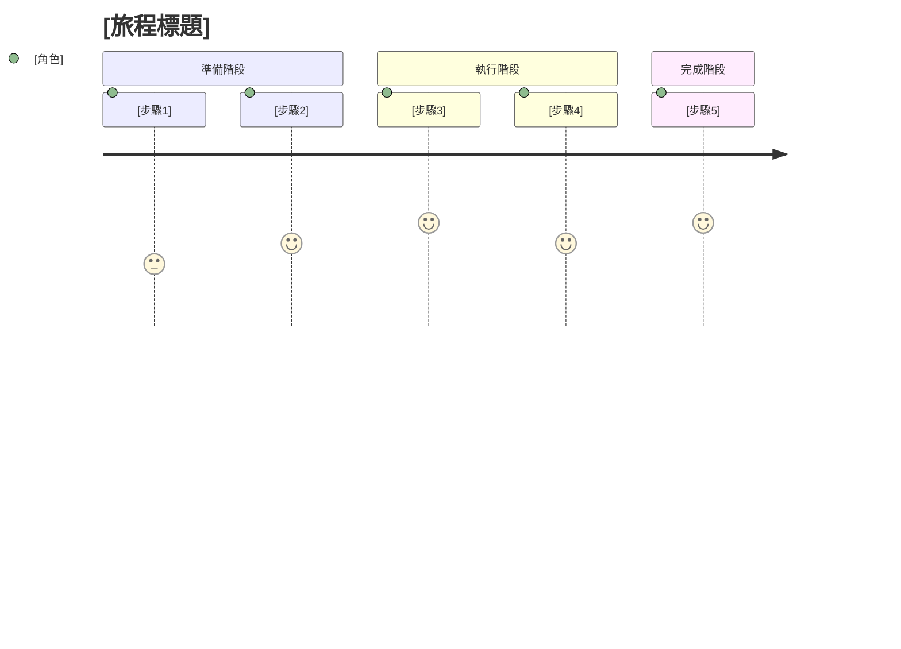

# 10_business - 業務目標與使用者情境

**建立日期**: [DATE]
**最後更新**: [DATE]
**文件版本**: 1.0.0
**關聯專案**: 參考 [00_meta.md](../meta/00_meta.md)
**輸入**: 使用者描述："$ARGUMENTS"

---

## 業務目標

<!--
描述此功能/系統要達成的業務目標
注意：這裡描述「為什麼做」而非「做什麼」或「怎麼做」
範例：
- 將各子公司現行會計系統匯出的 CSV/Excel 報表欄位，對齊至金控統一的 IFRS 報表格式
- 針對 STR/SAR 文本資料，自動抽取關鍵行為、金額、異常模式，產出標準化結構欄位與摘要文字
-->

### 主要業務目標

- [業務目標 1]
- [業務目標 2]
- [業務目標 3]

### 次要業務目標

- [次要目標 1]
- [次要目標 2]

---

## 問題與機會

### 當前痛點

<!--
描述現況的具體問題
範例：
- 分析人員撰寫 STR 摘要平均耗時 45 分鐘，重複性高
- 摘要格式不一致，稽核時需額外釐清
- 關鍵風險指標遺漏率約 15%
-->

**痛點 1**: [痛點描述]
- **影響範圍**: [影響的人員/部門/流程]
- **當前成本**: [時間/金錢/風險成本]
- **頻率**: [每天/每週/每月發生次數]

**痛點 2**: [痛點描述]
- **影響範圍**: [影響的人員/部門/流程]
- **當前成本**: [時間/金錢/風險成本]
- **頻率**: [每天/每週/每月發生次數]

**痛點 3**: [痛點描述]
- **影響範圍**: [影響的人員/部門/流程]
- **當前成本**: [時間/金錢/風險成本]
- **頻率**: [每天/每週/每月發生次數]

### 業務機會

<!--
描述解決問題後帶來的機會
範例：
- 提升分析效率，讓人力可專注於複雜個案判斷
- 建立摘要標準化流程，提升法遵審查效率
- 累積案例知識庫，支援新人訓練
-->

- [機會 1]
- [機會 2]
- [機會 3]

---

## KPI / 成功標準

<!--
定義可衡量的業務成功指標
注意：必須是可量化、可驗證的指標
範例：
- SC-001：分析人員撰寫單筆摘要平均耗時較現況減少 40% 以上
- SC-002：外部或內部稽核對「摘要內容不足或關鍵資訊遺漏」的指摘案件數不高於現況
-->

### 量化指標

- **SC-001**: [指標名稱] - [具體目標數字與基準線]
  - **衡量方式**: [如何衡量]
  - **達成時間**: [何時達成]
  - **基準值**: [當前數字]
  - **目標值**: [期望數字]

- **SC-002**: [指標名稱] - [具體目標數字與基準線]
  - **衡量方式**: [如何衡量]
  - **達成時間**: [何時達成]
  - **基準值**: [當前數字]
  - **目標值**: [期望數字]

- **SC-003**: [指標名稱] - [具體目標數字與基準線]
  - **衡量方式**: [如何衡量]
  - **達成時間**: [何時達成]
  - **基準值**: [當前數字]
  - **目標值**: [期望數字]

### 質化指標

<!--
無法量化但可觀察驗證的指標
範例：
- 使用者滿意度調查結果為「滿意」或以上
- 稽核單位認可摘要品質符合要求
-->

- [質化指標 1] - [驗證方式]
- [質化指標 2] - [驗證方式]
- [質化指標 3] - [驗證方式]

---

## 使用者角色定義

<!--
定義所有會與此系統互動的使用者角色
範例：
- 洗錢防制分析人員（AML Analyst）
- 法遵主管（Compliance Manager）
- 稽核人員（Auditor）
-->

### 主要使用者

**角色 1: [角色名稱]**
- **職責**: [在業務流程中的職責]
- **使用頻率**: [每日/每週/每月]
- **技術能力**: [高/中/低]
- **主要需求**: [對系統的期望]
- **痛點**: [當前遇到的問題]

**角色 2: [角色名稱]**
- **職責**: [在業務流程中的職責]
- **使用頻率**: [每日/每週/每月]
- **技術能力**: [高/中/低]
- **主要需求**: [對系統的期望]
- **痛點**: [當前遇到的問題]

### 次要使用者

**角色 3: [角色名稱]**
- **職責**: [在業務流程中的職責]
- **使用頻率**: [每週/每月/每季]
- **技術能力**: [高/中/低]
- **主要需求**: [對系統的期望]

---

## 使用者故事（User Stories）

<!--
重要：使用者故事應按業務優先級排序
每個故事必須獨立可測試，可單獨交付價值
使用 Gherkin 格式（Given-When-Then）描述驗收情境
-->

### 使用者故事 1 - [簡要標題]（優先級：P1）🎯 MVP

<!--
範例：分析人員審閱模型建議摘要
-->

**角色**: [哪個使用者角色]

**業務價值**: [為什麼這個故事重要，帶來什麼價值]

**故事描述**:
作為 [角色]，我想要 [功能]，以便 [達成目標/解決問題]。

**為何是此優先級**: [說明為何是 P1，與業務目標的關聯]

**獨立測試**: [描述如何獨立測試此故事，不依賴其他故事]
- 範例：只實作此故事即可完成「模型產生摘要 → 人工審核 → 儲存」閉環

**前置條件**:
- [前置條件 1]
- [前置條件 2]

**驗收情境（Gherkin）**:

**情境 1.1**: [情境簡述]
```gherkin
假設 [初始狀態]
當 [使用者動作]
則 [預期結果]
  並且 [額外驗證點]
```

**情境 1.2**: [情境簡述]
```gherkin
假設 [初始狀態]
當 [使用者動作]
則 [預期結果]
```

**情境 1.3 (例外情況)**: [例外情境簡述]
```gherkin
假設 [初始狀態]
當 [觸發例外的動作]
則 [系統如何處理]
  並且 [錯誤訊息或回復機制]
```

**可交付價值**:
- [此故事完成後使用者能做什麼]
- [解決了哪個具體痛點]

**UI/UX 要求** (若適用):
- [畫面/介面要求]
- [互動流程要求]

**資料要求**:
- [需要哪些資料]
- [資料來源]

---

### 使用者故事 2 - [簡要標題]（優先級：P1）

**角色**: [哪個使用者角色]

**業務價值**: [為什麼這個故事重要]

**故事描述**:
作為 [角色]，我想要 [功能]，以便 [達成目標/解決問題]。

**為何是此優先級**: [說明為何是 P1]

**獨立測試**: [描述如何獨立測試]

**驗收情境（Gherkin）**:

**情境 2.1**: [情境簡述]
```gherkin
假設 [初始狀態]
當 [使用者動作]
則 [預期結果]
```

**情境 2.2**: [情境簡述]
```gherkin
假設 [初始狀態]
當 [使用者動作]
則 [預期結果]
```

**可交付價值**:
- [此故事完成後的價值]

---

### 使用者故事 3 - [簡要標題]（優先級：P2）

**角色**: [哪個使用者角色]

**業務價值**: [為什麼這個故事重要]

**故事描述**:
作為 [角色]，我想要 [功能]，以便 [達成目標/解決問題]。

**為何是此優先級**: [說明為何是 P2，為何不是 P1]

**獨立測試**: [描述如何獨立測試]

**驗收情境（Gherkin）**:

**情境 3.1**: [情境簡述]
```gherkin
假設 [初始狀態]
當 [使用者動作]
則 [預期結果]
```

**可交付價值**:
- [此故事完成後的價值]

---

### 使用者故事 4 - [簡要標題]（優先級：P3）

<!--
P3 故事通常是優化、便利性功能，或可延後的需求
-->

**角色**: [哪個使用者角色]

**業務價值**: [為什麼這個故事有價值（但優先級較低）]

**故事描述**:
作為 [角色]，我想要 [功能]，以便 [達成目標]。

**為何是此優先級**: [說明為何可以延後]

**獨立測試**: [描述如何獨立測試]

**驗收情境（Gherkin）**:

**情境 4.1**: [情境簡述]
```gherkin
假設 [初始狀態]
當 [使用者動作]
則 [預期結果]
```

**可交付價值**:
- [此故事完成後的價值]

---

[依需要新增更多使用者故事]

---

## 使用者旅程地圖

<!--
描述典型使用者的完整使用流程
可使用 Mermaid 圖表視覺化
-->

### 主要旅程：[旅程名稱]

**觸發條件**: [什麼情況下開始此旅程]

**步驟流程**:



**各步驟說明**:

1. **[步驟 1]**: [詳細說明]
   - 使用者動作: [做什麼]
   - 系統回應: [系統做什麼]
   - 預期時間: [需要多久]

2. **[步驟 2]**: [詳細說明]
   - 使用者動作: [做什麼]
   - 系統回應: [系統做什麼]
   - 預期時間: [需要多久]

[繼續其他步驟...]

---

## 邊界與例外情況

<!--
描述超出正常流程的情況如何處理
範例：
- 模型無法產生有效摘要時如何處理
- 使用者權限不足時如何提示
- 資料來源異常時如何回應
-->

### 邊界情況

**BC-001: [邊界情況描述]**
- **觸發條件**: [何時發生]
- **系統行為**: [系統應如何處理]
- **使用者體驗**: [使用者看到什麼]
- **後續動作**: [使用者/系統接下來該做什麼]

**BC-002: [邊界情況描述]**
- **觸發條件**: [何時發生]
- **系統行為**: [系統應如何處理]
- **使用者體驗**: [使用者看到什麼]
- **後續動作**: [使用者/系統接下來該做什麼]

### 例外處理

**EX-001: [例外情況描述]**
- **發生條件**: [何時發生]
- **錯誤訊息**: [顯示什麼訊息]
- **回復機制**: [如何回復正常]
- **日誌記錄**: [記錄什麼資訊]

**EX-002: [例外情況描述]**
- **發生條件**: [何時發生]
- **錯誤訊息**: [顯示什麼訊息]
- **回復機制**: [如何回復正常]
- **日誌記錄**: [記錄什麼資訊]

---

## 業務規則

<!--
定義必須遵守的業務邏輯與限制
範例：
- BR-001: 每筆 STR 摘要必須包含「交易金額」、「異常行為類型」、「時間區間」三個必要欄位
- BR-002: 摘要文字長度不得超過 500 字
- BR-003: 模型信心分數低於 0.6 時必須標示「需人工審慎檢視」
-->

| 規則 ID | 規則描述 | 適用範圍 | 驗證方式 | 違反後果 |
|---------|----------|----------|----------|----------|
| BR-001 | [規則描述] | [適用於哪些功能/流程] | [如何驗證] | [違反時如何處理] |
| BR-002 | [規則描述] | [適用於哪些功能/流程] | [如何驗證] | [違反時如何處理] |
| BR-003 | [規則描述] | [適用於哪些功能/流程] | [如何驗證] | [違反時如何處理] |

---

## 非功能性業務需求

<!--
從業務角度描述品質屬性
注意：技術實作細節應放在 70_nfr.md
-->

### 可用性 (Usability)

- [需求 1]: [描述]
- [需求 2]: [描述]

### 效能 (Performance - 業務視角)

- **回應時間**: [使用者可接受的等待時間]
- **處理量**: [每天/每小時需要處理的業務量]
- **尖峰時段**: [何時是使用高峰]

### 可靠性 (Reliability - 業務視角)

- **可容忍停機時間**: [可接受的服務中斷時間]
- **資料正確性**: [錯誤率容忍度]
- **回復時間**: [故障後多久需要恢復]

---

## 與其他系統/流程的關聯

<!--
描述此功能與其他業務流程或系統的關係
-->

### 上游流程/系統

- **[系統/流程名稱]**: [提供什麼資料/觸發什麼事件]

### 下游流程/系統

- **[系統/流程名稱]**: [接收什麼資料/被觸發什麼動作]

### 平行流程

- **[流程名稱]**: [如何協作或避免衝突]

---

## 假設與限制

### 業務假設

<!--
專案成立的業務前提
範例：
- 假設分析人員願意信任並使用 AI 建議
- 假設法遵單位認可 AI 輔助方式
- 假設現有 STR 資料品質足夠訓練模型
-->

- [假設 1]
- [假設 2]
- [假設 3]

### 業務限制

<!--
業務層面的約束條件
範例：
- 必須符合金管會洗錢防制法規
- 摘要必須保留人工最終審核機制（不可全自動）
- 資料不得跨境傳輸
-->

- [限制 1]
- [限制 2]
- [限制 3]

---

## 附錄

### 詞彙表

| 術語 | 全名 | 業務定義 |
|------|------|----------|
| STR | Suspicious Transaction Report | 疑似洗錢或資恐交易報告 |
| SAR | Suspicious Activity Report | 疑似洗錢活動報告 |
| [術語] | [全名] | [定義] |

### 參考文件

- [文件名稱]: [連結或位置]
- [相關法規]: [連結]

### 變更歷史

| 版本 | 日期 | 修訂者 | 修訂內容 |
|------|------|--------|----------|
| 1.0.0 | YYYY-MM-DD | [姓名] | 初版建立 |

---

## 產生記錄

### Session YYYY-MM-DD HH:MM
- 命令：`/speckit.business`
- 輸入：「$ARGUMENTS」
- 使用者故事數量：[N] 個
- 覆蓋角色：[角色列表]
