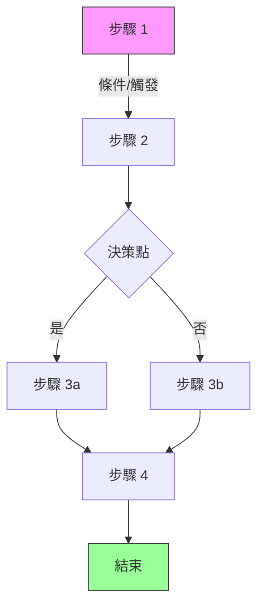
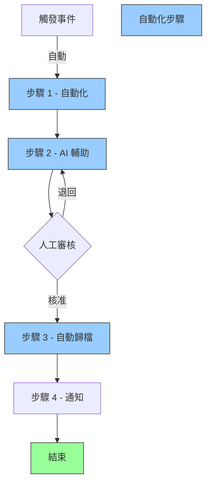
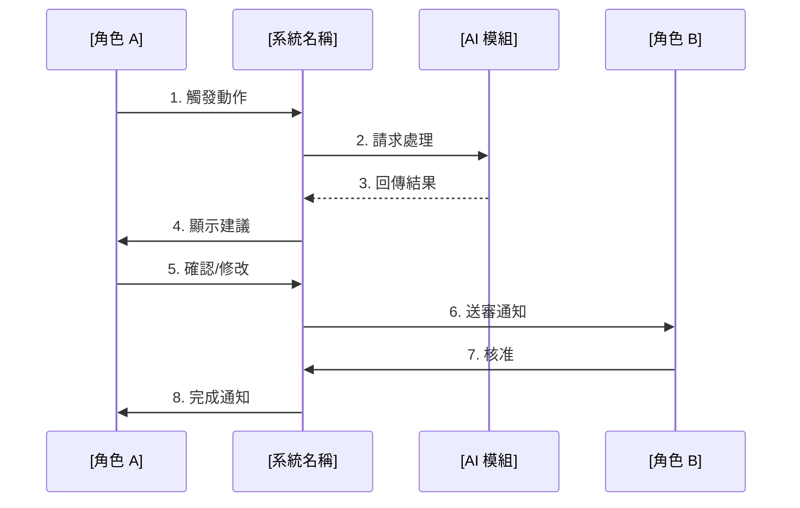
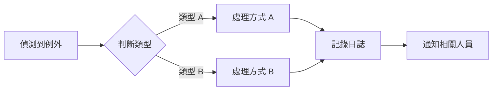
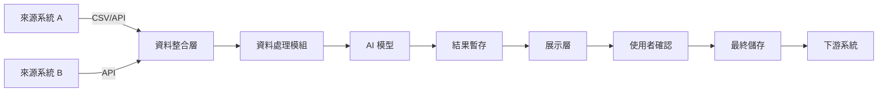

# 20_process - As-Is / To-Be 流程與例外

**建立日期**: [DATE]
**最後更新**: [DATE]
**文件版本**: 1.0.0
**關聯文件**:
- 專案元資料: [00_meta.md](../meta/00_meta.md)
- 業務目標: [10_business.md](10_business.md)
**輸入**: 使用者描述："$ARGUMENTS"

---

## 文件目的

本文件描述：
1. **As-Is 流程**: 當前的業務流程、痛點與問題
2. **To-Be 流程**: 目標流程設計、主要改善點
3. **例外情境**: 非主流程的特殊情況處理
4. **邊界條件**: 流程邊界與特殊狀況

**與其他文件的關係**:
- **10_business.md** 定義「為什麼做」（目標）和「做什麼」（功能）
- **20_process.md** 定義「怎麼流動」（流程）和「誰負責什麼」（職責）
- **spec.md** 將流程轉換為技術功能需求

---

## As-Is 流程（現況分析）

### 流程摘要

<!--
簡述當前流程的主要步驟
範例：
1. 分析人員從核心系統匯出 STR 個案資料
2. 人工閱讀交易明細與客戶往來紀錄（平均 30 分鐘）
3. 依照內部格式手動撰寫摘要（平均 15 分鐘）
4. 提交至法遵審核（1-2 個工作天）
5. 修改後正式歸檔
-->

[描述當前流程的主要步驟，使用編號列表]

### 流程圖（As-Is）

**流程說明**:

| 步驟 | 執行者 | 動作 | 輸入 | 輸出 | 耗時 | 工具/系統 |
|------|--------|------|------|------|------|-----------|
| 1 | [角色] | [做什麼] | [需要什麼資料] | [產出什麼] | [平均時間] | [使用工具] |
| 2 | [角色] | [做什麼] | [需要什麼資料] | [產出什麼] | [平均時間] | [使用工具] |
| 3 | [角色] | [做什麼] | [需要什麼資料] | [產出什麼] | [平均時間] | [使用工具] |

### 關鍵痛點（問題分析）

<!--
識別當前流程的主要問題
注意：這裡的痛點應與 10_business.md 的痛點一致或互補
-->

**痛點 1: [痛點名稱]**
- **問題描述**: [具體描述問題]
- **發生頻率**: [每天/每週/每月發生 X 次]
- **影響範圍**: [影響哪些人/部門/流程]
- **造成後果**:
  - 時間成本: [X 小時/天]
  - 金錢成本: [X 元/次] (若適用)
  - 風險成本: [什麼風險] (若適用)
- **根本原因**: [為什麼會發生這個問題]

**痛點 2: [痛點名稱]**
- **問題描述**: [具體描述問題]
- **發生頻率**: [每天/每週/每月發生 X 次]
- **影響範圍**: [影響哪些人/部門/流程]
- **造成後果**:
  - 時間成本: [X 小時/天]
  - 金錢成本: [X 元/次] (若適用)
  - 風險成本: [什麼風險] (若適用)
- **根本原因**: [為什麼會發生這個問題]

**痛點 3: [痛點名稱]**
- **問題描述**: [具體描述問題]
- **發生頻率**: [發生頻率]
- **影響範圍**: [影響範圍]
- **造成後果**: [後果]
- **根本原因**: [根本原因]

### 當前流程的限制與瓶頸

<!--
識別流程中的系統性限制
範例：
- 資料散落在 3 個系統，需人工彙整
- 無標準化格式，每人撰寫風格不同
- 缺乏版本控制，修改紀錄難以追溯
-->

**限制 1**: [限制描述]
- **類型**: [技術限制/流程限制/人力限制/工具限制]
- **影響**: [造成什麼問題]

**限制 2**: [限制描述]
- **類型**: [限制類型]
- **影響**: [造成什麼問題]

**限制 3**: [限制描述]
- **類型**: [限制類型]
- **影響**: [造成什麼問題]

---

## To-Be 流程（目標設計）

### 流程摘要

<!--
描述改善後的理想流程
範例：
1. 系統自動從核心系統拉取 STR 個案資料（自動化）
2. AI 模型自動分析並產生摘要草稿（30 秒內）
3. 分析人員審閱並微調摘要（5 分鐘）
4. 一鍵提交法遵審核，系統記錄完整軌跡
5. 法遵主管線上審核並核准（減少往返時間）
-->

[描述目標流程的主要步驟，標註自動化/改善點]

### 流程圖（To-Be）

**流程改善對照表**:

| 步驟 | As-Is 執行者 | To-Be 執行者 | 改善方式 | As-Is 耗時 | To-Be 耗時 | 節省時間 |
|------|-------------|-------------|---------|-----------|-----------|----------|
| 1 | [角色] | [系統/角色] | [自動化/輔助/流程優化] | [X 分鐘] | [Y 分鐘] | [Z 分鐘] |
| 2 | [角色] | [系統/角色] | [改善方式] | [X 分鐘] | [Y 分鐘] | [Z 分鐘] |
| 3 | [角色] | [系統/角色] | [改善方式] | [X 分鐘] | [Y 分鐘] | [Z 分鐘] |

**總計節省**: [總時間] / [百分比]

### 主流程（Happy Path）

<!--
描述最理想的主要流程路徑
使用 Swimlane 圖區分不同角色的職責
-->

#### 泳道圖（Swimlane Diagram）

#### 詳細步驟說明

**步驟 1**: [步驟名稱]
- **觸發條件**: [什麼情況下開始]
- **執行者**: [角色/系統]
- **輸入**: [需要什麼資料/條件]
- **處理邏輯**: [做什麼處理]
- **輸出**: [產出什麼]
- **預期時間**: [需要多久]
- **成功標準**: [如何判斷成功]

**步驟 2**: [步驟名稱]
- **觸發條件**: [前一步驟完成]
- **執行者**: [角色/系統]
- **輸入**: [需要什麼]
- **處理邏輯**: [做什麼]
- **輸出**: [產出什麼]
- **預期時間**: [需要多久]
- **成功標準**: [如何判斷成功]

[繼續其他步驟...]

### 角色與職責（RACI）

<!--
明確定義流程中每個步驟的角色職責
R=Responsible(執行), A=Accountable(負責), C=Consulted(諮詢), I=Informed(告知)
-->

| 步驟 | [角色 A] | [角色 B] | [系統/AI] | [角色 C] | 說明 |
|------|---------|---------|-----------|---------|------|
| 步驟 1 | R | I | A | - | [系統自動執行，通知角色 B] |
| 步驟 2 | A/R | C | R | I | [角色 A 執行並負責，諮詢角色 B] |
| 步驟 3 | I | A/R | - | C | [角色 B 負責執行] |

---

## 例外情境處理

<!--
描述非主流程的例外情況如何處理
注意：這裡的例外應對應到 10_business.md 的邊界情況
-->

### 例外情境 E1: [情境名稱]

**描述**: [什麼情況下發生]

**觸發條件**:
- [條件 1]
- [條件 2]

**處理流程**:

**詳細步驟**:
1. **偵測**: [系統如何偵測到這個例外]
2. **通知**: [通知誰]
3. **處理**: [執行什麼動作]
4. **回復**: [如何回到正常流程]
5. **記錄**: [記錄什麼資訊]

**影響範圍**: [影響哪些後續流程]

**預期頻率**: [多久發生一次]

**SLA**: [需要多久內處理完成]

---

### 例外情境 E2: [情境名稱]

**描述**: [什麼情況下發生]

**觸發條件**:
- [條件 1]
- [條件 2]

**處理流程**: [描述或流程圖]

**詳細步驟**: [同上格式]

**影響範圍**: [影響範圍]

**預期頻率**: [頻率]

**SLA**: [處理時限]

---

### 例外情境 E3: [情境名稱]

[同上格式]

---

## 邊界情況處理

<!--
描述流程邊界與極端情況
範例：
- 當資料來源無資料時
- 當並發請求超過系統負載時
- 當外部 API 無回應時
-->

### 邊界情況 BC-001: [邊界情況描述]

**情況說明**: [詳細描述]

**系統行為**:
- **主動偵測**: [如何偵測到此情況]
- **處理方式**: [系統如何處理]
- **使用者提示**: [顯示什麼訊息給使用者]
- **回復機制**: [如何回復]

**業務影響**: [對業務流程的影響]

**處理優先級**: [高/中/低]

---

### 邊界情況 BC-002: [邊界情況描述]

[同上格式]

---

### 邊界情況 BC-003: [邊界情況描述]

[同上格式]

---

## 資料流動

<!--
描述流程中的資料如何流動
-->

### 資料流程圖

### 資料對照表

| 資料項目 | 來源 | 格式 | 流經步驟 | 最終目的地 | 保留期限 |
|---------|------|------|---------|-----------|----------|
| [資料 A] | [系統/角色] | [格式] | [步驟 1→2→3] | [最終位置] | [保留時間] |
| [資料 B] | [系統/角色] | [格式] | [流經路徑] | [最終位置] | [保留時間] |

### 資料轉換規則

**轉換 1: [來源格式] → [目標格式]**
- **轉換邏輯**: [如何轉換]
- **驗證規則**: [如何驗證正確性]
- **錯誤處理**: [轉換失敗時如何處理]

**轉換 2: [來源格式] → [目標格式]**
- **轉換邏輯**: [如何轉換]
- **驗證規則**: [驗證方式]
- **錯誤處理**: [錯誤處理方式]

---

## 流程整合點

<!--
描述此流程與其他系統/流程的整合點
-->

### 上游整合

**整合點 1: [系統/流程名稱]**
- **整合方式**: [API/檔案傳輸/訊息佇列/其他]
- **觸發條件**: [何時觸發資料傳遞]
- **資料格式**: [JSON/XML/CSV/其他]
- **頻率**: [即時/批次/排程]
- **錯誤處理**: [整合失敗時如何處理]
- **負責單位**: [誰負責維護此整合]

**整合點 2: [系統/流程名稱]**
[同上格式]

### 下游整合

**整合點 3: [系統/流程名稱]**
- **整合方式**: [整合方式]
- **觸發條件**: [觸發條件]
- **資料格式**: [資料格式]
- **頻率**: [頻率]
- **錯誤處理**: [錯誤處理]
- **負責單位**: [負責單位]

---

## 流程監控與指標

<!--
定義流程執行的監控指標
-->

### 流程效能指標

| 指標 ID | 指標名稱 | 計算方式 | 目標值 | 監控頻率 | 負責人 |
|---------|----------|----------|--------|----------|--------|
| PM-001 | 平均處理時間 | [計算公式] | [< X 分鐘] | [即時/每日/每週] | [角色] |
| PM-002 | 流程完成率 | [計算公式] | [> X%] | [監控頻率] | [角色] |
| PM-003 | 例外發生率 | [計算公式] | [< X%] | [監控頻率] | [角色] |

### 流程品質指標

| 指標 ID | 指標名稱 | 計算方式 | 目標值 | 監控頻率 | 負責人 |
|---------|----------|----------|--------|----------|--------|
| PQ-001 | 退回重做率 | [計算公式] | [< X%] | [監控頻率] | [角色] |
| PQ-002 | 使用者滿意度 | [計算公式] | [> X 分] | [監控頻率] | [角色] |
| PQ-003 | 資料正確率 | [計算公式] | [> X%] | [監控頻率] | [角色] |

---

## 流程改善效益評估

### 量化效益

| 效益項目 | As-Is 數值 | To-Be 目標 | 改善幅度 | 計算依據 |
|---------|-----------|-----------|---------|----------|
| 平均處理時間 | [X 分鐘] | [Y 分鐘] | [減少 Z%] | [如何計算] |
| 人力成本 | [X 小時/天] | [Y 小時/天] | [節省 Z 小時] | [如何計算] |
| 錯誤率 | [X%] | [Y%] | [降低 Z%] | [如何計算] |
| 每日處理量 | [X 筆] | [Y 筆] | [提升 Z%] | [如何計算] |

**年度預估效益**: [總結年度可節省的時間/成本]

### 質化效益

- [效益 1]: [描述]
- [效益 2]: [描述]
- [效益 3]: [描述]

---

## 流程風險

<!--
識別流程中的風險點
-->

| 風險 ID | 風險描述 | 影響步驟 | 機率 | 影響 | 風險等級 | 應對措施 |
|---------|----------|----------|------|------|----------|----------|
| PR-001 | [風險描述] | [步驟 X] | [高/中/低] | [高/中/低] | [高/中/低] | [應對方式] |
| PR-002 | [風險描述] | [步驟 Y] | [機率] | [影響] | [風險等級] | [應對方式] |
| PR-003 | [風險描述] | [步驟 Z] | [機率] | [影響] | [風險等級] | [應對方式] |

---

## 流程變更管理

### 流程版本控制

- **當前版本**: 1.0.0
- **變更審核**: [誰負責審核流程變更]
- **變更通知**: [如何通知相關人員]
- **生效機制**: [新流程如何生效]

### 變更歷史

| 版本 | 日期 | 變更內容 | 變更原因 | 影響範圍 | 核准人 |
|------|------|----------|----------|----------|--------|
| 1.0.0 | YYYY-MM-DD | 初版建立 | - | - | [姓名] |

---

## 附錄

### 流程相關表單

- [表單 A]: [用途]
- [表單 B]: [用途]

### 流程相關系統

- [系統 A]: [角色]
- [系統 B]: [角色]

### 參考文件

- [文件名稱]: [連結]
- [相關 SOP]: [連結]

---

## 產生記錄

### Session YYYY-MM-DD HH:MM
- 命令：`/speckit.process`
- 輸入：「$ARGUMENTS」
- 參考文件：[10_business.md / 00_meta.md / 其他]
- 流程步驟數：As-Is [N] 步驟, To-Be [M] 步驟
- 例外情境：[N] 個
- 邊界情況：[M] 個
