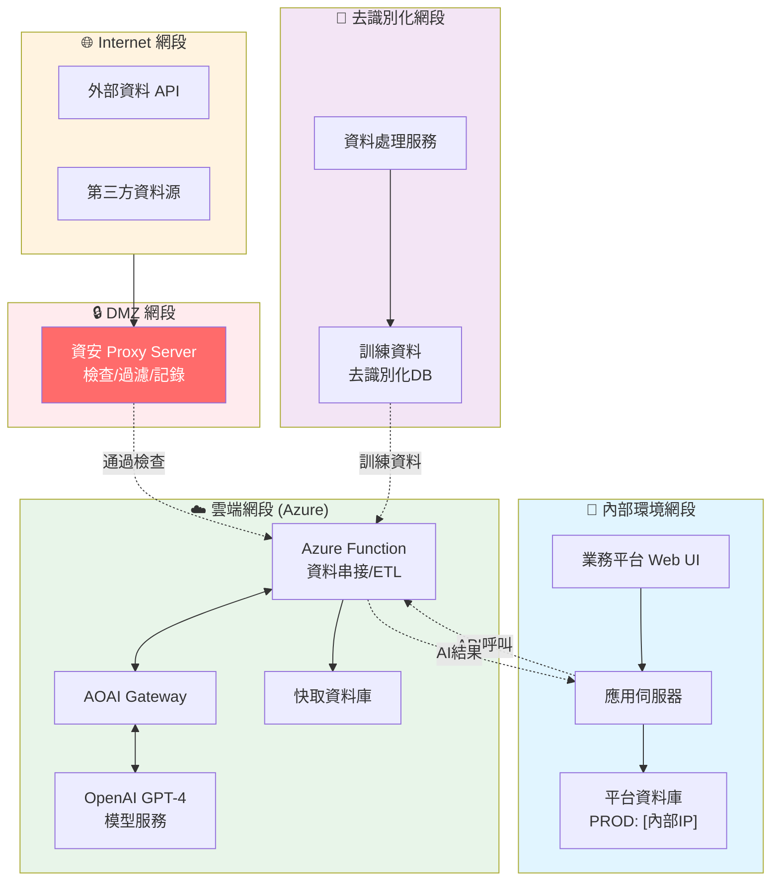

# 20_system_flow - 系統流程與整合

**建立日期**: [DATE]
**最後更新**: [DATE]
**文件版本**: 1.0.0

---

## 文件目的

定義系統間的整合與資料流動，是從0到1建置的核心文件。

**關注重點**：
- 系統流程圖（PROD/SIT）
- 資料流動方向
- 系統整合點
- API 呼叫鏈

---

## 系統流程圖

### 正式環境 (PROD) 系統流程



**系統說明**：

1. **🌐 Internet 網段**：
   - 外部資料 API（如：金融情報、黑名單）
   - 第三方資料源

2. **🔒 DMZ 網段**：
   - **資安 Proxy Server**：所有外部流量統一檢查、過濾、記錄

3. **🏢 內部環境網段**：
   - Web UI：使用者操作介面
   - 應用伺服器：業務邏輯處理
   - 平台資料庫 (PROD: [內部IP位址])

4. **🔐 去識別化網段**：
   - 訓練資料庫（已去識別化）
   - 資料處理服務

5. **☁️ 雲端網段 (Azure)**：
   - Azure Function：ETL 與資料串接
   - AOAI Gateway：AI 請求閘道
   - OpenAI GPT-4：模型推論服務
   - 快取資料庫

**資料流向**：
- 外部 API → 資安 Proxy → Azure Function
- 內部應用 ↔ Azure Function (雙向)
- 去識別化資料 → Azure Function (單向)

### 測試環境 (SIT/UAT) 系統流程

```mermaid
    
    subgraph CloudTest["雲端環境 (Azure SIT)"]
        ExtAPITest[外部 API SIT]
        ProxyTest[Proxy SIT]
        FunctionTest[Function SIT]
        GatewayTest[Gateway SIT]
        OpenAITest[GPT-4 測試配額]
        
        ExtAPITest --> ProxyTest --> FunctionTest
        FunctionTest <--> GatewayTest <--> OpenAITest
    end
    
    InternalTest -.測試資料.-> CloudTest
    
    style InternalTest fill:#e8f5e9
    style CloudTest fill:#fff9c4
```

**測試環境差異**：
- 獨立測試資料庫 (SIT: [測試環境IP])
- 測試 Azure 資源
- 限制 API 配額

---

## 系統整合點

### 內部 ↔ 雲端整合

| 項目 | 說明 |
|------|------|
| 通訊協定 | HTTPS (TLS 1.2+) |
| 認證方式 | API Key + Token |
| 資料格式 | JSON |
| 錯誤處理 | 重試3次 |

### 主要資料流

| 資料類型 | 來源 | 目的地 | 頻率 |
|---------|------|--------|------|
| STR 個案資料 | 內部 AML 平台 | Azure Function | 即時觸發 |
| AI 摘要結果 | OpenAI | 內部 AML 平台 | 即時回傳 |
| 交易明細資料 | 核心系統 | Azure Function | 批次 |
| 外部情報資料 | 第三方 API | Azure Function | 批次/即時 |

---

## 系統清單

| 系統名稱 | 環境 | 位址/端點 | 負責單位 |
|---------|------|----------|----------|
| AML 防洗錢平台 | PROD | [內部IP/端點] | 銀行資訊處風控科 |
| AML 防洗錢平台 | SIT | [測試環境IP/端點] | 銀行資訊處風控科 |
| Azure Function | PROD | [端點] | 金控數科處 |
| AOAI Gateway | PROD | [端點] | 金控數科處 |

---

## 產生記錄

- 命令：`/speckit.systemflow`
- 輸入：「$ARGUMENTS」
- 系統數：[N] 個
- 整合點：[M] 個
