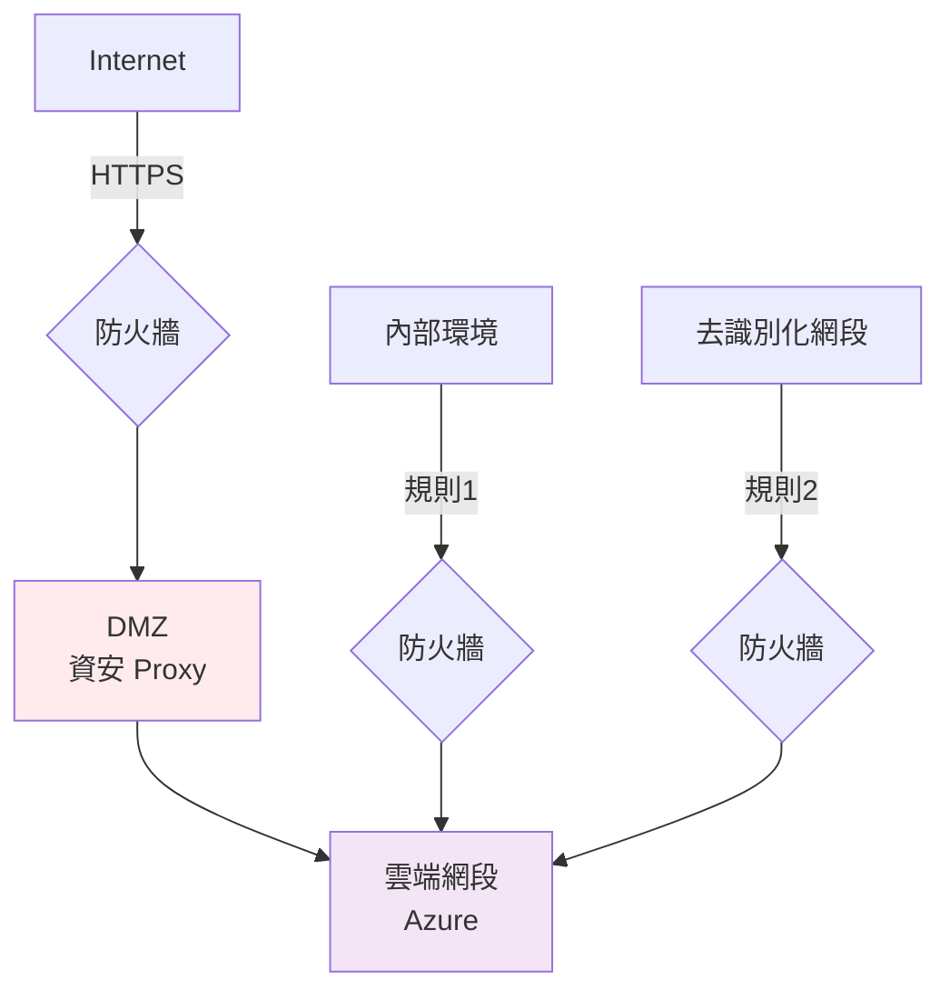
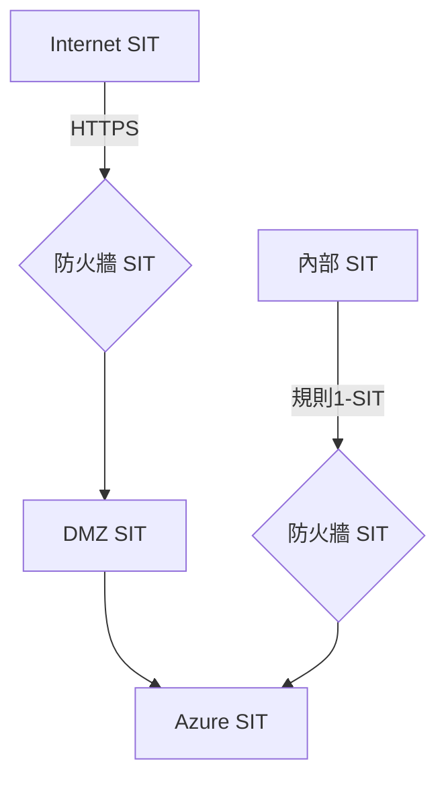

# 30_network_arch - 網路架構

**建立日期**: [DATE]
**最後更新**: [DATE]
**文件版本**: 1.0.0

---

## 文件目的

定義網路架構、防火牆規則與網段規劃。

---

## 網路架構圖

### 正式環境 (PROD)

### 測試環境 (SIT/UAT)

---

## 防火牆規則

| 來源 | 目的地 | 協定/埠號 | 動作 | 用途 |
|------|--------|-----------|------|------|
| 內部環境 | Azure Cloud | HTTPS/443 | 允許 | 資料傳輸 |
| 去識別化網段 | Azure Cloud | HTTPS/443 | 允許 | AI 訓練 |
| Internet | DMZ Proxy | HTTPS/443 | 允許 | 外部 API |
| DMZ | Azure Cloud | HTTPS/443 | 允許 | 已驗證流量 |
| 其他 | Azure Cloud | Any | 拒絕 | 預設拒絕 |

---

## 網段規劃

| 網段名稱 | IP 範圍 | VLAN | 用途 |
|---------|---------|------|------|
| 內部環境 | [IP範圍] | [VLAN ID] | 業務系統 |
| DMZ | [IP範圍] | [VLAN ID] | 資安閘道 |
| 去識別化 | [IP範圍] | [VLAN ID] | 測試資料 |

---

## 安全控制

- [ ] 網路分段 (Segmentation)
- [ ] WAF 部署
- [ ] DDoS 防護
- [ ] IP 白名單
- [ ] IDS/IPS

---

## 產生記錄

- 命令：`/speckit.networkarch`
- 防火牆規則：[N] 條
- 網段：[M] 個
