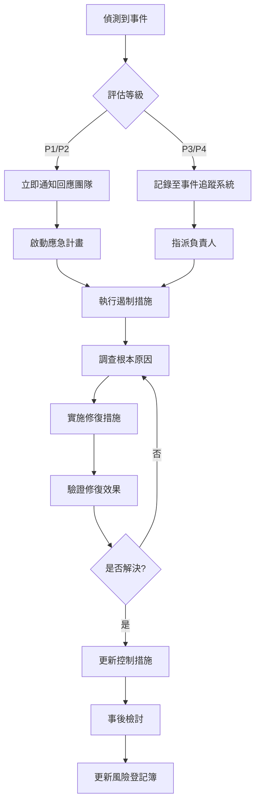

# 30_risk_control - 風險與控制設計

**建立日期**: [DATE]
**最後更新**: [DATE]
**文件版本**: 1.0.0
**關聯文件**:
- 專案元資料: [00_meta.md](../meta/00_meta.md)
- 業務目標: [10_business.md](10_business.md)
- 流程設計: [20_process.md](20_process.md)
**輸入**: 使用者描述："$ARGUMENTS"

---

## 文件目的

本文件定義：
1. **風險識別**: 專案執行與系統運作中的潛在風險
2. **控制措施**: 針對各風險的預防、偵測與回應機制
3. **RACI 矩陣**: 風險管理與控制活動的角色職責
4. **監控指標**: 風險與控制有效性的衡量方式

**與其他文件的關係**:
- **20_process.md** 定義流程 → **30_risk_control.md** 識別流程風險點
- **10_business.md** 定義業務目標 → **30_risk_control.md** 識別目標達成風險
- **40_infosec.md** 定義資安控制 → **30_risk_control.md** 整合資安風險

---

## 風險分類架構

<!--
使用風險分類框架協助完整識別
可依專案特性調整分類
-->

### 風險分類清單

| 分類 | 說明 | 範例 |
|------|------|------|
| **業務風險** | 影響業務目標達成的風險 | 使用者不接受新系統、效益未達預期 |
| **技術風險** | 技術實作與架構風險 | 技術選型錯誤、效能不足、整合失敗 |
| **資料風險** | 資料品質、完整性、可用性風險 | 資料遺失、資料洩漏、資料不準確 |
| **作業風險** | 日常運作與流程風險 | 人為錯誤、流程中斷、系統停機 |
| **合規風險** | 法規與政策遵循風險 | 違反個資法、不符監理要求 |
| **資安風險** | 資訊安全威脅風險 | 未授權存取、資料外洩、攻擊 |
| **專案風險** | 專案執行風險 | 時程延誤、預算超支、資源不足 |
| **供應商風險** | 第三方廠商相關風險 | 廠商倒閉、服務中斷、品質不符 |

---

## 主要風險清單

<!--
以風險登記簿 (Risk Register) 格式記錄
每個風險應包含：ID、描述、類別、原因、影響、機率、影響程度、風險等級
-->

### 風險評估矩陣

**機率定義**:
- **高 (H)**: 發生機率 > 50%，或過去 1 年內發生過
- **中 (M)**: 發生機率 20-50%，或業界有類似案例
- **低 (L)**: 發生機率 < 20%，罕見情況

**影響定義**:
- **高 (H)**: 嚴重影響業務目標、造成重大損失、違反法規
- **中 (M)**: 影響部分功能、造成中度損失、需要補救措施
- **低 (L)**: 影響輕微、可容忍的損失、容易修復

**風險等級計算**:
| 機率 \ 影響 | 低 (L) | 中 (M) | 高 (H) |
|------------|--------|--------|--------|
| **高 (H)** | 中 | 高 | 極高 |
| **中 (M)** | 低 | 中 | 高 |
| **低 (L)** | 低 | 低 | 中 |

---

### 風險 R-001: [風險名稱]

<!--
範例：模型遺漏關鍵可疑行為細節，導致個案記錄不足
-->

**風險 ID**: R-001

**風險類別**: [業務風險/技術風險/資料風險/作業風險/合規風險/資安風險/專案風險/供應商風險]

**風險描述**:
[詳細描述風險內容，包含可能發生的情況]

**風險來源/原因**:
- [原因 1]
- [原因 2]
- [原因 3]

**潛在影響**:
- **業務影響**: [對業務目標的影響]
- **財務影響**: [預估損失金額或範圍]
- **聲譽影響**: [對組織聲譽的影響]
- **法規影響**: [是否違反法規，造成什麼後果]
- **技術影響**: [對系統運作的影響]

**影響範圍**:
- **部門/單位**: [影響哪些部門]
- **流程**: [影響 20_process.md 中的哪些步驟]
- **系統**: [影響哪些系統或模組]
- **使用者**: [影響哪些使用者角色]

**風險評分**:
- **機率**: [高 (H) / 中 (M) / 低 (L)]
- **影響**: [高 (H) / 中 (M) / 低 (L)]
- **風險等級**: [極高 / 高 / 中 / 低]

**關聯風險**: [若此風險會觸發其他風險，列出關聯的風險 ID]

---

### 風險 R-002: [風險名稱]

**風險 ID**: R-002

**風險類別**: [分類]

**風險描述**:
[描述]

**風險來源/原因**:
- [原因列表]

**潛在影響**:
- **業務影響**: [影響]
- **財務影響**: [影響]
- **聲譽影響**: [影響]
- **法規影響**: [影響]

**影響範圍**: [範圍]

**風險評分**:
- **機率**: [H/M/L]
- **影響**: [H/M/L]
- **風險等級**: [極高/高/中/低]

**關聯風險**: [關聯 ID]

---

### 風險 R-003: [風險名稱]

[同上格式]

---

[依需要新增更多風險，建議至少識別 5-10 個主要風險]

---

## 控制措施設計

<!--
針對每個風險設計控制措施
控制類型：
- 預防性控制 (Preventive): 防止風險發生
- 偵測性控制 (Detective): 及早發現風險
- 回應性控制 (Responsive): 降低風險影響
- 補償性控制 (Compensating): 替代控制方式
-->

### 控制措施 C-001: [控制措施名稱]

**控制 ID**: C-001

**針對風險**: [R-001, R-002] ←列出此控制措施可降低的風險

**控制類型**: [預防性 / 偵測性 / 回應性 / 補償性]

**控制描述**:
[詳細描述控制措施的內容與執行方式]

**實施方式**:

**技術控制**:
- [技術手段 1]：[說明]
- [技術手段 2]：[說明]

**流程控制**:
- [流程步驟 1]：[說明]
- [流程步驟 2]：[說明]

**人員控制**:
- [人員要求 1]：[說明]
- [人員要求 2]：[說明]

**實施時機**: [何時執行此控制]
- 範例：系統上線前、每日批次執行、每次交易時、每月定期檢查

**實施地點**: [在哪裡執行]
- 範例：應用程式層、資料庫層、網路層、使用者端

**負責角色**: [誰負責執行此控制]

**控制頻率**: [執行頻率]
- 範例：即時、每日、每週、每月、每季、年度

**控制證據**: [如何證明控制有效執行]
- 範例：系統日誌、審核報告、檢查清單、測試結果

**控制成本**:
- **初期成本**: [建置成本]
- **持續成本**: [年度維護成本]

**控制有效性評估**:
- **預期效果**: [此控制可降低風險至何種程度]
- **殘餘風險**: [實施控制後仍存在的風險]
- **衡量指標**: [如何衡量控制有效性]

---

### 控制措施 C-002: [控制措施名稱]

**控制 ID**: C-002

**針對風險**: [R-003]

**控制類型**: [類型]

**控制描述**: [描述]

**實施方式**: [方式]

**實施時機**: [時機]

**負責角色**: [角色]

**控制頻率**: [頻率]

**控制證據**: [證據]

**控制有效性評估**: [評估]

---

### 控制措施 C-003: [控制措施名稱]

[同上格式]

---

[依需要新增更多控制措施]

---

## 風險-控制對照矩陣

<!--
展示風險與控制措施的對應關係
-->

| 風險 ID | 風險名稱 | 風險等級 | 主要控制措施 | 次要控制措施 | 殘餘風險等級 |
|---------|----------|----------|-------------|-------------|--------------|
| R-001 | [風險名稱] | 高 | C-001, C-002 | C-005 | 中 |
| R-002 | [風險名稱] | 極高 | C-003 | C-004 | 中 |
| R-003 | [風險名稱] | 中 | C-006 | - | 低 |
| R-004 | [風險名稱] | 高 | C-001, C-007 | C-008 | 低 |

**說明**:
- **殘餘風險**: 實施所有控制措施後仍存在的風險等級
- **控制缺口**: 若殘餘風險仍為「高」或「極高」，需考慮額外控制或風險接受決策

---

## 風險管理 RACI 矩陣

<!--
定義風險管理活動的角色職責
R=Responsible(執行), A=Accountable(負責), C=Consulted(諮詢), I=Informed(告知)
-->

| 活動 | [角色 A] | [角色 B] | [角色 C] | [角色 D] | 說明 |
|------|---------|---------|---------|---------|------|
| 風險識別與評估 | R | C | C | I | [角色 A 負責執行，諮詢 B 和 C] |
| 控制措施設計 | R | A | C | I | [角色 A 執行，角色 B 最終負責] |
| 控制措施實施 | R | A | C | I | [說明] |
| 控制有效性測試 | R | C | A | I | [說明] |
| 風險監控與報告 | R | I | C | A | [說明] |
| 事件回應與處理 | R | A | C | I | [說明] |
| 風險接受決策 | C | I | A | R | [重大風險需高階主管核准] |

**角色定義**:
- **[角色 A]**: [職稱] - [職責範圍]
- **[角色 B]**: [職稱] - [職責範圍]
- **[角色 C]**: [職稱] - [職責範圍]
- **[角色 D]**: [職稱] - [職責範圍]

---

## 風險監控與報告

### 風險指標 (Key Risk Indicators, KRI)

<!--
定義用於監控風險狀態的指標
-->

| KRI ID | 指標名稱 | 計算方式 | 閾值 | 監控頻率 | 負責人 | 回報對象 |
|--------|----------|----------|------|----------|--------|----------|
| KRI-001 | [指標名稱] | [公式] | [警示值/行動值] | [每日/每週] | [角色] | [角色] |
| KRI-002 | [指標名稱] | [公式] | [閾值] | [頻率] | [角色] | [角色] |
| KRI-003 | [指標名稱] | [公式] | [閾值] | [頻率] | [角色] | [角色] |

**範例 KRI**:
- **模型錯誤率**: (錯誤案例數 / 總案例數) × 100%，閾值 > 5% 需警示
- **控制失效次數**: 每月控制失效事件數，閾值 > 3 次需調查
- **異常存取次數**: 每日異常存取偵測數，閾值 > 10 次需回應

### 風險報告機制

**報告類型**:

1. **日常監控報告**
   - **頻率**: 每日
   - **內容**: KRI 數值、異常事件、控制執行狀態
   - **收件者**: [風險負責人、系統管理者]
   - **觸發條件**: KRI 超過警示值

2. **定期風險報告**
   - **頻率**: 每月
   - **內容**: 風險趨勢分析、控制有效性評估、新增風險
   - **收件者**: [專案經理、業務負責人、風險委員會]
   - **格式**: [報告模板連結]

3. **重大事件報告**
   - **頻率**: 即時
   - **內容**: 事件描述、影響範圍、應對措施、根本原因分析
   - **收件者**: [高階主管、風險委員會、相關利害關係人]
   - **升級機制**: [何時升級至更高層級]

---

## 事件管理與回應

### 事件分級

| 等級 | 定義 | 範例 | 回應時間 | 回應團隊 |
|------|------|------|----------|----------|
| **P1 - 緊急** | 嚴重影響業務、法規違反、重大資料外洩 | [範例] | < 1 小時 | [團隊] |
| **P2 - 高** | 影響多數使用者、控制失效、中度影響 | [範例] | < 4 小時 | [團隊] |
| **P3 - 中** | 影響少數使用者、可容忍的異常 | [範例] | < 1 工作日 | [團隊] |
| **P4 - 低** | 輕微異常、無立即影響 | [範例] | < 3 工作日 | [團隊] |

### 事件回應流程

### 事件回應責任

| 角色 | 職責 |
|------|------|
| **事件管理者** | 統籌事件回應、溝通協調、決策升級 |
| **技術團隊** | 技術調查、系統修復、日誌分析 |
| **業務團隊** | 業務影響評估、使用者溝通、替代方案 |
| **法遵/資安** | 法規影響評估、資安事件處理、外部通報 |
| **高階主管** | 重大決策、資源調度、對外溝通 |

---

## 風險接受與例外

<!--
對於無法完全消除或成本過高的風險，需明確風險接受決策
-->

### 風險接受標準

**可接受風險**:
- 殘餘風險等級為「低」
- 控制成本合理且有效
- 業務單位認可殘餘風險

**需升級決策的風險**:
- 殘餘風險等級為「高」或「極高」
- 控制措施成本過高或技術上不可行
- 涉及法規或重大業務影響

### 風險接受登記簿

| 風險 ID | 風險名稱 | 殘餘風險等級 | 接受原因 | 接受條件 | 核准人 | 核准日期 | 複審日期 |
|---------|----------|--------------|----------|----------|--------|----------|----------|
| R-XXX | [風險名稱] | 中 | [原因] | [條件] | [姓名/職稱] | YYYY-MM-DD | YYYY-MM-DD |

**接受條件範例**:
- 須定期監控 KRI，若超過閾值需重新評估
- 須在 6 個月內實施補償性控制
- 業務單位承諾配合替代流程

---

## 持續改善

### 風險管理成熟度評估

**當前成熟度等級**: [初始 / 可重複 / 已定義 / 已管理 / 最佳化]

**目標成熟度等級**: [目標等級]

**改善計畫**:
1. [改善項目 1] - [負責人] - [完成日期]
2. [改善項目 2] - [負責人] - [完成日期]
3. [改善項目 3] - [負責人] - [完成日期]

### 經驗教訓 (Lessons Learned)

<!--
記錄風險管理過程中的經驗教訓
-->

| 日期 | 事件/情境 | 學到什麼 | 改善行動 | 負責人 |
|------|-----------|----------|----------|--------|
| YYYY-MM-DD | [事件描述] | [教訓] | [行動] | [姓名] |

---

## 附錄

### 風險管理框架參考

- [ISO 31000 風險管理標準]
- [COSO ERM 框架]
- [組織內部風險管理政策]

### 專有名詞

| 術語 | 定義 |
|------|------|
| 殘餘風險 (Residual Risk) | 實施控制措施後仍存在的風險 |
| 固有風險 (Inherent Risk) | 未實施任何控制前的原始風險 |
| KRI | Key Risk Indicator，關鍵風險指標 |
| RACI | Responsible, Accountable, Consulted, Informed |

### 變更歷史

| 版本 | 日期 | 修訂者 | 修訂內容 |
|------|------|--------|----------|
| 1.0.0 | YYYY-MM-DD | [姓名] | 初版建立 |

---

## 產生記錄

### Session YYYY-MM-DD HH:MM
- 命令：`/speckit.risk`
- 輸入：「$ARGUMENTS」
- 參考文件：[10_business.md / 20_process.md / 其他]
- 識別風險數：[N] 個
- 設計控制措施：[M] 個
- 風險覆蓋率：[X]% (有控制措施的風險比例)
