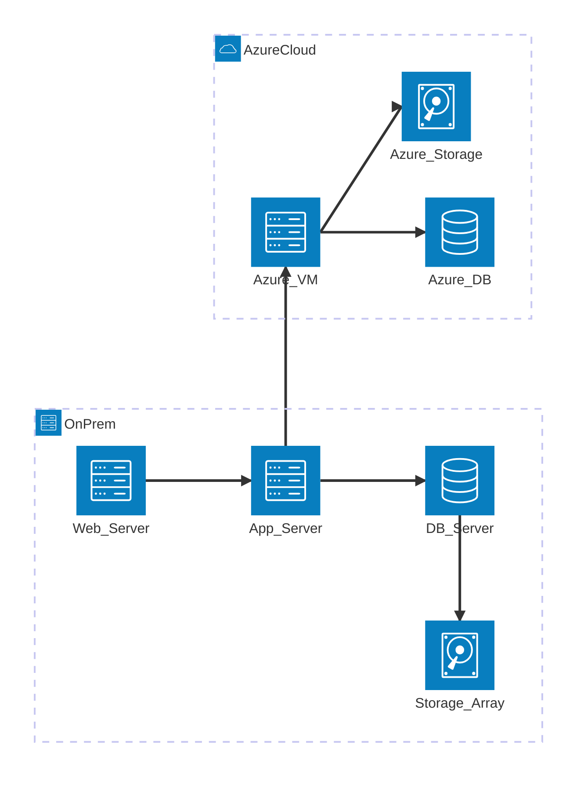

# 40_hardware_arch - 硬體架構

**建立日期**: [DATE]
**最後更新**: [DATE]
**文件版本**: 1.0.0

---

## 文件目的

定義伺服器、儲存與基礎設施配置，區分地端與雲端環境。

---

## 硬體架構圖

### 整體架構

---

## 地端環境硬體規格

### 伺服器配置

| 用途 | 數量 | CPU | RAM | Storage | 作業系統 | 備註 |
|------|------|-----|-----|---------|----------|------|
| Web Server | 2 | Xeon-Gold 18 core × 2 | 128G | C: 12T SSD | Windows Server 2016 | 負載平衡 |
| App Server | 2 | Xeon-Gold 18 core × 2 | 128G | C: 12T SSD | Windows Server 2016 | HA 主備 |
| DB Server | 1 | Xeon-Gold 18 core × 2 | 128G | C: 12T SSD | Windows Server 2016 | MS-SQL Server 2017 |

**CPU 規格**：
- 型號：Intel Xeon Gold
- 核心數：18 core × 2 (共 36 core)
- 超執行緒：支援 (72 threads)

**記憶體規格**：
- 容量：128GB DDR4
- 速度：2666 MHz
- ECC：支援

**儲存規格**：
- 類型：企業級 SSD
- 容量：12TB (C:\ 系統碟)
- RAID：RAID 10 (效能與備援)
- IOPS：≥ 100,000

---

## 雲端環境硬體規格

### Azure 虛擬機器

| 用途 | SKU | vCPU | RAM | Storage | 作業系統 | 備註 |
|------|-----|------|-----|---------|----------|------|
| Azure Function | Consumption Plan | 動態 | 動態 | - | Linux | Serverless |
| Azure VM (ETL) | Standard_B1s | 1 core | 4G | 32GB SSD | Linux | Python 3.12.3 |
| AOAI Gateway | Managed Service | - | - | - | Azure PaaS | API 管理 |

**Azure 資源規格**：
- **虛擬機器類型**：Standard_B1s (Burstable)
- **vCPU**：1 core
- **記憶體**：4GB RAM  
- **儲存**：32GB Premium SSD (OS Disk)
- **網路**：1 Gbps

**Azure 服務**：
- Azure Functions (Consumption Plan)
- Azure OpenAI Service
- Azure Storage (Blob/Queue)
- Azure Application Insights (監控)

---

## 儲存架構

### 地端儲存

| 儲存類型 | 容量 | 備援 | 用途 | 效能 |
|---------|------|------|------|------|
| SSD (系統碟) | 12TB | RAID 10 | OS + 應用程式 | 100K IOPS |
| SSD (資料碟) | [容量] | RAID 10 | 資料庫檔案 | [IOPS] |
| NAS | [容量] | RAID 6 | 備份與歸檔 | [IOPS] |

### 雲端儲存

| 儲存類型 | 容量 | 備援 | 用途 |
|---------|------|------|------|
| Premium SSD | 32GB | Azure 3副本 | VM OS Disk |
| Blob Storage | [容量] | LRS/GRS | 檔案儲存 |
| Azure SQL | [容量] | 自動備份 | 關聯式資料 |

---

## 負載平衡

| 層級 | 類型 | 演算法 | 後端節點數 |
|------|------|--------|-----------|
| L7 (應用層) | [LB類型] | Round Robin | [N] |
| L4 (傳輸層) | [LB類型] | Least Connection | [N] |

---

## 容量規劃

| 資源 | 當前使用 | 預估成長 | 擴充計畫 |
|------|---------|---------|---------|
| CPU | [%] | [%/年] | [說明] |
| RAM | [%] | [%/年] | [說明] |
| Storage | [TB] | [TB/年] | [說明] |
| Network | [Gbps] | [Gbps/年] | [說明] |

---

## 產生記錄

- 命令：`/speckit.hardwarearch`
- 伺服器：PROD [N]台 / SIT [M]台
- 總容量：[X] TB
