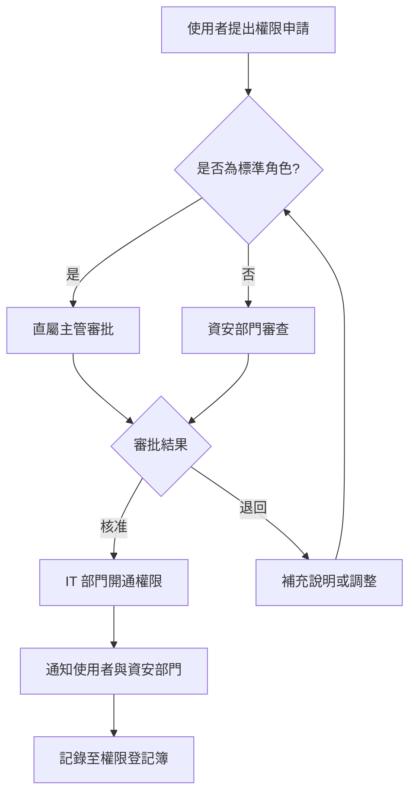

# 40_infosec - 資安需求與權限矩陣

**建立日期**: [DATE]
**最後更新**: [DATE]
**文件版本**: 1.0.0
**關聯文件**:
- 專案元資料: [00_meta.md](../meta/00_meta.md)
- 業務目標: [10_business.md](10_business.md)
- 流程設計: [20_process.md](20_process.md)
- 風險控制: [30_risk_control.md](30_risk_control.md)
**輸入**: 使用者描述："$ARGUMENTS"

---

## 文件目的

本文件定義：
1. **資料分級**: 資料敏感度分類與保護要求
2. **存取控制**: 角色定義、權限矩陣、身分驗證
3. **資安防護**: 技術安全控制措施
4. **日誌稽核**: 操作記錄與異常偵測
5. **合規要求**: 資安相關法規與標準

**與其他文件的關係**:
- **10_business.md** 定義使用者角色 → **40_infosec.md** 定義角色權限
- **20_process.md** 定義流程 → **40_infosec.md** 定義流程中的安全控制點
- **30_risk_control.md** 識別風險 → **40_infosec.md** 提供資安控制措施

---

## 資料分級與保護

### 資料分級標準

<!--
依據組織資料分級政策定義資料敏感度
常見分級：公開、內部、機密、高度機密
-->

| 分級 | 定義 | 範例 | 保護要求 | 保留期限 |
|------|------|------|----------|----------|
| **公開 (Public)** | 可對外公開的資訊 | 行銷文宣、公開報告 | 基本保護即可 | [期限] |
| **內部 (Internal)** | 僅供內部使用的資訊 | 內部流程文件、會議紀錄 | 內部網路存取、身分驗證 | [期限] |
| **機密 (Confidential)** | 敏感業務資訊 | 客戶資料、業務合約 | 加密、存取控制、日誌記錄 | [期限] |
| **高度機密 (Highly Confidential)** | 極敏感資訊 | 個資、金融交易、監理資料 | 強化加密、嚴格權限、稽核追蹤 | [期限] |

### 專案資料分級

<!--
識別此專案中處理的所有資料類型及其分級
範例：STR/SAR 文本 → 高度機密
-->

| 資料類型 | 分級 | 包含欄位/內容 | 來源 | 儲存位置 | 傳輸方式 |
|---------|------|--------------|------|----------|----------|
| [資料類型 A] | [分級] | [欄位列表] | [系統/使用者] | [位置] | [加密/明文] |
| [資料類型 B] | [分級] | [欄位列表] | [系統/使用者] | [位置] | [加密/明文] |
| [資料類型 C] | [分級] | [欄位列表] | [系統/使用者] | [位置] | [加密/明文] |

**特殊資料類型**:

**個人資料 (PII)**:
- **包含欄位**: [姓名、身分證字號、地址、電話、Email 等]
- **法規依據**: [個資法、GDPR、PDPA 等]
- **保護措施**: [加密、遮罩、存取控制]
- **保留政策**: [保留期限、刪除機制]

**敏感個人資料 (Sensitive PII)**:
- **包含欄位**: [病歷、財務交易、犯罪記錄等]
- **額外保護**: [強化加密、多因子認證、審計追蹤]

**訓練/測試資料**:
- **資料來源**: [正式環境/合成資料]
- **遮罩要求**: [需遮罩的欄位]
- **使用限制**: [僅限開發環境、不可外傳]

---

## 身分與存取管理 (IAM)

### 角色定義

<!--
定義系統中的所有角色
角色應對應 10_business.md 中的使用者角色
-->

**角色 1: [角色名稱]**
- **角色 ID**: ROLE-001
- **對應使用者角色**: [10_business.md 中的角色]
- **業務職責**: [此角色的業務職責]
- **典型使用者**: [部門/職稱]
- **使用頻率**: [每日/每週/每月]
- **存取時段**: [24x7 / 上班時間 / 特定時段]

**角色 2: [角色名稱]**
- **角色 ID**: ROLE-002
- **對應使用者角色**: [對應角色]
- **業務職責**: [職責]
- **典型使用者**: [使用者]
- **使用頻率**: [頻率]
- **存取時段**: [時段]

[繼續定義其他角色...]

### 權限矩陣

<!--
定義角色對資料/功能的存取權限
權限類型：無、檢視、編輯、刪除、管理
-->

#### 資料存取權限

| 角色 | [資料類型 A] | [資料類型 B] | [資料類型 C] | [訓練資料] | [操作日誌] |
|------|-------------|-------------|-------------|-----------|-----------|
| [角色 1] | 檢視/編輯 | 檢視 | 無 | 無 | 僅本人 |
| [角色 2] | 檢視 | 檢視/編輯 | 檢視 | 無 | 檢視 |
| [角色 3] | 檢視(遮罩後) | 無 | 檢視 | 檢視/編輯 | 檢視 |
| [角色 4] | 檢視 | 檢視 | 檢視 | 檢視(遮罩後) | 檢視 |

**權限說明**:
- **無**: 無法存取
- **檢視**: 僅能查看，不可修改
- **檢視(遮罩後)**: 敏感欄位遮罩後可查看
- **編輯**: 可查看與修改
- **刪除**: 可刪除記錄（需額外審批）
- **管理**: 完整權限（含設定、授權）

#### 功能存取權限

| 角色 | [功能 A] | [功能 B] | [功能 C] | [系統設定] | [使用者管理] |
|------|---------|---------|---------|-----------|-------------|
| [角色 1] | 使用 | 使用 | 無 | 無 | 無 |
| [角色 2] | 使用 | 使用 | 使用 | 無 | 無 |
| [角色 3] | 檢視 | 無 | 檢視 | 無 | 無 |
| [管理員] | 管理 | 管理 | 管理 | 管理 | 管理 |

### 權限申請與審核流程



**權限申請要求**:
- **業務理由**: 說明為何需要此權限
- **存取範圍**: 需要存取哪些資料/功能
- **使用期限**: 臨時權限需註明期限
- **審批層級**:
  - 一般權限：直屬主管
  - 敏感資料權限：資安主管
  - 特權帳號：資安主管 + IT 主管

### 權限複審機制

**定期複審**:
- **頻率**: 每季/每半年
- **負責單位**: 資安部門
- **複審內容**:
  - 確認使用者角色是否仍需此權限
  - 檢查長期未使用的權限
  - 識別權限過度授予情況
- **處理方式**: 不需要的權限立即撤銷

**異動觸發複審**:
- 人員調動/離職 → 立即撤銷權限
- 專案結束 → 撤銷臨時權限
- 違規事件 → 重新評估權限

---

## 身分驗證與授權

### 驗證機制

**主要驗證方式**: [單一選項]
- [ ] 帳號密碼 (Username/Password)
- [ ] 單一登入 (SSO) - 使用組織 AD/LDAP
- [ ] 多因子認證 (MFA) - 帳密 + OTP/生物辨識
- [ ] 憑證認證 (Certificate-based)
- [ ] 其他: [說明]

**密碼政策** (若使用帳密驗證):
- **複雜度要求**: [最小長度、大小寫、數字、特殊字元]
- **有效期限**: [X 天需更換]
- **歷史限制**: [不可重複使用最近 Y 次密碼]
- **鎖定機制**: [連續失敗 Z 次鎖定帳號]
- **暫時密碼**: [首次登入需強制變更]

**多因子認證 (MFA) 要求**:
- **適用角色**: [哪些角色強制 MFA]
- **適用情境**: [從外部網路存取、存取敏感資料、管理員操作]
- **MFA 方式**: [OTP、簡訊、推播通知、硬體 Token、生物辨識]

### 單一登入 (SSO) 整合

**SSO 協定**: [SAML 2.0 / OAuth 2.0 / OpenID Connect]

**Identity Provider**: [組織 AD / Azure AD / Okta / 其他]

**使用者屬性對應**:
| SSO 屬性 | 系統欄位 | 用途 |
|---------|---------|------|
| employeeID | 員工編號 | 唯一識別 |
| mail | Email | 通知與聯絡 |
| department | 部門 | 權限分組 |
| title | 職稱 | 角色對應 |

**SSO 失效處理**: [當 SSO 服務中斷時的備援方案]

### 授權控制

**授權模型**: [RBAC / ABAC / 混合]

**RBAC (角色基礎)**:
- 使用者 → 角色 → 權限
- 角色繼承: [是否支援角色繼承]

**ABAC (屬性基礎)** (若適用):
- 考慮屬性: [使用者屬性、資源屬性、環境屬性]
- 範例: 「分析人員只能存取自己轄區的個案」

**最小權限原則**:
- 使用者僅獲得完成工作所需的最小權限
- 特權操作需額外審批
- 預設為「拒絕」，明確授權才能存取

---

## 存取控制

### 網路存取控制

**存取路徑限制**:
- [ ] 僅限內部網路
- [ ] 允許 VPN 存取
- [ ] 允許特定 IP 範圍
- [ ] 允許網際網路存取(需 MFA)

**VPN 要求** (若允許遠端存取):
- **VPN 類型**: [SSL VPN / IPSec VPN]
- **認證方式**: [帳密 + MFA]
- **連線時間限制**: [自動斷線時間]
- **允許裝置**: [公司配發裝置 / BYOD(需 MDM)]

**IP 白名單** (若適用):
- 辦公室固定 IP: [IP 範圍]
- 合作夥伴 IP: [IP 範圍]
- 例外處理: [如何申請例外]

### 資料存取控制

**資料隔離**:
- **實體隔離**: [生產/測試/開發環境完全分離]
- **邏輯隔離**: [租戶隔離、部門隔離]
- **資料遮罩**: [敏感欄位在非生產環境遮罩]

**欄位層級控制**:
| 欄位 | [角色 1] | [角色 2] | [角色 3] | 遮罩規則 |
|------|---------|---------|---------|----------|
| 姓名 | 明文 | 明文 | 遮罩 | 顯示姓氏+* |
| 身分證字號 | 明文 | 遮罩 | 遮罩 | 僅顯示後 4 碼 |
| 電話 | 明文 | 明文 | 遮罩 | 中間 4 碼遮罩 |
| 交易金額 | 明文 | 明文 | 明文 | - |

**動態資料遮罩 (DDM)**:
- **遮罩時機**: 查詢時動態遮罩
- **遮罩邏輯**: [依角色/情境決定]
- **遮罩範例**:
  - 姓名: 王小明 → 王**
  - 帳號: 1234567890 → ******7890
  - Email: user@example.com → u***@example.com

### 時間與地點控制

**存取時段限制** (若適用):
- **一般使用者**: [上班時間 08:00-18:00]
- **管理員**: [24x7，但非上班時間需告警]
- **批次作業**: [僅限維護時段]

**地點限制** (若適用):
- **敏感操作**: 僅限辦公室內部網路
- **遠端存取**: 需 VPN + MFA
- **異常地點告警**: 偵測從未登入過的地點

---

## 資料保護技術

### 加密要求

**傳輸中加密 (Data in Transit)**:
- **協定**: TLS 1.2+ / TLS 1.3
- **適用範圍**: 所有網路傳輸
- **憑證管理**: [內部 CA / 公開 CA]
- **憑證有效期**: [1 年更換]

**靜態資料加密 (Data at Rest)**:
- **資料庫加密**: [TDE / 欄位層級加密]
- **檔案加密**: [AES-256]
- **備份加密**: [強制加密]
- **金鑰管理**: [KMS / HSM / 其他]

**應用層加密** (若適用):
- **加密欄位**: [高度敏感欄位]
- **加密演算法**: [AES-256-GCM]
- **金鑰輪替**: [每 X 個月輪替]

### 金鑰管理

**金鑰層級**:
- **主金鑰 (Master Key)**: [儲存位置與保護方式]
- **資料加密金鑰 (DEK)**: [產生與儲存方式]
- **金鑰包裝**: [DEK 由 Master Key 加密]

**金鑰生命週期**:
1. **產生**: [使用安全亂數產生器]
2. **儲存**: [加密儲存於 KMS/HSM]
3. **使用**: [僅在記憶體中明文]
4. **輪替**: [定期輪替週期]
5. **銷毀**: [安全刪除機制]

**金鑰存取控制**:
- 金鑰僅供系統使用，人員無法直接存取
- 金鑰管理操作需雙人授權
- 所有金鑰操作記錄稽核日誌

### 資料去識別化

**去識別化方法**:
- **遮罩 (Masking)**: 部分隱藏敏感資訊
- **假名化 (Pseudonymization)**: 以假名取代真實識別資訊
- **匿名化 (Anonymization)**: 完全移除可識別資訊
- **泛化 (Generalization)**: 降低資料精確度

**使用情境**:
| 情境 | 方法 | 範例 |
|------|------|------|
| 非生產環境測試 | 假名化 | 真實姓名 → 假名 |
| 模型訓練 | 假名化 + 泛化 | 出生日期 → 年齡區間 |
| 資料分析 | 匿名化 + 聚合 | 個人交易 → 統計數據 |
| 外部分享 | 匿名化 | 移除所有可識別資訊 |

**去識別化驗證**:
- 重新識別風險評估
- 與原始資料比對測試
- 第三方驗證 (若適用)

---

## 日誌與監控

### 日誌記錄要求

**必須記錄的事件**:

**身分驗證事件**:
- 登入成功/失敗
- 登出
- 密碼變更
- MFA 驗證

**授權事件**:
- 權限變更
- 角色指派/撤銷
- 存取拒絕

**資料存取事件**:
- 查詢敏感資料
- 修改/刪除資料
- 匯出資料
- 批次下載

**系統管理事件**:
- 系統設定變更
- 使用者帳號建立/停用
- 安全政策變更

**安全事件**:
- 異常登入嘗試
- 權限提升嘗試
- 惡意程式偵測
- 安全掃描結果

### 日誌格式

**標準欄位**:
```json
{
  "timestamp": "ISO 8601 格式時間",
  "event_id": "事件唯一識別碼",
  "event_type": "事件類型",
  "user_id": "使用者識別",
  "ip_address": "來源 IP",
  "action": "執行動作",
  "resource": "存取資源",
  "result": "成功/失敗",
  "details": "詳細資訊"
}
```

### 日誌保留與保護

**保留期限**:
- **一般操作日誌**: [90 天]
- **安全事件日誌**: [1 年]
- **稽核日誌**: [7 年]（依監理要求）

**日誌保護**:
- 日誌僅能新增，不可修改或刪除
- 日誌傳輸加密
- 日誌儲存加密
- 日誌完整性驗證 (Checksum/簽章)

**日誌存取控制**:
- 僅資安、稽核、授權人員可存取
- 日誌存取本身需記錄
- 定期匯出至不可變儲存

### 異常偵測與告警

**偵測規則**:

**異常登入**:
- 短時間多次失敗登入
- 非常態時間登入
- 從未見過的地點登入
- 同時從多個地點登入

**異常存取**:
- 大量資料下載
- 存取非權限範圍資料
- 異常查詢模式
- 權限提升嘗試

**系統異常**:
- 服務異常流量
- 資源使用異常
- 錯誤率飆高

**告警機制**:
- **即時告警**: Email、SMS、推播通知
- **告警對象**: 資安團隊、系統管理員、相關主管
- **告警升級**: 重大事件自動升級至高階主管

---

## 安全開發與部署

### 開發環境安全

**環境隔離**:
- 開發 / 測試 / 預生產 / 生產 完全隔離
- 不同環境使用不同憑證與金鑰
- 生產資料不可直接複製至測試環境

**程式碼安全**:
- 程式碼版本控制 (Git)
- 分支保護 (main/master 需 PR + Review)
- Secrets 不可寫死在程式碼中
- 使用 Secret Scanner 偵測洩漏

**測試資料**:
- 使用合成資料或去識別化資料
- 測試環境資料定期清理
- 測試資料不可包含真實 PII

### 部署安全

**CI/CD 安全**:
- Pipeline 存取控制
- 自動化安全掃描 (SAST/DAST/SCA)
- 容器映像掃描
- 部署需審批機制

**基礎設施安全**:
- 最小權限原則
- 網路分段與防火牆
- 定期漏洞掃描與修補
- 安全基線配置

---

## 第三方與供應商管理

### 第三方存取控制

**存取原則**:
- 第三方廠商僅授予必要的最小權限
- 使用專屬帳號，不可共用
- 限定存取時段與範圍
- 所有操作需記錄

**廠商管理**:
- 簽署保密協議 (NDA)
- 安全評估 (Security Assessment)
- 定期安全稽核
- 合約包含安全條款

### 外部API安全

**API 認證**:
- API Key + Secret
- OAuth 2.0 Token
- 雙向 TLS (Mutual TLS)

**API 授權**:
- 細緻的 API 權限控制
- Rate Limiting
- IP 白名單

**API 監控**:
- API 呼叫記錄
- 異常流量偵測
- 錯誤率監控

---

## 資安合規

### 適用法規與標準

<!--
列出專案需遵守的資安相關法規與標準
-->

| 法規/標準 | 適用性 | 主要要求 | 遵循方式 |
|----------|--------|----------|----------|
| 個資法 | 適用 | 個資蒐集/處理/利用告知、當事人權利 | [遵循措施] |
| [其他法規] | 適用 | [要求] | [遵循方式] |

### 合規檢查點

**個資保護檢查**:
- [ ] 個資蒐集有明確告知與同意
- [ ] 個資處理符合蒐集目的
- [ ] 提供當事人查詢/更正/刪除機制
- [ ] 個資保留期限明確
- [ ] 個資跨境傳輸符合規範

**資安技術檢查**:
- [ ] 傳輸加密 (TLS 1.2+)
- [ ] 靜態資料加密
- [ ] 存取控制實施
- [ ] 日誌記錄完整
- [ ] 定期漏洞掃描

---

## 附錄

### 資安術語

| 術語 | 定義 |
|------|------|
| PII | Personally Identifiable Information，個人可識別資訊 |
| MFA | Multi-Factor Authentication，多因子認證 |
| RBAC | Role-Based Access Control，角色基礎存取控制 |
| TDE | Transparent Data Encryption，透明資料加密 |
| KMS | Key Management Service，金鑰管理服務 |

### 變更歷史

| 版本 | 日期 | 修訂者 | 修訂內容 |
|------|------|--------|----------|
| 1.0.0 | YYYY-MM-DD | [姓名] | 初版建立 |

---

## 產生記錄

### Session YYYY-MM-DD HH:MM
- 命令：`/speckit.infosec`
- 輸入：「$ARGUMENTS」
- 參考文件：[10_business.md / 20_process.md / 30_risk_control.md]
- 定義角色數：[N] 個
- 資料分級類型：[M] 種
- 資安控制措施：[X] 個
