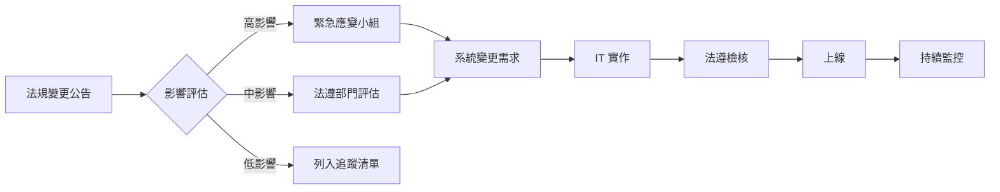

# 50_compliance - 法遵依據與系統對應

> **文件版本**: v1.0.0
> **最後更新**: [YYYY-MM-DD]
> **專案名稱**: [專案名稱]
> **專案代號**: [PROJECT-CODE]

---

## 📋 文件摘要

本文件定義專案需遵守的法規與規範，並說明系統設計如何對應法遵要求。

**關鍵產出**：
- 適用法規清單與法規需求對應
- 法遵控制點與檢核機制
- 法遵 RACI 與責任分工
- 法遵稽核證據與文件留存要求

**前置文件**：
- `00_meta.md` - 專案背景與監理要求
- `30_risk_control.md` - 合規風險識別
- `40_infosec.md` - 資安法規要求

**後續文件**：
- `60_audit.md` - 稽核需求（證據收集）
- `spec.md` - 技術規格（法遵功能實作）

---

## 1. 適用法規與規範

### 1.1 法規識別

**主要法規**：

| 法規代號 | 法規名稱 | 適用範圍 | 主管機關 | 違反後果 |
|---------|---------|---------|---------|---------|
| [REG-001] | [法規全名] | [適用情境] | [主管機關] | [罰則說明] |
| [REG-002] | [法規全名] | [適用情境] | [主管機關] | [罰則說明] |

**範例（STR/SAR）**：
| 法規代號 | 法規名稱 | 適用範圍 | 主管機關 | 違反後果 |
|---------|---------|---------|---------|---------|
| REG-AML-001 | 洗錢防制法及相關子法 | 所有可疑交易處理 | 法務部調查局 | 刑責或罰款 |
| REG-AML-002 | 金融機構防制洗錢及打擊資恐辦法 | STR/SAR 報送流程 | 金管會 | 裁罰或停業 |
| REG-PDPA-001 | 個人資料保護法 | 個資蒐集、處理、利用 | 國家發展委員會 | 民事賠償或行政罰 |

**次要規範**（內部政策、產業標準）：

| 規範代號 | 規範名稱 | 來源 | 強制性 |
|---------|---------|------|--------|
| [NORM-001] | [規範全名] | [來源組織] | 強制/建議 |
| [NORM-002] | [規範全名] | [來源組織] | 強制/建議 |

**範例**：
| 規範代號 | 規範名稱 | 來源 | 強制性 |
|---------|---------|------|--------|
| NORM-FSC-001 | 金管會洗錢防制與打擊資恐作業指引 | 金管會 | 強制 |
| NORM-INT-001 | 內部資訊安全管理辦法 | 公司資安部 | 強制 |
| NORM-ISO-001 | ISO 27001 資訊安全標準 | 國際標準組織 | 建議 |

### 1.2 法規適用性分析

**法規觸發條件**：

| 法規代號 | 觸發條件 | 適用業務流程 | 涉及資料類型 |
|---------|---------|-------------|-------------|
| [REG-001] | [何時適用] | [流程名稱] | [資料類型] |
| [REG-002] | [何時適用] | [流程名稱] | [資料類型] |

**範例**：
| 法規代號 | 觸發條件 | 適用業務流程 | 涉及資料類型 |
|---------|---------|-------------|-------------|
| REG-AML-001 | 處理任何可疑交易調查 | STR 調查與摘要產生 | 客戶個資、交易資料 |
| REG-PDPA-001 | 蒐集、處理、利用個人資料 | 模型訓練、測試、推論 | 姓名、身分證、交易記錄 |

---

## 2. 法規需求對應

### 2.1 法規需求拆解

**[REG-001] - [法規名稱]**

**法規條文摘要**：
> [關鍵條文內容或解讀]

**系統需求對應**：

| 需求編號 | 法規要求 | 系統對應措施 | 實作位置 | 狀態 |
|---------|---------|-------------|---------|------|
| REQ-[REG-001]-01 | [法規要求] | [系統如何實現] | [模組/功能] | 規劃中/已實作 |
| REQ-[REG-001]-02 | [法規要求] | [系統如何實現] | [模組/功能] | 規劃中/已實作 |

**範例（REG-AML-001 洗錢防制法）**：

| 需求編號 | 法規要求 | 系統對應措施 | 實作位置 | 狀態 |
|---------|---------|-------------|---------|------|
| REQ-AML-001-01 | 對可疑交易進行適當調查與記錄 | 保存原始 STR 文本、模型摘要、人工修改記錄 | STR 摘要模組 | 規劃中 |
| REQ-AML-001-02 | 調查過程需可證明與追溯 | 所有操作記錄稽核日誌（含時間戳、操作人員、變更內容） | 稽核日誌模組 | 規劃中 |
| REQ-AML-001-03 | 保留完整調查證據 | 資料保留 7 年（原始資料、模型輸出、最終摘要） | 資料儲存層 | 規劃中 |

**[REG-002] - [法規名稱]**

**法規條文摘要**：
> [關鍵條文內容或解讀]

**系統需求對應**：

| 需求編號 | 法規要求 | 系統對應措施 | 實作位置 | 狀態 |
|---------|---------|-------------|---------|------|
| REQ-[REG-002]-01 | [法規要求] | [系統如何實現] | [模組/功能] | 規劃中/已實作 |

### 2.2 法遵控制點（Compliance Control Points）

**關鍵法遵控制點**：

| 控制點編號 | 控制點名稱 | 對應法規 | 控制類型 | 驗證方式 |
|-----------|-----------|---------|---------|---------|
| CP-[REG]-001 | [控制點描述] | [法規代號] | 預防/偵測/回應 | [如何驗證] |
| CP-[REG]-002 | [控制點描述] | [法規代號] | 預防/偵測/回應 | [如何驗證] |

**範例（STR/SAR）**：

| 控制點編號 | 控制點名稱 | 對應法規 | 控制類型 | 驗證方式 |
|-----------|-----------|---------|---------|---------|
| CP-AML-001 | STR 個案完整追溯能力 | REG-AML-001 | 偵測 | 隨機抽查 10 個案例，查詢原始文本、模型輸出、最終摘要 |
| CP-AML-002 | 防止模型自動決定報送 | REG-AML-002 | 預防 | 系統設計檢查：模型僅提供建議，無報送決策權限 |
| CP-AML-003 | 模型使用情況統計報表 | REG-AML-002 | 偵測 | 法遵可產出「模型建議 vs 最終摘要」統計報表 |
| CP-PDPA-001 | 訓練資料保護措施 | REG-PDPA-001 | 預防 | 訓練環境網路隔離、資料去識別化、存取審批記錄 |
| CP-PDPA-002 | 個資存取紀錄 | REG-PDPA-001 | 偵測 | 所有個資查詢記錄稽核日誌（7 年保留） |

---

## 3. 法遵檢核機制

### 3.1 上線前法遵檢核清單

**功能上線前必須通過的法遵檢核**：

- [ ] **CP-AML-001**: 可針對任一 STR 個案，快速查得原始文本、模型輸出與最終摘要
  - 驗證方式：隨機抽取 10 個案例，查詢時間 < 30 秒
  - 負責人：法遵部門、IT 部門

- [ ] **CP-AML-002**: 系統無法自動決定「是否報送」，僅提供輔助資訊
  - 驗證方式：功能測試、程式碼審查
  - 負責人：業務部門、IT 部門

- [ ] **CP-AML-003**: 可產出「模型使用情況與摘要品質」統計報表
  - 驗證方式：報表功能測試（包含：模型建議被修改率、處理時間等）
  - 負責人：法遵部門

- [ ] **CP-PDPA-001**: 訓練資料保護措施已實施
  - 驗證方式：環境隔離測試、存取權限檢查、去識別化驗證
  - 負責人：資安部門、IT 部門

- [ ] **CP-PDPA-002**: 個資存取已記錄稽核日誌
  - 驗證方式：日誌完整性測試（查詢、修改、刪除操作均有記錄）
  - 負責人：稽核部門

### 3.2 持續法遵監控

**上線後持續監控項目**：

| 監控項目 | 對應控制點 | 監控頻率 | 異常門檻 | 告警對象 |
|---------|-----------|---------|---------|---------|
| [監控項目] | [CP-XXX] | 每日/每週/每月 | [門檻值] | [角色] |

**範例**：

| 監控項目 | 對應控制點 | 監控頻率 | 異常門檻 | 告警對象 |
|---------|-----------|---------|---------|---------|
| STR 個案追溯失敗次數 | CP-AML-001 | 每日 | > 5 次/日 | 法遵部門、IT 部門 |
| 模型建議被修改率 | CP-AML-003 | 每週 | > 50% | 法遵部門、業務主管 |
| 個資未授權存取嘗試 | CP-PDPA-002 | 每日 | > 3 次/日 | 資安部門、法遵部門 |
| 訓練資料外部存取嘗試 | CP-PDPA-001 | 每日 | > 0 次 | 資安部門（立即） |

---

## 4. 法遵文件與證據留存

### 4.1 必須留存的文件

**法規要求留存的文件**：

| 文件類型 | 對應法規 | 留存期限 | 儲存位置 | 存取權限 |
|---------|---------|---------|---------|---------|
| [文件名稱] | [法規代號] | [期限] | [位置] | [角色] |

**範例**：

| 文件類型 | 對應法規 | 留存期限 | 儲存位置 | 存取權限 |
|---------|---------|---------|---------|---------|
| 原始 STR 文本 | REG-AML-001 | 7 年 | 案件管理資料庫 | 分析人員、法遵、稽核 |
| 模型建議摘要 | REG-AML-002 | 7 年 | 案件管理資料庫 | 分析人員、法遵、稽核 |
| 最終確認摘要 | REG-AML-001 | 7 年 | 案件管理資料庫 | 分析人員、法遵、稽核 |
| 操作稽核日誌 | REG-AML-001, REG-PDPA-001 | 7 年 | 稽核日誌系統 | 稽核、法遵 |
| 模型版本變更記錄 | REG-AML-002 | 7 年 | 版本控制系統 | 模型工程師、稽核 |
| 個資當事人同意書 | REG-PDPA-001 | 特定目的消失後 5 年 | 法遵文件庫 | 法遵、客服 |

### 4.2 法遵證據收集機制

**自動化證據收集**：

| 證據類型 | 收集方式 | 收集頻率 | 證據格式 | 用途 |
|---------|---------|---------|---------|------|
| [證據名稱] | [自動/手動] | [頻率] | [格式] | [用途說明] |

**範例**：

| 證據類型 | 收集方式 | 收集頻率 | 證據格式 | 用途 |
|---------|---------|---------|---------|------|
| 模型推論日誌 | 自動（API 呼叫時記錄） | 即時 | JSON 日誌 | 證明模型輸出內容與時間 |
| 人工修改記錄 | 自動（前端送出時記錄） | 即時 | 資料庫記錄（含 before/after） | 證明人工審核介入 |
| 系統存取日誌 | 自動（存取控制層記錄） | 即時 | 結構化日誌（Syslog 格式） | 證明存取權限控制有效 |
| 法遵檢核報告 | 手動（法遵部門產出） | 每季 | PDF 報告 | 定期法遵檢視證明 |

---

## 5. 法遵 RACI 矩陣

**法遵活動與角色責任**：

| 法遵活動 | 業務單位 | IT 單位 | 法遵部門 | 資安部門 | 稽核部門 | 外部律師 |
|---------|---------|---------|---------|---------|---------|---------|
| 適用法規識別 | C | C | **A** | I | I | C |
| 法規需求解讀 | I | I | **A** | C | I | **R** |
| 系統對應設計 | C | **R** | **A** | C | I | I |
| 法遵控制點實作 | I | **R** | C | **R** | I | I |
| 上線前法遵檢核 | C | **R** | **A** | C | **R** | I |
| 持續法遵監控 | I | C | **A** | C | **R** | I |
| 法規變更評估 | C | I | **A** | I | I | C |
| 法遵報告產出 | I | I | **R** | I | **A** | I |
| 外部法遵稽核應對 | C | C | **R** | C | **A** | C |

**角色說明**：
- **R (Responsible)**: 執行者
- **A (Accountable)**: 最終負責人（決策者）
- **C (Consulted)**: 需諮詢（雙向溝通）
- **I (Informed)**: 需告知（單向通知）

---

## 6. 法遵風險與例外管理

### 6.1 法遵風險

**從 30_risk_control.md 整合法遵風險**：

| 風險編號 | 風險描述 | 對應法規 | 影響 | 控制措施 | 殘餘風險 |
|---------|---------|---------|------|---------|---------|
| [R-XXX] | [風險描述] | [法規代號] | 高/中/低 | [控制措施] | 高/中/低 |

**範例**：

| 風險編號 | 風險描述 | 對應法規 | 影響 | 控制措施 | 殘餘風險 |
|---------|---------|---------|---------|---------|---------|
| R-COMP-001 | 模型輸出直接用於報送，未經人工審核 | REG-AML-002 | 高 | CP-AML-002（系統設計防止自動報送） | 低 |
| R-COMP-002 | 訓練資料未去識別化，違反個資法 | REG-PDPA-001 | 高 | CP-PDPA-001（隔離環境 + 去識別化） | 低 |
| R-COMP-003 | 無法證明調查過程，稽核時無證據 | REG-AML-001 | 中 | CP-AML-001（完整日誌與資料留存） | 低 |
| R-COMP-004 | 法規變更後，系統未及時更新 | 多項法規 | 中 | 建立法規變更追蹤機制、季度檢視 | 中 |

### 6.2 法遵例外情境

**法遵例外處理程序**：

| 例外情境 | 觸發條件 | 處理流程 | 核准層級 | 記錄要求 |
|---------|---------|---------|---------|---------|
| [例外情境] | [何時發生] | [如何處理] | [誰核准] | [如何記錄] |

**範例**：

| 例外情境 | 觸發條件 | 處理流程 | 核准層級 | 記錄要求 |
|---------|---------|---------|---------|---------|
| 緊急情況下無法完成人工審核 | 分析人員不在且案件緊急 | 1. 主管臨時授權代理人 2. 代理人審核並標註 3. 原分析人員事後補確認 | 法遵主管 | 例外核准單 + 稽核日誌 |
| 模型服務故障期間 | 模型 API 連續失敗 > 10 次 | 1. 自動降級為純人工模式 2. 告警通知 IT 與法遵 3. 人工撰寫摘要並標註「未使用模型」 | 自動降級（事後報告） | 系統告警日誌 + 案件標註 |
| 資料保留期限延長 | 個案涉及訴訟或調查 | 1. 法遵部門發出保留通知 2. IT 標註該案「延長保留」 3. 訴訟結束後解除標註 | 法遵部門主管 | 保留通知單 + 系統標註記錄 |

---

## 7. 法遵報告與溝通

### 7.1 定期法遵報告

**報告產出需求**：

| 報告名稱 | 頻率 | 接收對象 | 內容摘要 |
|---------|------|---------|---------|
| [報告名稱] | 每日/每週/每月/每季/每年 | [角色] | [主要內容] |

**範例**：

| 報告名稱 | 頻率 | 接收對象 | 內容摘要 |
|---------|------|---------|---------|
| 模型使用法遵監控報告 | 每月 | 法遵部門主管 | 模型建議被修改率、異常個案數、法遵檢核點通過率 |
| 個資存取稽核報告 | 每季 | 法遵部門、稽核部門 | 個資存取次數、異常存取嘗試、存取權限變更記錄 |
| 法規遵循年度報告 | 每年 | 管理階層、外部稽核 | 法規遵循狀況、法遵風險評估、改善建議 |

### 7.2 法遵溝通機制

**內部溝通**：
- 每季法遵委員會會議：檢視法遵監控結果、討論法遵風險
- 法規變更通知：法遵部門發現法規變更時，立即通知相關單位
- 法遵訓練：每年至少 1 次法遵訓練（含洗錢防制、個資保護）

**外部溝通**：
- 主管機關查核應對：由法遵部門統籌，IT 提供技術證據
- 外部稽核配合：提供法遵文件、系統存取記錄、法遵報告
- 法規主管機關諮詢：重大法規疑義時，由法遵部門向主管機關或律師諮詢

---

## 8. 法規變更管理

### 8.1 法規變更追蹤

**法規變更監控機制**：
- 訂閱主管機關電子報（如：金管會、法務部調查局）
- 參加產業法遵研討會（如：銀行公會、證券公會）
- 委請外部律師定期法規掃描（每季）

**法規變更評估流程**：

### 8.2 法規變更影響分析

**法規變更影響評估表**：

| 變更項目 | 變更日期 | 影響層級 | 系統變更需求 | 預計完成日 | 負責人 | 狀態 |
|---------|---------|---------|-------------|-----------|-------|------|
| [法規/條文] | [日期] | 高/中/低 | [變更描述] | [日期] | [姓名] | 規劃中/進行中/已完成 |

---

## 9. 品質檢查

### 9.1 完整性檢查

- [ ] 至少識別 3 項主要適用法規
- [ ] 每項法規有明確的系統需求對應
- [ ] 定義至少 5 個法遵控制點
- [ ] 上線前法遵檢核清單完整
- [ ] 文件留存要求明確（類型、期限、位置）
- [ ] 法遵 RACI 矩陣完整

### 9.2 一致性檢查

- [ ] 法規要求與 30_risk_control.md 的合規風險對齊
- [ ] 法遵控制點與 40_infosec.md 的資安控制一致
- [ ] 文件留存要求與 60_audit.md 的稽核需求對齊
- [ ] RACI 角色與 00_meta.md 的利害關係人一致

### 9.3 可執行性檢查

- [ ] 每個法遵控制點有明確驗證方式
- [ ] 文件留存要求技術可行（儲存容量、查詢效能）
- [ ] 法遵報告可自動化產出或明確手動流程
- [ ] 法規變更管理機制已建立

---

## 10. 會議記錄

### 會議 01 - 法遵需求確認會議

**日期**: [YYYY-MM-DD]
**參與者**: [法遵部門、IT 部門、業務部門、律師（若有）]

**討論議題**：
1. 確認適用法規清單
2. 解讀關鍵法規要求
3. 討論系統對應措施可行性
4. 確認法遵控制點與檢核機制

**決議事項**：
- [ ] [決議 1]
- [ ] [決議 2]

**待辦事項**：
- [ ] [待辦 1] - 負責人：[姓名] - 期限：[日期]
- [ ] [待辦 2] - 負責人：[姓名] - 期限：[日期]

---

## 附錄

### A. 法規條文參考

**[REG-001] - [法規名稱]**

**相關條文**：
> [條文內容或連結]

**官方解釋函令**：
> [解釋函令內容或連結]

### B. 法遵檢核表（詳細版）

[詳細的法遵檢核清單，包含每個控制點的檢核步驟、證據要求、通過標準]

### C. 法遵術語對照表

| 術語 | 定義 | 英文對照 |
|------|------|---------|
| STR | 可疑交易報告 | Suspicious Transaction Report |
| SAR | 可疑活動報告 | Suspicious Activity Report |
| AML | 洗錢防制 | Anti-Money Laundering |
| PII | 個人可識別資訊 | Personally Identifiable Information |
| RACI | 責任分工矩陣 | Responsible, Accountable, Consulted, Informed |

---

**文件核准**：

| 角色 | 姓名 | 簽名 | 日期 |
|------|------|------|------|
| 法遵部門主管 | [姓名] | [簽名] | [日期] |
| IT 部門主管 | [姓名] | [簽名] | [日期] |
| 專案經理 | [姓名] | [簽名] | [日期] |
