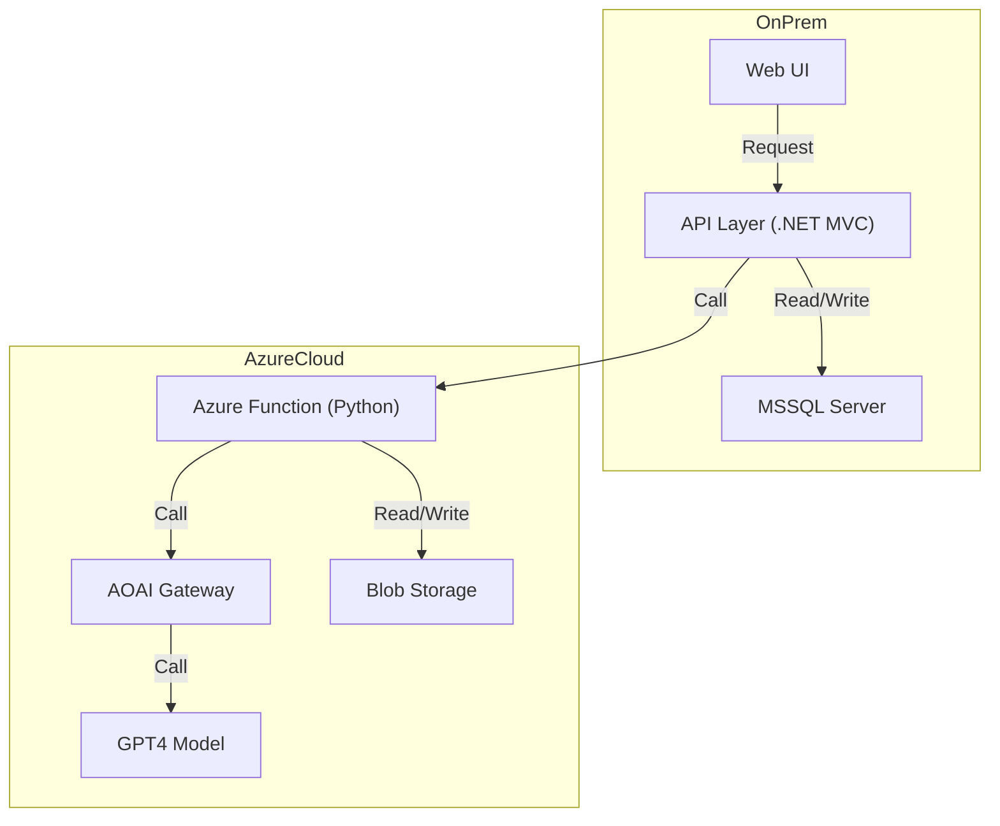
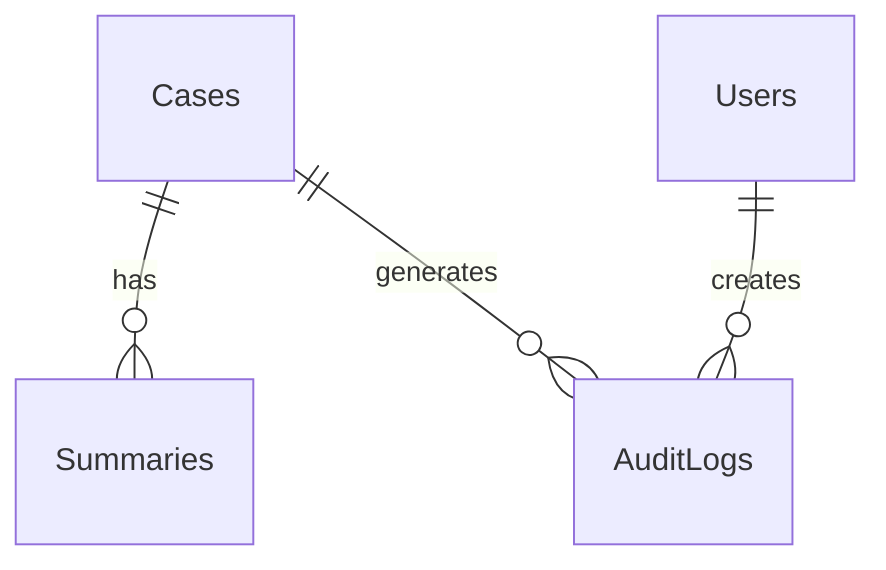

# 50_software_arch - 軟體架構與 API 設計

**建立日期**: [DATE]
**最後更新**: [DATE]
**文件版本**: 1.0.0

---

## 文件目的

定義應用程式架構、API 規格、GAI 整合與資料庫設計，區分地端與雲端技術堆疊。

---

## 軟體架構圖

### 整體架構



**架構層級**：
- **地端環境**：Web UI → API Layer (.NET MVC) → MS-SQL Server
- **雲端環境**：Azure Function (Python) → AOAI Gateway → GPT-4
- **跨環境整合**：REST API (HTTPS)

---

## 地端軟體堆疊

### 技術選型

| 層級 | 技術 | 版本 | 用途 |
|------|------|------|------|
| 作業系統 | Windows Server | 2016 | 伺服器平台 |
| 程式語言 | C# | .NET Framework 4.x | 後端開發 |
| Web 框架 | ASP.NET MVC | 5.x | Web 應用程式 |
| 資料庫 | MS-SQL Server | 2017 | 關聯式資料庫 |
| ORM | Entity Framework | 6.x | 資料存取層 |
| Web Server | IIS | 10.0 | HTTP 伺服器 |

### 地端應用程式架構

**展示層 (Presentation Layer)**：
- ASP.NET MVC Views
- Razor 範本引擎
- jQuery / Bootstrap (前端框架)

**業務邏輯層 (Business Logic Layer)**：
- C# Service Classes
- 業務規則驗證
- 工作流程引擎

**資料存取層 (Data Access Layer)**：
- Entity Framework 6.x
- Stored Procedures (MS-SQL)
- Repository Pattern

---

## 雲端軟體堆疊

### 技術選型

| 層級 | 技術 | 版本 | 用途 |
|------|------|------|------|
| 作業系統 | Linux | Ubuntu 22.04 LTS | 容器基礎 |
| 程式語言 | Python | 3.12.3 | Serverless 函式 |
| 運行環境 | Azure Functions | v4 | Serverless 平台 |
| HTTP 框架 | FastAPI / Flask | [版本] | API 開發 |
| AI SDK | OpenAI Python SDK | ≥1.0 | GPT 整合 |
| 容器 | Docker | [版本] | 應用容器化 |

### Python 套件清單

**核心套件**：
```python
# requirements.txt
python==3.12.3
azure-functions>=1.18.0
openai>=1.0.0
fastapi>=0.104.0
pydantic>=2.5.0
httpx>=0.25.0
python-dotenv>=1.0.0
```

**資料處理**：
```python
pandas>=2.1.0
numpy>=1.26.0
```

**監控與日誌**：
```python
azure-monitor-opentelemetry>=1.0.0
applicationinsights>=0.11.10
```

---

## API 設計

### RESTful API 規格

| API 端點 | 方法 | 用途 | 請求格式 | 回應格式 |
|---------|------|------|---------|---------|
| `/api/cases` | GET | 取得個案列表 | Query Params | JSON |
| `/api/cases/{id}` | GET | 取得個案詳情 | Path Param | JSON |
| `/api/summary` | POST | 生成 AI 摘要 | JSON Body | JSON |
| `/api/submit` | POST | 提交審核 | JSON Body | JSON |

**範例請求**：
```json
POST /api/summary
{
  "caseId": "12345",
  "type": "STR"
}
```

**範例回應**：
```json
{
  "summaryId": "abc123",
  "content": "...",
  "confidence": 0.95
}
```

---

## GAI 整合設計

### AOAI Gateway 串接

| 項目 | 說明 |
|------|------|
| 端點 | [AOAI Gateway URL] |
| 認證 | API Key |
| 模型 | GPT-4 / GPT-3.5-turbo |
| Timeout | 30 秒 |
| Retry | 3 次 |

### Prompt 設計

**系統 Prompt**：
```
你是一個專業的 STR/SAR 摘要撰寫助手...
```

**使用者 Prompt 範本**：
```
請根據以下交易明細產生摘要：
[交易資料]
```

---

## 資料庫設計

### 主要資料表

| 資料表名稱 | 用途 | 主鍵 | 索引 |
|-----------|------|------|------|
| Cases | 個案主檔 | case_id | created_at, status |
| Summaries | AI 摘要 | summary_id | case_id, created_at |
| Users | 使用者 | user_id | email |
| AuditLogs | 稽核日誌 | log_id | timestamp, user_id |

### ERD (簡化版)



---

## CI/CD 流程

### CI/CD Pipeline 架構圖

```mermaid
flowchart TB
    subgraph CI["CI 持續整合"]
        Repos["Git Repository"]
        Pipeline["Build Pipeline"]
        LinuxAgent["Linux Agent"]
        
        RedHat["Red Hat Registry"]
        Quay["Quay Registry"]
        AIBastion["AI Bastion Server"]
        
        ACR["Azure Container Registry"]
        
        Repos --> Pipeline
        Pipeline --> LinuxAgent
        
        RedHat -->|Base Image| Quay
        Quay -->|Pull Image| LinuxAgent
        AIBastion -->|Install Packages| LinuxAgent
        
        LinuxAgent --> ACR
    end
    
    subgraph CD["CD 持續部署"]
        WinAgent["Windows Agent"]
        AzFunc["Azure Functions"]
        
        ACR <-->|Pull/Push Image| AzFunc
        WinAgent -->|Deploy Config| AzFunc
    end
    
    CI -..|CD| CD
    
    style CI fill:#e3f2fd
    style CD fill:#f3e5f5
    style ACR fill:#fff9c4
    style AzFunc fill:#c8e6c9
```

### CI 階段說明

**持續整合流程**：

1. **程式碼提交**：
   - 開發者推送程式碼至 Git Repository
   - 觸發自動化 Build Pipeline

2. **映像檔建置** (Linux Agent)：
   - 從 Red Hat 經由系統科協助提取 Base Image
   - Quay Registry 管理 Base Image
   - AI Bastion (跳板機) 安裝所需套件
   - 建置 Docker Container Image

3. **映像檔推送**：
   - 推送至 Azure Container Registry (ACR)
   - 標記版本號與環境標籤

### CD 階段說明

**持續部署流程**：

1. **映像檔拉取**：
   - Azure Functions 從 ACR 拉取最新映像檔
   - 自動或手動觸發部署

2. **配置部署** (Windows Agent)：
   - Windows Agent 管理部署配置
   - 更新環境變數、連線字串
   - 部署至 Azure Functions

3. **版本管理**：
   - ACR 與 Azure Functions 雙向同步
   - 支援快速回滾至前一版本

### Pipeline 配置

| 階段 | 工具/平台 | 執行環境 | 主要任務 |
|------|----------|----------|----------|
| Source Control | Git (GitHub/Azure DevOps) | - | 版本控制 |
| CI Build | Azure Pipelines | Linux Agent | 建置 + 測試 |
| Image Registry | Azure Container Registry | Cloud | 映像檔管理 |
| CD Deploy | Azure Pipelines | Windows Agent | 部署配置 |
| Runtime | Azure Functions | Serverless | 執行環境 |

### 建置步驟範例

**Dockerfile**：
```dockerfile
# Base Image from Quay (Red Hat)
FROM quay.io/redhat/base-image:latest

# Install packages via AI Bastion
COPY requirements.txt .
RUN pip install -r requirements.txt

# Application code
COPY . /app
WORKDIR /app

CMD ["python", "app.py"]
```

**CI Pipeline (YAML)**：
```yaml
trigger:
  - main

pool:
  vmImage: 'ubuntu-latest'

steps:
  - task: Docker@2
    inputs:
      command: 'build'
      repository: 'aml-function'
      dockerfile: '**/Dockerfile'
  
  - task: Docker@2
    inputs:
      command: 'push'
      repository: 'aml-function'
      containerRegistry: 'ACR'
```

---

## 技術堆疊

| 層級 | 技術選型 | 版本 |
|------|---------|------|
| 前端 | [React/Vue/Angular] | [版本] |
| 後端 | [Python/Node.js/Java] | [版本] |
| API框架 | [FastAPI/Express/Spring] | [版本] |
| 資料庫 | [PostgreSQL/MySQL/MongoDB] | [版本] |
| 快取 | [Redis] | [版本] |
| 訊息佇列 | [RabbitMQ/Kafka] | [版本] |

---

## 產生記錄

- 命令：`/speckit.softwarearch`
- API 端點：[N] 個
- 資料表：[M] 個
- GAI 模型：[型號]
