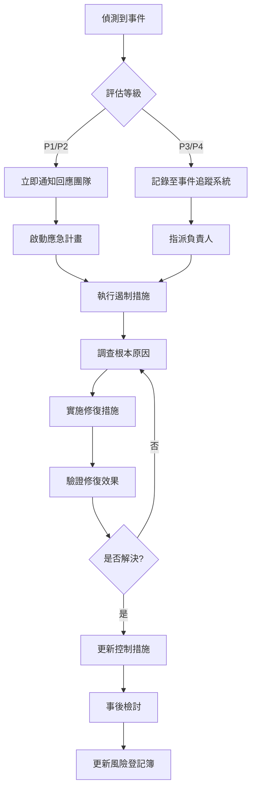

# 70_infosec - 資安需求與法規遵循

**建立日期**: [DATE]
**最後更新**: [DATE]
**文件版本**: 1.0.0

---

##文件目的

整合資安需求與法規遵循兩大主題。

---

## 資安風險說明

本專案因未涉及客戶交易和往來，故無信用風險、市場風險、作業風險和其他風險等議題，先予敘明。

**權限管理**:
本平台台依使用者工作職掌及職能區分適當授權，權限開放給第一層子公司防洗專責單位，僅有有權限之人能登入檢視，平台權限須經申請程序核准，且權限和平台既有功能之權限分開。當使用者離職或職務更動，需刪除或配合變更其權限，金控法遵處並有定期盤點權限。

**網路安全**:
本平台皆於內網作業，雖有使用 Azure OpenAI，但其服務層級及架構屬地端之延伸(皆係在公司內部使用)。另會定期實施企業網路弱點漏洞安全檢測，以防範駭客入侵及電腦病毒對系統之破壞威脅。

**資料保護**:
本平台設有浮水印顯示使用者名稱，避免有心人士使用手機拍照。另對於有權限之人於系統進行查詢及使用，系統均留有查詢軌跡。

---

# 📌 第一部分：資安需求 (InfoSec)

## 資料分級

| 分級 | 定義 | 保護要求 |
|------|------|----------|
| 公開 | 可對外公開 | 基本保護 |
| 內部 | 內部使用 | 身分驗證 |
| 機密 | 敏感資訊 | 加密+存取控制 |
| 高度機密 | 極敏感資訊 | 強化加密+稽核 |

### 專案資料分級

| 資料類型 | 分級 | 包含欄位 | 儲存位置 |
|---------|------|----------|----------|
| [資料類型] | [分級] | [欄位] | [位置] |

---

## 權限矩陣

| 角色 | 資料類型A | 資料類型B | 功能A | 功能B |
|------|----------|----------|-------|-------|
| [角色1] | 檢視/編輯 | 檢視 | 使用 | 無 |
| [角色2] | 檢視 | 檢視/編輯 | 使用 | 使用 |

---

## 身分驗證

**驗證方式**:
- [ ] 帳號密碼
- [ ] SSO (AD/LDAP)
- [ ] MFA
- [ ] 憑證認證

**密碼政策**:
- 最小長度: [X] 字元
- 有效期限: [X] 天
- 失敗鎖定: [X] 次

---

## 加密要求

| 加密類型 | 協定/演算法 | 適用範圍 |
|---------|------------|----------|
| 傳輸中加密 | TLS 1.2+ | 所有網路傳輸 |
| 靜態資料加密 | AES-256 | 資料庫、檔案 |

---

## 資安掃描

### 掃描工具與對應系統

| 掃描工具 | 掃描類型 | 對應系統/模組 | 掃描頻率 | 負責單位 | 備註 |
|---------|---------|--------------|----------|----------|------|
| Fortify | 程式碼靜態掃描 (SAST) | 內部功能模組 (.NET MVC) | 每次上版前 | 銀行資訊處 | 地端系統 |
| Fortify | 程式碼靜態掃描 (SAST) | ETL 模組 (Python) | 每次上版前 | 金控數科處 | 雲端 Azure Functions |
| White Source | 開源套件掃描 (SCA) | ETL 模組 (Python) | 每週自動掃描 | 金控數科處 | requirements.txt |
| White Source | 開源套件掃描 (SCA) | [其他使用開源套件的模組] | 每週自動掃描 | [單位] | NuGet/npm 套件 |

**掃描標準**：
- **高風險漏洞 (High/Critical)**：必須修復後才能上線
- **中風險漏洞 (Medium)**：需提出修復計畫或風險接受簽核
- **低風險漏洞 (Low)**：記錄追蹤，排程修復

**開源套件掃描範圍** (White Source)：
- Python: `requirements.txt`， `Pipfile`
- .NET: `packages.config`， `.csproj`
- Node.js: `package.json`

---

## 維運設計

### 維運項目清單

| 項次 | 維運項目 | 配合事項 | 窗口 | 執行頻率 | SLA |
|------|---------|---------|------|----------|-----|
| 1 | 每日排程執行狀況監控 | 檢查 Azure Functions 執行日誌，確認無異常失敗 | 金控數科處 | 每日 09:00 | 發現異常 30 分鐘內通報 |
| 2 | AI 模型推論監控 | 監控 AOAI API 呼叫成功率、延遲時間、配額使用率 | 金控數科處 | 即時監控 | 成功率 < 95% 立即告警 |
| 3 | 資料庫效能監控 | 監控 MS-SQL Server CPU/Memory/Disk I/O | 銀行資訊處 | 每日 | CPU > 80% 持續 10 分鐘告警 |
| 4 | 防火牆規則檢視 | 每季檢視防火牆規則，移除不必要規則 | 銀行資訊處資安科 | 每季 | - |
| 5 | 憑證到期檢查 | 檢查 SSL/TLS 憑證有效期限 | 銀行資訊處 | 每月 | 到期前 30 天更新 |
| 6 | 日誌歸檔與清理 | 歸檔超過 90 天的日誌至冷儲存 | 金控數科處 | 每月 | - |
| 7 | 災難復原演練 | 執行 DR 演練，驗證備份可用性 | 銀行資訊處 + 金控數科處 | 每半年 | RTO < 4 小時 |
| 8 | 安全性更新套用 | 套用作業系統與套件安全性更新 | 銀行資訊處 (地端) 金控數科處 (雲端) | 每月 | Critical 更新 7 天內套用 |

**維運通報機制**：
- **緊急事件** (P1)：電話 + Email + Slack 通知
- **重要事件** (P2)：Email + Slack 通知
- **一般事件** (P3)：Email 通知

**維運交接文件**：
- [ ] 系統操作手冊 (SOP)
- [ ] 監控儀表板存取權限
- [ ] 告警通知設定
- [ ] 緊急聯絡人清單

---

## 資料庫備份與備援

### 系統分類

本專案涉及的資料庫系統屬於 **第三類系統**（依據組織資訊系統分類標準）。

**第三類系統定義**：
- 非核心業務系統，中斷影響有限
- 允許較長的復原時間 (RTO ≥ 4 小時)
- 資料遺失容忍度較高 (RPO ≥ 24 小時)

### 備份策略

**地端資料庫 (MS-SQL Server 2017)**：
- **備份類型**：Full Backup + Transaction Log Backup
- **備份頻率**：
  - Full Backup：每兩週執行一次（週日凌晨 02:00）
  - Transaction Log Backup：每日執行一次（每日凌晨 04:00）
- **備份保留期限**：
  - Full Backup：保留 3 個月
  - Transaction Log：保留 30 天
- **備份儲存位置**：
  - 主要備份：本地 NAS (RAID 6)
  - 異地備份：備援機房磁帶櫃（每月）

**雲端資料庫 (Azure SQL / Blob Storage)**：
- **備份類型**：Azure 自動備份
- **備份頻率**：
  - Full Backup：每週自動執行
  - Differential Backup：每 12 小時自動執行
- **備份保留期限**：35 天 (Azure 預設)
- **地理備援**：啟用 GRS (Geo-Redundant Storage)

### 備援機制

**Cluster 同地備援** (類似 IRIS 架構)：
- **主機配置**：2 台實體伺服器 (Active-Standby)
- **資料同步**：同步複寫 (Synchronous Replication)
- **故障切換**：自動 Failover (< 5 分鐘)
- **部署位置**：同一機房不同機櫃

**災難復原指標**：
- **RTO (Recovery Time Objective)**：4 小時
- **RPO (Recovery Point Objective)**：24 小時

---

## 議題確認

### 已識別議題與應對

| 議題編號 | 議題描述 | 風險等級 | 應對措施 | 負責單位 | 狀態 |
|---------|---------|---------|---------|---------|------|
| ISS-001 | AOAI API 配額不足導致服務中斷 | 高 | 1. 設定配額告警 (80% 使用率) 2. 準備降級方案 (純人工模式) 3. 評估增購配額 | 金控數科處 | 規劃中 |
| ISS-002 | 地端與雲端系統時間不同步 | 中 | 1. 統一使用 NTP 時間伺服器 2. 監控時間偏移量 (> 1 秒告警) | 銀行資訊處 | 待確認 |
| ISS-003 | 個資遮罩機制未涵蓋所有欄位 | 高 | 1. 盤點所有個資欄位 2. 實施自動遮罩規則 3. 定期稽核遮罩有效性 | 銀行資訊處風控科 | 進行中 |
| ISS-004 | 防火牆規則過於寬鬆 | 中 | 1. 實施最小權限原則 2. 限定來源 IP 白名單 3. 移除不必要的 ANY 規則 | 銀行資訊處資安科 | 待確認 |
| ISS-005 | White Source 掃描發現高風險套件 | 高 | 1. 評估套件更新可行性 2. 若無法更新，評估替代套件 3. 若必須使用，簽核風險接受 | 金控數科處 | 持續追蹤 |
| ISS-006 | Log4j 等重大漏洞緊急應變 | 高 | 1. 建立緊急漏洞應變流程 2. 訂閱資安情資通報 3. 準備緊急修補 SOP | 銀行資訊處資安科 | 已建立 |
| ISS-007 | 備份還原演練未定期執行 | 中 | 1. 排定每半年 DR 演練 2. 記錄演練結果與改善項目 3. 更新 DR 文件 | 銀行資訊處 | 待排程 |

### 技術與資安風險

<!--
技術/資安風險追蹤
業務風險請參考 10_business.md
-->

| 風險 ID | 風險名稱 | 風險類別 | 影響 | 機率 | 風險等級 | 主要控制措施 | 殘餘風險 |
|---------|----------|----------|------|------|----------|-------------|----------|
| R-SEC-001 | [資安風險] | 資安風險 | H/M/L | H/M/L | 極高/高/中/低 | C-SEC-001 | H/M/L |
| R-TECH-001 | [技術風險] | 技術風險 | H/M/L | H/M/L | 極高/高/中/低 | C-TECH-001 | H/M/L |
| R-DATA-001 | [資料風險] | 資料風險 | H/M/L | H/M/L | 極高/高/中/低 | C-DATA-001 | H/M/L |

**常見技術/資安風險範例**:
- 資安風險: 未授權存取、資料外洩、惡意攻擊、供應鏈攻擊
- 技術風險: 技術選型錯誤、效能不足、整合失敗、相依性衝突
- 資料風險: 資料遺失、資料洩漏、資料不準確、資料品質問題

### 技術控制措施

| 控制 ID | 控制措施名稱 | 針對風險 | 控制類型 | 實施方式 | 控制證據 |
|---------|-------------|----------|----------|----------|----------|
| C-SEC-001 | [控制措施] | R-SEC-001 | 預防性/偵測性/回應性 | [技術實施方式] | [日誌/報告/測試結果] |
| C-TECH-001 | [控制措施] | R-TECH-001 | 預防性/偵測性/回應性 | [技術實施方式] | [日誌/報告/測試結果] |

**技術控制範例**:
- 加密控制: TLS 1.2+ 傳輸加密、AES-256 資料庫加密
- 存取控制: SSO/AD 身分驗證、MFA、RBAC 權限管理
- 監控控制: 異常偵測告警、資安事件記錄、效能監控

### 事件管理與回應

**事件分級**:

| 等級 | 定義 | 範例 | 回應時間 | 回應團隊 |
|------|------|------|----------|----------|
| **P1 - 緊急** | 嚴重影響業務、法規違反、重大資料外洩 | 資料庫遭竄改、大規模服務中斷 | < 1 小時 | 資安部門+IT主管+業務主管 |
| **P2 - 高** | 影響多數使用者、控制失效、中度影響 | API 配額耗盡、部分功能無法使用 | < 4 小時 | 資安部門+IT部門 |
| **P3 - 中** | 影響少數使用者、可容忍的異常 | 單一使用者權限問題、效能緩慢 | < 1 工作日 | IT部門 |
| **P4 - 低** | 輕微異常、無立即影響 | 非關鍵日誌異常、建議性改善 | < 3 工作日 | IT部門 |

**事件回應流程**:

**事件回應責任**:
- **事件管理者**: 統籌事件回應、溝通協調、決策升級
- **技術團隊**: 技術調查、系統修復、日誌分析
- **業務團隊**: 業務影響評估、使用者溝通、替代方案
- **法遵/資安**: 法規影響評估、資安事件處理、外部通報

### 議題追蹤機制

**定期檢視**：
- 每兩週資安議題追蹤會議
- 高風險議題每週追蹤

**升級機制**：
- 高風險議題超過 1 個月未解決 → 上報專案指導委員會
- 中風險議題超過 3 個月未解決 → 上報專案經理

**議題狀態**：
- **規劃中**：方案評估階段
- **待確認**：等待利害關係人確認
- **進行中**：執行解決方案
- **持續追蹤**：需長期監控
- **已解決**：議題已關閉
- **已建立**：機制已建立

---

## 產生記錄

- 命令：`/speckit.infosec` + `/speckit.compliance`
- 資料分級：[N] 種
- 法規：[M] 項
- 控制點：[X] 個
- 掃描工具：[K] 種
- 維運項目：[P] 項
- 議題：[Q] 個
