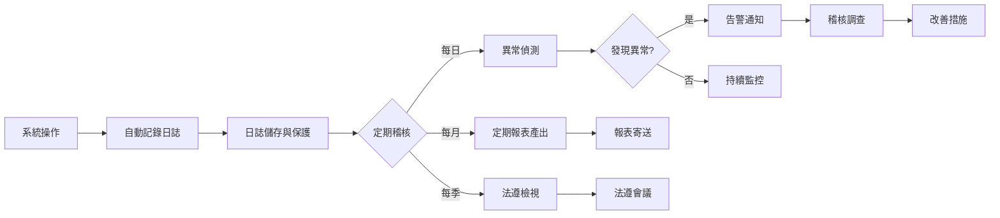
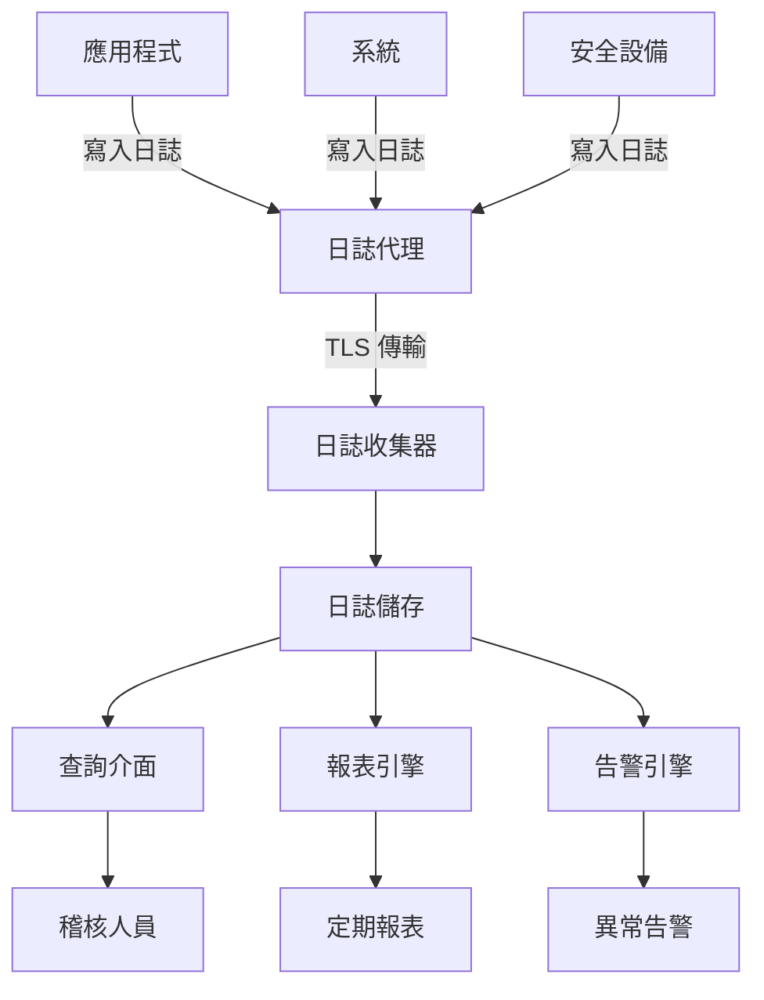

# 60_audit - 稽核可稽性需求

> **文件版本**: v1.0.0
> **最後更新**: [YYYY-MM-DD]
> **專案名稱**: [專案名稱]
> **專案代號**: [PROJECT-CODE]

---

## 📋 文件摘要

本文件定義專案的稽核需求，確保系統操作可追溯、可證明、可稽核。

**關鍵產出**：
- 必須可稽核的事件清單
- 日誌結構與記錄要求
- 資料保留期限與查詢能力
- 稽核報表需求與產出頻率

**前置文件**：
- `30_risk_control.md` - 風險與控制措施
- `40_infosec.md` - 資安日誌需求
- `50_compliance.md` - 法遵證據留存要求

**後續文件**：
- `spec.md` - 技術規格（日誌系統實作）
- `plan.md` - 實作計畫（稽核功能開發）

---

## 1. 必須可稽核的事件

### 1.1 稽核事件分類

**業務操作事件**（與核心業務流程相關）：

| 事件編號 | 事件名稱 | 觸發時機 | 稽核目的 | 優先級 |
|---------|---------|---------|---------|--------|
| AE-BIZ-001 | [事件名稱] | [何時發生] | [為何需稽核] | P0/P1/P2 |
| AE-BIZ-002 | [事件名稱] | [何時發生] | [為何需稽核] | P0/P1/P2 |

**範例（STR/SAR）**：
| 事件編號 | 事件名稱 | 觸發時機 | 稽核目的 | 優先級 |
|---------|---------|---------|---------|--------|
| AE-BIZ-001 | 查看 STR 個案原始資料 | 分析人員開啟個案詳情 | 證明敏感資料存取合理性 | P0 |
| AE-BIZ-002 | 查看模型建議摘要 | 分析人員請求模型輸出 | 證明使用 AI 輔助 | P0 |
| AE-BIZ-003 | 修改摘要內容 | 分析人員編輯摘要 | 證明人工審核介入程度 | P0 |
| AE-BIZ-004 | 確認最終摘要 | 分析人員送出最終版本 | 證明案件處理完成 | P0 |
| AE-BIZ-005 | 退回摘要重新處理 | 主管退回案件 | 追蹤品質控制流程 | P1 |

**系統管理事件**（與系統維運相關）：

| 事件編號 | 事件名稱 | 觸發時機 | 稽核目的 | 優先級 |
|---------|---------|---------|---------|--------|
| AE-SYS-001 | [事件名稱] | [何時發生] | [為何需稽核] | P0/P1/P2 |

**範例**：
| 事件編號 | 事件名稱 | 觸發時機 | 稽核目的 | 優先級 |
|---------|---------|---------|---------|--------|
| AE-SYS-001 | 模型版本上線 | 部署新模型版本 | 追蹤模型變更歷史 | P0 |
| AE-SYS-002 | 模型版本下線/滾回 | 移除或回退模型版本 | 證明變更管理流程 | P0 |
| AE-SYS-003 | 權限變更 | 修改使用者角色或權限 | 證明存取控制管理 | P0 |
| AE-SYS-004 | 系統配置變更 | 修改系統參數或設定 | 追蹤系統變更 | P1 |
| AE-SYS-005 | 資料匯出 | 使用者匯出資料 | 偵測異常資料外洩 | P0 |

**資安事件**（與資訊安全相關）：

| 事件編號 | 事件名稱 | 觸發時機 | 稽核目的 | 優先級 |
|---------|---------|---------|---------|--------|
| AE-SEC-001 | [事件名稱] | [何時發生] | [為何需稽核] | P0/P1/P2 |

**範例**：
| 事件編號 | 事件名稱 | 觸發時機 | 稽核目的 | 優先級 |
|---------|---------|---------|---------|--------|
| AE-SEC-001 | 使用者登入成功 | 通過身分驗證 | 追蹤使用者活動 | P1 |
| AE-SEC-002 | 使用者登入失敗 | 登入驗證失敗 | 偵測暴力破解攻擊 | P0 |
| AE-SEC-003 | 未授權存取嘗試 | 存取未授權資源 | 偵測權限繞過嘗試 | P0 |
| AE-SEC-004 | 異常時段存取 | 非工作時間存取敏感資料 | 偵測異常行為 | P1 |

### 1.2 稽核事件優先級定義

- **P0（最高）**: 涉及法規遵循、資料保護、安全事件，必須記錄且無例外
- **P1（高）**: 涉及業務關鍵操作、異常偵測，必須記錄但可有效能最佳化
- **P2（中）**: 輔助性稽核、統計分析用途，可依需求選擇性記錄

---

## 2. 日誌結構需求

### 2.1 標準日誌欄位

**所有稽核日誌必須包含的欄位**：

| 欄位名稱 | 資料類型 | 必填 | 說明 | 範例值 |
|---------|---------|------|------|--------|
| log_id | UUID | 是 | 日誌唯一識別碼 | "550e8400-e29b-41d4-a716-446655440000" |
| timestamp | ISO 8601 DateTime | 是 | 事件發生時間（UTC） | "2025-01-15T08:30:45.123Z" |
| event_type | String | 是 | 事件類型（參考 1.1） | "AE-BIZ-003" |
| user_id | String | 是 | 操作人員識別碼 | "user@example.com" |
| user_role | String | 是 | 操作人員角色 | "analyst" |
| session_id | UUID | 是 | 使用者會話識別碼 | "a1b2c3d4-e5f6-7890-abcd-ef1234567890" |
| source_ip | IP Address | 是 | 來源 IP 位址 | "[內部IP]" |
| result | Enum | 是 | 操作結果（success/failure/error） | "success" |
| message | String | 否 | 事件描述訊息 | "User viewed case STR-2025-001" |

**業務相關欄位**（依事件類型擴充）：

| 欄位名稱 | 資料類型 | 適用事件 | 說明 | 範例值 |
|---------|---------|---------|------|--------|
| case_id | String | AE-BIZ-* | STR/SAR 個案編號 | "STR-2025-001" |
| model_version | String | AE-BIZ-002, AE-SYS-001/002 | 模型版本號 | "v1.2.3" |
| before_value | JSON | AE-BIZ-003 | 變更前內容（摘要修改） | {"summary": "..."} |
| after_value | JSON | AE-BIZ-003 | 變更後內容（摘要修改） | {"summary": "..."} |
| action_detail | JSON | 多種事件 | 操作詳細參數 | {"field": "summary", "length": 150} |

### 2.2 日誌格式範例

**範例 1：查看 STR 個案（AE-BIZ-001）**

```json
{
  "log_id": "550e8400-e29b-41d4-a716-446655440000",
  "timestamp": "2025-01-15T08:30:45.123Z",
  "event_type": "AE-BIZ-001",
  "event_name": "view_case",
  "user_id": "analyst001@bank.com",
  "user_role": "analyst",
  "session_id": "a1b2c3d4-e5f6-7890-abcd-ef1234567890",
  "source_ip": "[使用者IP]",
  "result": "success",
  "message": "User viewed STR case original data",
  "case_id": "STR-2025-001",
  "action_detail": {
    "viewed_sections": ["customer_info", "transaction_data", "investigation_notes"]
  }
}
```

**範例 2：修改摘要內容（AE-BIZ-003）**

```json
{
  "log_id": "660e9500-f39c-52e5-b827-557766551111",
  "timestamp": "2025-01-15T08:35:12.456Z",
  "event_type": "AE-BIZ-003",
  "event_name": "edit_summary",
  "user_id": "analyst001@bank.com",
  "user_role": "analyst",
  "session_id": "a1b2c3d4-e5f6-7890-abcd-ef1234567890",
  "source_ip": "192.168.1.100",
  "result": "success",
  "message": "User edited summary content",
  "case_id": "STR-2025-001",
  "model_version": "v1.2.3",
  "before_value": {
    "summary": "客戶於短期內進行多筆大額現金存款...",
    "length": 120
  },
  "after_value": {
    "summary": "客戶於短期內進行多筆大額現金存款，且無法提供合理資金來源...",
    "length": 150
  },
  "action_detail": {
    "edit_type": "append",
    "added_text": "且無法提供合理資金來源",
    "modification_percentage": 25
  }
}
```

**範例 3：模型版本變更（AE-SYS-001）**

```json
{
  "log_id": "770ea600-g40d-63f6-c938-668877662222",
  "timestamp": "2025-01-15T09:00:00.000Z",
  "event_type": "AE-SYS-001",
  "event_name": "deploy_model_version",
  "user_id": "admin@bank.com",
  "user_role": "system_admin",
  "session_id": "b2c3d4e5-f6g7-8901-bcde-fg2345678901",
  "source_ip": "[伺服器IP]",
  "result": "success",
  "message": "Deployed new model version to production",
  "model_version": "v1.3.0",
  "before_value": {
    "previous_version": "v1.2.3"
  },
  "after_value": {
    "new_version": "v1.3.0",
    "deployment_method": "blue-green"
  },
  "action_detail": {
    "change_request_id": "CR-2025-0042",
    "approval_by": "compliance_manager@bank.com",
    "test_completion_date": "2025-01-14"
  }
}
```

### 2.3 日誌安全性要求

**敏感資料遮罩**：
- 個人資料（姓名、身分證、電話）→ 僅記錄資料類型，不記錄實際值
- 範例：❌ `{"customer_name": "王小明"}` → ✅ `{"data_type": "customer_name", "masked": true}`

**日誌完整性保護**：
- 日誌寫入後不可修改（append-only）
- 日誌傳輸加密（TLS 1.2+）
- 日誌儲存加密（AES-256）
- 日誌檔案完整性驗證（如：SHA-256 checksum）

---

## 3. 保留期間與查詢能力

### 3.1 資料保留期限

**依法規要求分級保留**：

| 資料類型 | 法規依據 | 保留期限 | 儲存位置 | 歸檔策略 |
|---------|---------|---------|---------|---------|
| [資料類型] | [法規] | [期限] | [位置] | [策略] |

**範例（STR/SAR）**：

| 資料類型 | 法規依據 | 保留期限 | 儲存位置 | 歸檔策略 |
|---------|---------|---------|---------|---------|
| STR 相關操作日誌 | 洗錢防制法 | 7 年 | 稽核日誌系統（主儲存） | 即時寫入，每月備份 |
| 模型使用日誌 | 洗錢防制法、內部政策 | 7 年 | 稽核日誌系統 | 即時寫入，每月備份 |
| 系統管理日誌 | 內部政策 | 3 年 | 稽核日誌系統 | 即時寫入，每月備份 |
| 安全事件日誌 | 資通安全管理法 | 1 年（熱儲存）<br>+ 6 年（冷儲存） | 稽核日誌系統 + 歸檔儲存 | 超過 1 年後歸檔至冷儲存 |
| 一般存取日誌 | 內部政策 | 6 個月 | 稽核日誌系統 | 滾動式刪除 |

**歸檔策略說明**：
- **熱儲存**（Hot Storage）：即時查詢，查詢時間 < 5 秒
- **溫儲存**（Warm Storage）：歸檔但可查詢，查詢時間 < 1 分鐘
- **冷儲存**（Cold Storage）：長期保存，查詢時間可達數小時（需事前申請）

### 3.2 查詢能力需求

**必須支援的查詢維度**：

| 查詢維度 | 查詢參數 | 查詢範例 | 回應時間要求 |
|---------|---------|---------|-------------|
| 個案編號 | case_id | "查詢 STR-2025-001 所有相關操作" | < 5 秒 |
| 操作人員 | user_id | "查詢 analyst001 所有操作記錄" | < 10 秒 |
| 日期區間 | timestamp (range) | "查詢 2025-01-01 ~ 2025-01-31 所有日誌" | < 30 秒 |
| 模型版本 | model_version | "查詢模型 v1.2.3 所有使用記錄" | < 10 秒 |
| 事件類型 | event_type | "查詢所有摘要修改事件（AE-BIZ-003）" | < 10 秒 |
| 複合查詢 | 多個參數 | "查詢特定人員在特定期間的特定事件" | < 30 秒 |

**查詢結果格式**：
- 支援 JSON 格式匯出（API 查詢）
- 支援 CSV 格式匯出（報表產出）
- 支援分頁查詢（避免單次查詢過大）
- 支援排序（依時間、事件類型等）

**查詢權限控制**：
- 稽核部門：可查詢所有日誌
- 法遵部門：可查詢業務操作日誌、模型使用日誌
- 使用者本人：僅可查詢自己的操作記錄
- 系統管理員：可查詢系統管理日誌、安全事件日誌

---

## 4. 稽核報表需求

### 4.1 定期稽核報表

**必須產出的稽核報表**：

| 報表編號 | 報表名稱 | 產出頻率 | 接收對象 | 用途 |
|---------|---------|---------|---------|------|
| RA-001 | [報表名稱] | 每日/每週/每月/每季 | [角色] | [用途說明] |

**範例（STR/SAR）**：

| 報表編號 | 報表名稱 | 產出頻率 | 接收對象 | 用途 |
|---------|---------|---------|---------|------|
| RA-AML-001 | 分析人員模型使用情況統計 | 每月 | 法遵部門、業務主管 | 統計「模型建議被修改程度」，評估模型品質 |
| RA-AML-002 | 模型版本異常標記統計 | 每月 | 法遵部門、IT 部門 | 按模型版本統計「異常標記個案」比例，評估模型效能 |
| RA-AML-003 | STR 個案處理時間分析 | 每月 | 業務主管 | 統計從建立到摘要確認的時間分布，評估流程效率 |
| RA-SEC-001 | 異常存取行為報告 | 每週 | 資安部門、法遵部門 | 列出異常時段存取、未授權嘗試等異常行為 |
| RA-SEC-002 | 權限變更稽核報告 | 每月 | 稽核部門 | 列出所有權限變更記錄，確認變更合理性 |
| RA-SYS-001 | 系統變更稽核報告 | 每月 | 稽核部門、IT 部門 | 列出所有模型版本變更、配置變更記錄 |

### 4.2 報表內容結構

**RA-AML-001: 分析人員模型使用情況統計**

報表內容：
- 分析人員清單
- 每位分析人員處理案件數
- 模型建議被採用率（未修改比例）
- 模型建議被修改率（修改比例）
- 平均修改幅度（修改字數 / 原始字數）
- 異常值標註（修改率 > 80% 者）

範例表格：
| 分析人員 | 處理案件數 | 模型建議採用率 | 模型建議修改率 | 平均修改幅度 | 異常標註 |
|---------|-----------|--------------|--------------|-------------|---------|
| analyst001 | 50 | 60% | 40% | 25% | - |
| analyst002 | 45 | 30% | 70% | 55% | ⚠️ 高修改率 |

**RA-AML-002: 模型版本異常標記統計**

報表內容：
- 模型版本清單
- 每個版本處理案件數
- 異常標記個案數（模型信心分數 < 0.5）
- 異常標記比例
- 趨勢分析（與前一版本比較）

範例表格：
| 模型版本 | 處理案件數 | 異常標記個案數 | 異常標記比例 | 趨勢 |
|---------|-----------|--------------|-------------|------|
| v1.2.3 | 200 | 25 | 12.5% | ↑ +3% |
| v1.3.0 | 150 | 10 | 6.7% | ↓ -5.8% |

**RA-AML-003: STR 個案處理時間分析**

報表內容：
- 處理時間統計（平均、中位數、最大、最小）
- 處理時間分布圖（直方圖）
- 超時案件清單（處理時間 > 24 小時）
- 流程瓶頸分析（哪個步驟耗時最長）

範例表格：
| 時間區間 | 案件數 | 比例 |
|---------|-------|------|
| < 1 小時 | 50 | 25% |
| 1-4 小時 | 80 | 40% |
| 4-24 小時 | 60 | 30% |
| > 24 小時 | 10 | 5% |

### 4.3 報表產出方式

**自動化報表產出**：
- 定期自動執行（每月 1 日凌晨 2:00 產出上月報表）
- 報表格式：PDF + CSV（資料明細）
- 自動寄送給指定接收對象
- 報表儲存於稽核報表庫（保留 7 年）

**即時報表查詢**：
- 稽核人員可隨時查詢即時報表
- 支援自訂查詢條件（時間區間、人員、模型版本等）
- 支援匯出功能（PDF / CSV / Excel）

---

## 5. 稽核流程與 RACI

### 5.1 稽核活動 RACI 矩陣

| 稽核活動 | 稽核部門 | 法遵部門 | IT 部門 | 業務單位 | 資安部門 |
|---------|---------|---------|---------|---------|---------|
| 定義稽核需求 | **A** | C | **R** | C | C |
| 日誌系統實作 | C | I | **R** | I | C |
| 稽核日誌查詢 | **R** | **R** | C | I | **R** |
| 稽核報表產出 | **A** | **R** | C | I | C |
| 稽核發現追蹤 | **A** | C | **R** | C | C |
| 稽核報告發布 | **R** | C | I | I | I |
| 外部稽核應對 | **A** | **R** | **R** | C | **R** |

**角色說明**：
- **R (Responsible)**: 執行者
- **A (Accountable)**: 最終負責人（決策者）
- **C (Consulted)**: 需諮詢（雙向溝通）
- **I (Informed)**: 需告知（單向通知）

### 5.2 稽核流程

**日常稽核流程**：



**外部稽核應對流程**：


---

## 6. 稽核告警與異常偵測

### 6.1 稽核告警規則

**必須告警的異常情境**：

| 告警編號 | 告警名稱 | 觸發條件 | 告警等級 | 通知對象 | 回應時間 |
|---------|---------|---------|---------|---------|---------|
| ALERT-001 | [告警名稱] | [條件] | 高/中/低 | [角色] | [時間] |

**範例**：

| 告警編號 | 告警名稱 | 觸發條件 | 告警等級 | 通知對象 | 回應時間 |
|---------|---------|---------|---------|---------|---------|
| ALERT-SEC-001 | 短時間多次登入失敗 | 同一帳號 15 分鐘內登入失敗 > 5 次 | 高 | 資安部門、該使用者主管 | 立即 |
| ALERT-SEC-002 | 異常時段存取敏感資料 | 非工作時段（22:00-07:00）存取 STR 個案 | 中 | 資安部門、法遵部門 | 24 小時內 |
| ALERT-BIZ-001 | 異常大量資料查詢 | 單一使用者單日查詢 > 100 個案 | 中 | 該使用者主管、稽核部門 | 24 小時內 |
| ALERT-SYS-001 | 未經核准的權限變更 | 權限變更無對應變更單 | 高 | 稽核部門、IT 主管 | 立即 |
| ALERT-AML-001 | 模型建議全部被修改 | 模型建議摘要 100% 被修改（連續 5 次） | 中 | 法遵部門、IT 部門 | 24 小時內 |

### 6.2 異常偵測機制

**基於規則的偵測**（Rule-based）：
- 預設規則（如上表告警規則）
- 自訂規則（法遵或稽核部門可新增規則）
- 規則引擎每 15 分鐘執行一次

**基於統計的偵測**（Statistical）：
- 基線建立：學習使用者正常行為模式
- 異常偵測：超出基線 2 個標準差視為異常
- 範例：某分析人員平均每日處理 10 個案，突然單日處理 50 個案 → 告警

**基於機器學習的偵測**（可選）：
- 訓練異常偵測模型（如：Isolation Forest）
- 偵測未知的異常模式
- 僅用於輔助，不取代規則偵測

---

## 7. 稽核系統技術需求

### 7.1 日誌系統架構

**日誌收集層**：
- 應用程式日誌（Application Logs）
- 系統日誌（System Logs）
- 安全日誌（Security Logs）
- 網路日誌（Network Logs）

**日誌傳輸層**：
- 使用 Syslog 或等效協議
- TLS 加密傳輸
- 確保日誌傳輸可靠性（不遺失）

**日誌儲存層**：
- 結構化日誌儲存（如：Elasticsearch, OpenSearch）
- 時間序列最佳化
- 支援快速查詢與聚合

**日誌分析層**：
- 查詢介面（Web UI）
- 報表產出引擎
- 告警引擎

**參考架構**：



### 7.2 效能需求

| 效能指標 | 要求 |
|---------|------|
| 日誌寫入延遲 | < 1 秒（從事件發生到寫入儲存） |
| 日誌查詢回應時間（熱儲存） | < 5 秒（單一個案查詢）<br>< 30 秒（複合查詢） |
| 日誌查詢回應時間（冷儲存） | < 5 分鐘（需事前申請） |
| 日誌系統可用性 | 99.5%（工作時段 09:00-19:00） |
| 日誌儲存容量 | 支援至少 7 年資料（預估：[X] TB） |

### 7.3 災難復原需求

| 項目 | 要求 |
|------|------|
| RTO（Recovery Time Objective） | 4 小時（日誌查詢功能） |
| RPO（Recovery Point Objective） | 0（不得遺失任何日誌） |
| 備份頻率 | 每日增量備份 + 每月完整備份 |
| 備份保留 | 與日誌保留期限相同（7 年） |
| 備份異地儲存 | 備份需複製至異地機房 |

---

## 8. 品質檢查

### 8.1 完整性檢查

- [ ] 至少定義 10 個必須可稽核的事件
- [ ] 日誌結構包含所有必要欄位
- [ ] 所有事件類型有對應的日誌格式範例
- [ ] 資料保留期限明確（依法規要求）
- [ ] 至少定義 3 個定期稽核報表

### 8.2 一致性檢查

- [ ] 稽核事件與 20_process.md 的流程步驟對齊
- [ ] 資料保留期限與 50_compliance.md 的法遵要求一致
- [ ] 稽核報表與 30_risk_control.md 的 KRI 對齊
- [ ] RACI 角色與 00_meta.md 的利害關係人一致

### 8.3 可執行性檢查

- [ ] 日誌格式技術可實作（JSON 結構合理）
- [ ] 查詢回應時間需求合理（考量資料量）
- [ ] 報表產出可自動化或有明確手動流程
- [ ] 告警規則明確且可實作

---

## 9. 會議記錄

### 會議 01 - 稽核需求確認會議

**日期**: [YYYY-MM-DD]
**參與者**: [稽核部門、法遵部門、IT 部門、資安部門]

**討論議題**：
1. 確認必須可稽核的事件清單
2. 討論日誌結構與記錄要求
3. 確認資料保留期限
4. 討論稽核報表需求

**決議事項**：
- [ ] [決議 1]
- [ ] [決議 2]

**待辦事項**：
- [ ] [待辦 1] - 負責人：[姓名] - 期限：[日期]
- [ ] [待辦 2] - 負責人：[姓名] - 期限：[日期]

---

## 附錄

### A. 稽核事件完整清單

[詳細的稽核事件清單，包含所有業務操作、系統管理、資安事件]

### B. 日誌欄位資料字典

| 欄位名稱 | 資料類型 | 長度 | 必填 | 索引 | 說明 |
|---------|---------|------|------|------|------|
| log_id | UUID | 36 | 是 | 主鍵 | 日誌唯一識別碼 |
| timestamp | DateTime | - | 是 | 索引 | 事件發生時間（UTC） |
| ... | ... | ... | ... | ... | ... |

### C. 稽核術語對照表

| 術語 | 定義 | 英文對照 |
|------|------|---------|
| 稽核軌跡 | 可追溯的操作記錄 | Audit Trail |
| 稽核日誌 | 用於稽核的系統日誌 | Audit Log |
| 熱儲存 | 即時查詢的高效能儲存 | Hot Storage |
| 冷儲存 | 長期歸檔的低成本儲存 | Cold Storage |
| RTO | 復原時間目標 | Recovery Time Objective |
| RPO | 復原點目標 | Recovery Point Objective |

---

**文件核准**：

| 角色 | 姓名 | 簽名 | 日期 |
|------|------|------|------|
| 稽核部門主管 | [姓名] | [簽名] | [日期] |
| 法遵部門主管 | [姓名] | [簽名] | [日期] |
| IT 部門主管 | [姓名] | [簽名] | [日期] |
| 專案經理 | [姓名] | [簽名] | [日期] |
