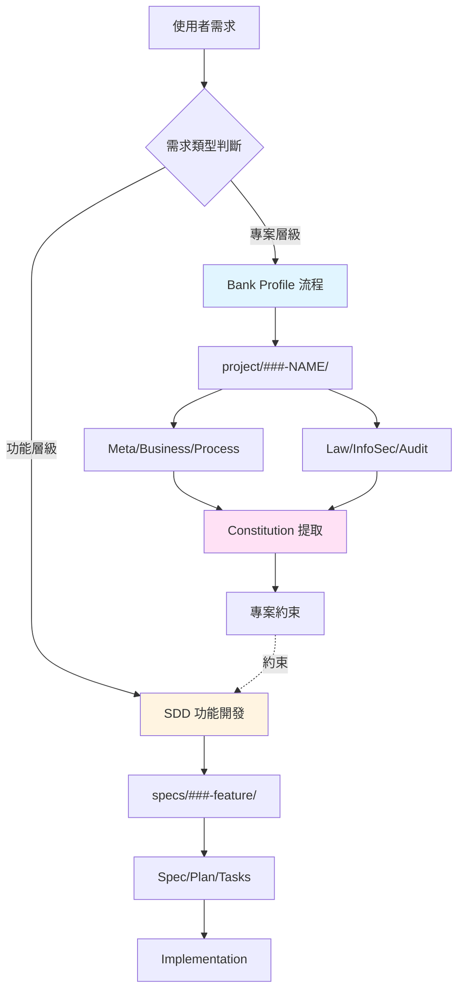
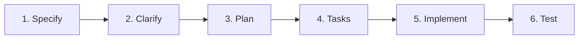
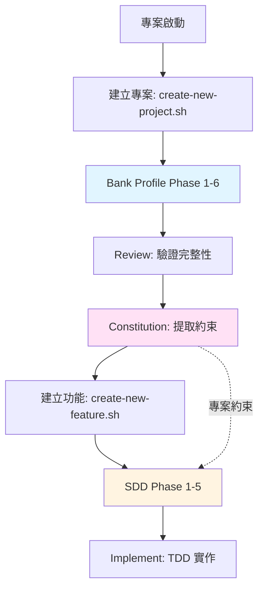
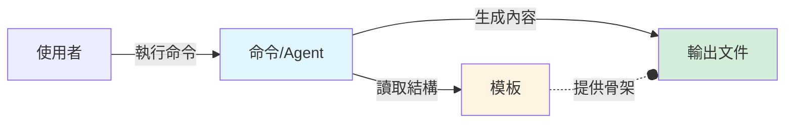
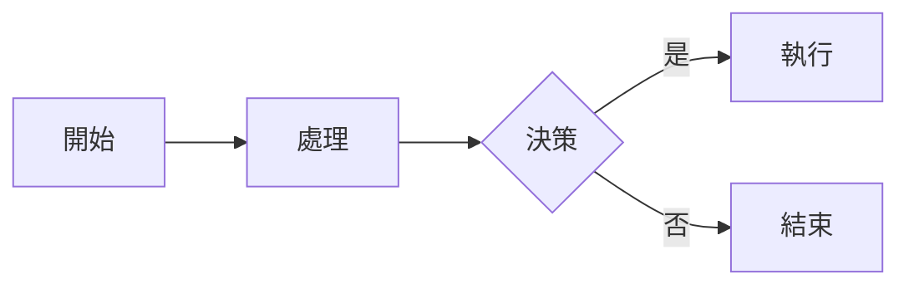

# 架構說明 - SDD Kit

本文檔詳細說明 SDD Kit 的系統架構、設計理念和實作細節。

## 系統概覽

SDD Kit 是一個雙層架構的規格管理系統：



## 核心架構

### 1. Speckit/Specify 原始架構（功能導向）

**目的**：功能層級的 SDD 工作流程

**目錄結構**：
```
specs/###-feature-name/
├── spec.md          # 功能規格（Gherkin 場景）
├── plan.md          # 實作規劃
├── tasks.md         # 任務清單
├── data-model.md    # 資料模型
└── contracts/       # API 契約
```

**工作流程**：


**關鍵腳本**：
- `create-new-feature.sh`: 建立 `###-feature-name` 分支與目錄
- `check-prerequisites.sh`: 驗證前置條件
- `common.sh`: 共用函數（`get_feature_paths`, `find_feature_dir_by_prefix`）

**設計決策**：
- 使用 Git 分支名稱作為功能編號（`###-feature-name`）
- 支援多個分支對應同一個 spec（透過數字前綴匹配）
- 無 Git 環境下降級到目錄查找

---

### 2. Project 新增架構（專案導向）

**目的**：專案層級的 Project 文檔管理

**目錄結構**：
```
project/###-PROJECTNAME/
├── meta/
│   └── 00_meta.md              # 專案元資料
├── business/
│   └── 10_business.md          # 業務需求與風險
├── process/
│   ├── 20_system_flow.md       # 系統流程圖
│   ├── 30_network_arch.md      # 網路架構
│   ├── 40_hardware_arch.md     # 硬體架構
│   └── 50_software_arch.md     # 軟體架構
├── law/
│   └── 60_law.md               # 法規遵循
├── infosec/
│   └── 70_infosec.md           # 資訊安全與技術風險
├── nfr/
│   └── 80_nfr.md               # 非功能需求
├── audit/
│   └── 90_audit.md             # 稽核與 KRI 監控
├── API/                        # API 規格
└── export/                     # 匯出的 PPTX/DOCX
```

**工作流程**：


**關鍵腳本**：
- `create-new-project.sh`: 建立 `###-PROJECTNAME` 目錄（模仿 `create-new-feature.sh`）
- `common.sh`: 新增專案函數（`get_project_paths`, `get_current_project`, `find_project_dir_by_prefix`, `get_highest_project_number`）

**設計決策**：
- 不使用 Git 分支，直接使用目錄編號
- 自動產生下一個編號（001, 002, ...）
- 支援手動指定編號（`--number`）
- 專案名稱自動轉大寫並替換特殊字元為 `-`

---

## 層次關係

### 專案 vs 功能

| 特性 | 專案層級 | 功能層級 |
|------|---------|---------|
| **目的** | 需求分析、合規文檔 | 功能規格、開發實作 |
| **目錄** | `project/###-NAME/` | `specs/###-feature/` |
| **文件數** | 10+ 個（Bank Profile） | 3-5 個（SDD） |
| **使用時機** | 專案啟動、需求盤點 | IT 開發、功能實作 |
| **Git 分支** | 不使用 | 使用（`###-feature-name`） |
| **編號規則** | 自動遞增或手動 | 自動遞增 + 檢查遠端 |
| **模板** | `/templates/*-template.md` | `/templates/spec-template.md` |

### 完整流程



---

## AI 助手整合

### Claude (.claude/commands/)

**16 個命令**：
- `/speckit.meta`, `/speckit.business`, `/speckit.process`
- `/speckit.law`, `/speckit.infosec`, `/speckit.audit`
- `/speckit.review`, `/speckit.constitution`
- `/speckit.specify`, `/speckit.clarify`, `/speckit.plan`, `/speckit.tasks`, `/speckit.implement`
- `/speckit.analyze`, `/speckit.checklist`

**格式**：Markdown 檔案，包含詳細的執行步驟

### GitHub Copilot (.github/agents/)

**18 個 agents**：
- Bank Profile: `speckit.meta`, `speckit.business`, `speckit.process`, `speckit.law`, `speckit.infosec`, `speckit.audit`, `speckit.review`
- SDD: `speckit.specify`, `speckit.clarify`, `speckit.plan`, `speckit.tasks`, `speckit.implement`
- Constitution: `speckit.constitution`
- Project管理: `project.create`, `project.context`
- 分析: `speckit.analyze`, `speckit.checklist`, `speckit.taskstoissues`

**格式**：
- `agents/*.agent.md`: 詳細執行邏輯（YAML frontmatter + Markdown）
- `prompts/*.prompt.md`: 簡短提示

**全域指示**：`.github/copilot-instructions.md`
- 專案概述、目錄結構、工作流程
- 命令對照表
- 專案特定約束（從 `PROJECT_SUMMARY.md` 提取）

---

## 腳本架構

### create-new-project.sh

**功能**：建立專案目錄與子目錄結構

**參數**：
```bash
create-new-project.sh [--json] [--project-name <NAME>] [--number N] <description>
```

**邏輯流程**：
1. 解析參數（`--project-name`, `--number`）
2. 查找 repository root（`find_repo_root`）
3. 取得最高編號（`get_highest_from_projects`）
4. 產生專案名稱（`generate_project_name` 或 `clean_project_name`）
5. 建立目錄結構（9 個子目錄 + export）
6. 複製模板（`00_meta-template.md` → `meta/00_meta.md`）
7. 設定環境變數（`PROJECT_CONTEXT`）

**與 create-new-feature.sh 的差異**：

| 特性 | create-new-feature | create-new-project |
|------|-------------------|-------------------|
| 目標目錄 | `specs/` | `project/` |
| Git 分支 | 建立分支 | 不建立 |
| 編號來源 | specs + git branches | project/ 目錄 |
| 名稱格式 | lowercase-with-dashes | UPPERCASE-WITH-DASHES |
| 子目錄 | 無（只有 spec.md） | 9 個子目錄 |
| 環境變數 | `SPECIFY_FEATURE` | `PROJECT_CONTEXT` |

### common.sh 擴充

**新增函數**：

1. **`get_project_root()`**
   - 回傳：`$REPO_ROOT/project`

2. **`get_highest_project_number(project_root)`**
   - 掃描 `project/` 下所有 `###-*` 目錄
   - 回傳最高編號

3. **`get_current_project()`**
   - 優先讀取 `$PROJECT_CONTEXT` 環境變數
   - 否則查找最新專案（最高編號）

4. **`find_project_dir_by_prefix(project_root, project_name)`**
   - 根據 `###-` 前綴查找專案目錄
   - 支援多個專案編號前綴相同的情況（錯誤處理）

5. **`get_project_paths()`**
   - 輸出所有專案相關路徑變數（類似 `get_feature_paths`）
   - 回傳：`PROJECT_ROOT`, `CURRENT_PROJECT`, `PROJECT_DIR`, `PROJECT_META`, 等

---

## 模板系統

### Project 模板（15 個）

```
.specify/templates/
├── 00_meta-template.md          # 專案元資料
├── 10_business-template.md      # 業務需求
├── 20_system_flow-template.md   # 系統流程
├── 30_network_arch-template.md  # 網路架構
├── 40_hardware_arch-template.md # 硬體架構
├── 50_software_arch-template.md # 軟體架構
├── 60_law-template.md           # 法規遵循
├── 70_infosec-template.md       # 資訊安全
├── 80_nfr-template.md           # 非功能需求
├── 90_audit-template.md         # 稽核
├── spec-template.md             # SDD 功能規格
├── plan-template.md             # SDD 實作規劃
├── tasks-template.md            # SDD 任務清單
├── checklist-template.md        # 檢查清單
└── agent-file-template.md       # Agent 檔案
```

### 模板分類

| 編號範圍 | 用途 | 階段 |
|---------|------|------|
| 00-90 | Bank Profile | 專案層級 |
| spec/plan/tasks | SDD | 功能層級 |
| checklist/agent | 輔助工具 | 通用 |

---

## 模板 vs 命令

### 核心差異

**模板（Templates）**和**命令（Commands/Agents）**是兩個不同但相互配合的概念：

| 特性 | 模板 | 命令 |
|------|------|------|
| **本質** | 靜態文件結構 | 動態執行邏輯 |
| **位置** | `.specify/templates/` | `.claude/commands/`<br/>`.github/agents/` |
| **格式** | Markdown 文件（含範例內容） | Markdown 文件（含執行步驟） |
| **用途** | 提供文件骨架與範例 | 引導 AI 填寫模板 |
| **執行者** | 被動（被複製） | 主動（執行邏輯） |
| **內容** | 章節標題、範例、指引 | 提示詞、執行步驟、參數 |

### 工作關係



### 具體範例

#### 範例 1: `/speckit.meta` 命令

**模板**：`.specify/templates/00_meta-template.md`
```markdown
# 專案元資料

## 專案資訊

### 專案名稱
[請填寫專案名稱]

### 專案代號
[請填寫專案代號，如：RISK-FINWARN]

### 專案描述
[請簡述專案目的與範圍]

...
```

**命令**：`.claude/commands/speckit.meta.md`
```markdown
## Goal
Generate comprehensive project metadata...

## Execution Steps
1. Read template from `.specify/templates/00_meta-template.md`
2. Gather project information from user
3. Fill in all sections with specific details
4. Output to `project/###-NAME/meta/00_meta.md`
```

**執行流程**：
1. 使用者執行 `/speckit.meta`
2. Claude 讀取 `00_meta-template.md` 了解需要哪些章節
3. Claude 詢問使用者專案資訊
4. Claude 依據模板結構填寫實際內容
5. 輸出完整的 `00_meta.md` 到專案目錄

#### 範例 2: `create-new-project.sh` 腳本

**模板**：`.specify/templates/00_meta-template.md`
- 只複製到 `meta/` 子目錄

**腳本邏輯**：
```bash
# 不填寫內容，只複製模板
if [ -f "$TEMPLATE" ]; then 
    cp "$TEMPLATE" "$META_FILE"
else 
    touch "$META_FILE"
fi
```

**差異**：
- 腳本只負責**複製**模板
- 命令負責**填寫**模板

### 使用場景對照

| 場景 | 模板的角色 | 命令的角色 |
|------|-----------|-----------|
| **建立新專案** | 被複製到專案目錄 | 執行 `create-new-project.sh` |
| **填寫專案元資料** | 提供章節結構 | `/speckit.meta` 引導填寫 |
| **生成業務需求** | 提供風險識別框架 | `/speckit.business` 分析並填寫 |
| **產生流程圖** | 提供 Mermaid 範例 | `/speckit.process` 繪製實際圖表 |
| **手動編輯** | 作為參考指引 | 不需要命令 |

### 為什麼需要兩者？

#### 只有模板的問題
- ❌ 使用者需要手動填寫每個欄位
- ❌ 可能遺漏重要章節
- ❌ 格式不一致
- ❌ 需要參考大量說明文件

#### 只有命令的問題
- ❌ AI 每次產生的結構可能不同
- ❌ 缺乏標準化的文件骨架
- ❌ 難以維護一致性
- ❌ 無法讓使用者預覽預期格式

#### 結合兩者的優勢
- ✅ **模板**確保結構一致性
- ✅ **命令**自動化內容生成
- ✅ AI 理解預期輸出格式（從模板）
- ✅ 使用者獲得完整且準確的文件（從命令）
- ✅ 可以手動編輯或使用 AI 輔助（彈性）

### 修改與擴展

#### 修改模板
```bash
# 編輯模板
vim .specify/templates/00_meta-template.md

# 下次執行命令時會使用新模板
/speckit.meta
```

#### 修改命令
```bash
# 編輯 Claude 命令
vim .claude/commands/speckit.meta.md

# 或編輯 Copilot agent
vim .github/agents/speckit.meta.agent.md

# 下次執行時會使用新邏輯
/speckit.meta  # Claude
@agent speckit.meta  # Copilot
```

#### 新增自訂階段
1. **建立模板**：`.specify/templates/95_custom-template.md`（文件結構）
2. **建立命令**：`.claude/commands/speckit.custom.md`（生成邏輯）
3. **建立 agent**：`.github/agents/speckit.custom.agent.md`（Copilot 版本）
4. **更新腳本**：修改 `create-new-project.sh` 建立對應子目錄

### 快速參考

| 你想要... | 修改... |
|----------|---------|
| 改變文件結構 | 模板（`.specify/templates/`） |
| 改變生成邏輯 | 命令（`.claude/commands/` 或 `.github/agents/`） |
| 新增文件章節 | 先更新模板，再更新命令讓 AI 知道 |
| 調整 AI 問題 | 只需更新命令 |
| 修改範例內容 | 模板中的範例區塊 |
| 變更執行順序 | 命令中的執行步驟 |

---

## 憲法系統（Constitution v2.0.0）

### 位置
- 專案層級：`.specify/memory/constitution.md`
- Agent 層級：`.agent/constitution.md`（由 `/speckit.constitution` 生成）

### 核心原則

1. **Single Source of Truth**: Git 為唯一真相來源
2. **Test-Driven Development**: TDD + Gherkin（非協商）
3. **YAGNI**: 拒絕 spec.md 未定義的複雜度
4. **Zero Trust & Least Privilege**: 最小權限
5. **Grounded AI**: RAG + Source Citations

### 專案特定約束（從 PROJECT_SUMMARY.md 提取）

**技術約束**：
- 強制使用：Python 3.12, XGBoost, FastAPI, K8s, TLS 1.2+, AES-256
- 禁止使用：TLS 1.0/1.1, GPL 套件, 明碼 Secret

**流程約束**：
- 強制審核點：模型重訓、發布、上線前、年度
- 必要人工介入：模型發布/回退、配置變更、權限管理（需 MFA）

**合規約束**：
- AI 可解釋性：100% Top-N 指標解釋
- 個資保護：100% 去識別化/遮罩
- 日誌保留：7 年
- RPO = 0：日誌不可遺失

---

## Mermaid 圖表整合

### 語法規範

**重要**：所有標點符號必須使用半形（ASCII）字符。

**正確範例**：


**常見錯誤**（全形符號）：
```mermaid
graph LR
    A［開始］－＞B［處理］
```

### 使用場景

- **系統流程圖**（20_system_flow.md）
- **架構圖**（30_network_arch.md, 40_hardware_arch.md, 50_software_arch.md）
- **資料流圖**（data-model.md）
- **工作流程圖**（本文檔）

---

## 設計原則

### 1. 漸進式複雜度

```
簡單需求 → 核心 SDD 流程
↓
複雜需求 → Bank Profile + SDD
↓
受監理需求 → Bank Profile + Constitution + SDD
```

### 2. 關注點分離

| 層次 | 關注點 | 輸出 |
|------|--------|------|
| 專案 | 需求、風險、合規 | Bank Profile 文檔 |
| 憲法 | 不可變約束 | Constitution |
| 功能 | 規格、實作、測試 | SDD Artifacts |

### 3. AI 輔助 + 人工審核

- AI 產生草稿（快速、完整）
- 人工審核確認（準確、合規）
- 版本控制（可追溯、可稽核）

### 4. 模板驅動

- 所有文件都有模板
- 模板包含結構、範例、指引
- 降低上手門檻、確保一致性

---

## 擴展性

### 新增Project階段

1. 在 `.specify/templates/` 新增模板（如 `95_performance-template.md`）
2. 在 `.claude/commands/` 新增命令（如 `speckit.performance.md`）
3. 在 `.github/agents/` 新增 agent（如 `speckit.performance.agent.md`）
4. 更新 `create-new-project.sh` 建立對應子目錄

### 新增 SDD 階段

1. 在 `.specify/templates/` 新增模板
2. 在 `.claude/commands/` 和 `.github/agents/` 新增對應命令
3. 更新工作流程文檔

### 整合其他 AI 助手

1. 參考 `.claude/commands/` 和 `.github/agents/` 格式
2. 建立對應的配置檔案
3. 整合到 `check-prerequisites.sh` 驗證流程

---

## 限制與權衡

### 當前限制

1. **單一專案編號**：不支援子專案層級
2. **目錄固定**：子目錄結構固定，不可自訂
3. **匯出功能**：PPTX/DOCX 匯出需手動觸發
4. **併發衝突**：多人同時建立專案可能編號衝突

### 設計權衡

| 需求 | 決策 | 權衡 |
|------|------|------|
| 編號唯一性 | 自動遞增 | 併發風險 vs 易用性 |
| Git 依賴 | Feature 需要，Project 不需要 | 複雜度 vs 彈性 |
| 模板數量 | 15 個（完整但多） | 完整性 vs 維護成本 |
| AI 整合 | Claude + Copilot | 兼容性 vs 複雜度 |

---

## 參考資料

- **[README.md](../README.md)**: 專案概述與快速開始
- **[SETUP_GUIDE.md](SETUP_GUIDE.md)**: 環境設定與第一個專案
- **PROJECT_SUMMARY.md**: Bank Profile 範例完整輸出（若保留範例）
- **.specify/memory/constitution.md**: 憲法原則
- **.github/copilot-instructions.md**: Copilot 全域指示

---

**本架構設計旨在平衡嚴謹性與易用性，讓 Bank Profile 與 SDD 無縫整合。**

