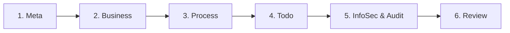

# Spec Bot - 規格機器人

**Specification-Driven Development (SDD) 工具包** - 將自然語言需求轉換為可執行的技術規格

[](CHANGELOG.md)
[](LICENSE)

---

## 專案簡介

Spec Bot 是一個 **AI 驅動的規格自動化工具**，透過結構化工作流程將 BRD 轉換為 SDD，確保一致性、可追溯性與合規性。

### 核心價值

- **規格即真相**: 所有需求以 Markdown 儲存於 Git，版本可控、可稽核
- **工作流程驅動**: 強制執行 `specify → clarify → plan → tasks → implement` 流程
- **銀行級合規**: 支援風險管理、資安、法遵、稽核需求 (Bank Profile 擴充)
- **測試驅動開發**: 內建 Gherkin 場景，TDD 為核心原則
- **AI 輔助人審**: AI 產生草稿，人工審核確認，符合監理要求

---

## 快速開始

### 核心 SDD 工作流程

適用於所有專案的基本流程：

```bash
/speckit.specify "設計 STR 可疑交易報告摘要自動化功能"
/speckit.clarify
/speckit.plan
/speckit.tasks
/speckit.implement
```

### Bank Profile 工作流程 (金融/醫療/受監理產業)

**新6階段精簡流程**：



#### 各階段說明

**Phase 1: Meta (專案設定)**
```bash
/speckit.meta
# 輸出: 00_meta.md - 專案元資料、利害關係人、RACI
```

**Phase 2: Business (需求 + 業務風險)**
```bash
/speckit.business
# 輸出: 10_business.md - 業務目標、KPI、使用者故事、業務/專案風險
```

**Phase 3: Process (流程圖 + 架構圖 20-50)**
```bash
/speckit.process
# 輸出: 20-50_*.md series - 系統流程圖、網路/硬體/軟體架構
```

**Phase 4: Todo (事項確認)**
```bash
/speckit.checklist  # 或 /speckit.clarify
# 確認所有必要項目已建立，準備進入資安階段
```

**Phase 5: InfoSec & Audit (資安 + 法遵 + 技術風險)**
```bash
/speckit.infosec
# 輸出: 70_infosec.md - 資安需求、權限矩陣、技術/資安風險、事件管理

/speckit.audit
# 輸出: 90_audit.md - 稽核事件、日誌格式、KRI 監控
```

**Phase 6: Review (審核)**
```bash
/speckit.review
# 驗證 00-90 所有文件的完整性與一致性
```

---

## 架構總覽

### 目錄結構

```
.
├── .claude/commands/         # Slash 命令定義 (16 commands)
├── .gemini/commands/         # Gemini 對應命令 (TOML)
├── .specify/
│   ├── memory/constitution.md     # 專案憲法 (v2.0.0)
│   └── templates/                 # 文件模板 (14 templates)
│       ├── 00_meta-template.md
│       ├── 10_business-template.md  ← 含業務/專案風險
│       ├── 20-50_*-template.md      ← 流程圖與架構
│       ├── 70_infosec-template.md   ← 含技術/資安風險
│       ├── 80_nfr-template.md
│       └── 90_audit-template.md      ← 含 KRI 監控
├── bank-profile/             # 專案層級 Bank Profile 文件
│   ├── 00_meta.md
│   ├── 10_business.md       ← NEW: 整合業務風險
│   ├── 20-50_*.md
│   ├── 70_infosec.md        ← NEW: 整合技術風險 + 事件管理
│   └── 90_audit.md          ← NEW: 整合 KRI 監控
└── specs/###-feature-name/  # 功能層級 SDD
    ├── spec.md
    ├── plan.md
    └── tasks.md
```

### 核心命令

| 命令 | 用途 | 輸出 |
|------|------|------|
| `/speckit.specify` | 從自然語言生成功能規格 | `spec.md` (Gherkin 場景) |
| `/speckit.clarify` | 偵測並解決規格模糊處 | 更新的 `spec.md` |
| `/speckit.plan` | 生成實作規劃 | `plan.md`, `data-model.md` |
| `/speckit.tasks` | 生成可執行任務清單 | `tasks.md` |
| `/speckit.implement` | 執行 TDD 實作 | 程式碼 + 測試 |

#### Bank Profile 命令

| 階段 | 命令 | 輸出 |
|------|------|------|
| 1 | `/speckit.meta` | `00_meta.md` |
| 2 | `/speckit.business` | `10_business.md` (含風險) |
| 3 | `/speckit.process` | `20-50_*.md` |
| 4 | `/speckit.checklist` | 確認清單 |
| 5 | `/speckit.infosec` | `70_infosec.md` (含風險+事件) |
| 5 | `/speckit.audit` | `90_audit.md` (含KRI) |
| 6 | `/speckit.review` | 一致性驗證報告 |

---

## 風險管理整合

**新架構**: 風險內容已整合到相關文件中，不再有獨立的 `risk_control.md`

- **業務/專案風險** → `10_business.md` (風險識別 section)
- **技術/資安風險** → `70_infosec.md` (技術與資安風險 section)
- **風險監控 (KRI)** → `90_audit.md` (KRI 監控 section)

**好處**: 風險內容與相關業務/技術關注點共同存放，更易理解與維護

---

## 憲法原則 (v2.0.0)

核心原則確保系統簡潔、可靠、合規：

1. **Single Source of Truth** - 所有狀態存於 Git
2. **Test-Driven Development** - TDD 搭配 Gherkin (**非協商**)
3. **YAGNI** - 拒絕 spec.md 未定義的複雜度
4. **Zero Trust & Least Privilege** - 最小權限原則
5. **Grounded AI** - RAG + Source Citations

完整憲法: [`.specify/memory/constitution.md`](.specify/memory/constitution.md)

---

## 使用情境

### ✅ 強烈建議使用 Bank Profile

- 金融業 (銀行、證券、保險)
- 醫療照護系統 (HIPAA, GDPR)
- 處理個資或敏感資料的系統
- 受監理單位稽核的專案

### ✅ 可選使用 Bank Profile

- 中大型企業內部系統
- SaaS 產品 (需要資安與合規文件)

### ❌ 不建議使用 Bank Profile

- 快速原型驗證
- 內部工具 (無監理要求)
- 非受監理產業

---

## 真實案例

**STR/SAR 可疑交易報告摘要自動化**

```bash
# Phase 1-2: 專案上下文 + 業務需求
/speckit.meta
/speckit.business
# → 業務目標: 摘要時間減少 70% (30分鐘→5分鐘)
# → 業務風險: 使用者不接受 AI 輔助、效益未達預期

# Phase 3: 流程設計
/speckit.process
# → As-Is: 人工閱讀 → 人工撰寫 (30 min/案)
# → To-Be: AI 草稿 (5 sec) → 人工審核 (5 min)

# Phase 5: 資安 + 稽核
/speckit.infosec
# → 資料分級: STR 文本為「高度機密」
# → 技術風險: 模型錯誤率 >5%、API 配額耗盡
# → 事件管理: P1-P4 分級 + 回應流程

/speckit.audit
# → 稽核事件: 修改摘要內容 (記錄 before/after)
# → KRI 監控: 模型錯誤率、異常存取次數
# → 日誌保留: 7 年 (洗錢防制法)

# Phase 6: 審核
/speckit.review

# → 功能開發
/speckit.specify --from-bank-profile
/speckit.plan
/speckit.tasks
/speckit.implement
```

---

## 常見問題

**Q: Bank Profile 一定要全部完成才能產生 spec.md 嗎？**

A: 不用。Bank Profile 命令是**獨立且可選的**。可以只執行部分命令或直接跳到 `/speckit.specify`。

**Q: 如果我的專案不需要法遵怎麼辦？**

A: 跳過 Bank Profile，直接使用核心 SDD 工作流程 (specify → clarify → plan → tasks → implement)。

**Q: 風險管理文件去哪了？**

A: 從 v2.0.0 開始，風險內容整合到相關文件：
- 業務風險 → `10_business.md`
- 技術風險 → `70_infosec.md`
- 風險監控 → `90_audit.md`

---

## 版本資訊

- **Spec Bot 版本**: 2.0.0
- **憲法版本**: v2.0.0
- **更新日誌**: [CHANGELOG.md](CHANGELOG.md)

---

## 授權

MIT License - 詳見 [LICENSE](LICENSE)

---

## 下一步

1. **快速體驗**: 執行 `/speckit.specify "你的功能描述"`
2. **深入學習**: 閱讀 [CLAUDE.md](CLAUDE.md)
3. **銀行級專案**: 依6階段執行 Bank Profile
4. **技術細節**: 查看 [實作計畫](file:///Users/ro9air/.gemini/antigravity/brain/bfab1f2d-52de-4916-bfe8-4f10397fd415/implementation_plan.md)

**讓規格驅動開發，讓 AI 輔助人審，讓合規成為設計基礎。**
