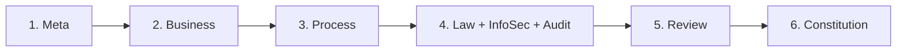
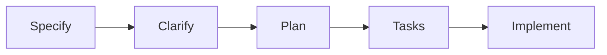

# SDD Kit - Specification-Driven Development 工具包

**將自然語言需求轉換為可執行的技術規格** - AI 驅動的規格自動化工具
- **環境設定與第一個專案**: [SETUP_GUIDE.md](SETUP_GUIDE.md)
- **架構說明**：[ARCHITECTURE.md](ARCHITECTURE.md)

[](CHANGELOG.md)
[](LICENSE)

---

## 🚀 快速開始

```bash
# 1. Clone 或使用 GitHub Template
git clone https://github.com/ro9er117911/SDD_kit my-project
cd my-project

# 2. 初始化（清理範例資料）
./init.sh

# 3. 安裝 AI 助手 (推薦 Antigravity 免費方案)
# 詳見 SETUP_GUIDE.md 說明
# 設定 API Key: export GEMINI_API_KEY="..."

# 4. 建立第一個專案
./.specify/scripts/bash/create-new-project.sh "專案描述" --project-name "PROJECT-NAME"

# 5. 開始填寫 (使用 Gemini CLI)
gemini "請幫我填寫 project/001-PROJECT-NAME/meta/00_meta.md"
```

---

## ✨ 核心功能

- 🗂️ **專案管理**：自動編號（001, 002...）、完整目錄結構、模板系統
- 📊 **Bank Profile 流程**：6 階段分析（Meta → Business → Process → Law/InfoSec/Audit → Review → Constitution）
- 📝 **SDD 功能開發**：Specify → Clarify → Plan → Tasks → Implement
- 🤖 **多 AI 支援**：
  - **Antigravity** (IDE, 推薦免費)
  - **Gemini CLI** (CLI, 免費)
  - **GitHub Copilot** (付費)
  - **Claude Code** (付費)
- 📄 **文檔自動生成**：PPTX/DOCX 匯出功能
- 銀行級合規**：支援風險管理、資安、法遵、稽核需求

---

## 📚 工作流程

### 專案層級：Bank Profile

適用於金融、醫療等受監理產業的完整需求分析：



**使用命令**：
```bash
/speckit.meta       # 專案元資料
/speckit.business   # 業務需求與風險
/speckit.process    # 流程圖與架構
/speckit.law        # 法規遵循
/speckit.infosec    # 資訊安全
/speckit.audit      # 稽核與 KRI
/speckit.review     # 完整性驗證
```

### 功能層級：SDD

適用於所有專案的功能開發流程：



**使用命令**：
```bash
/speckit.specify    # 功能規格（含 Gherkin）
/speckit.clarify    # 釐清模糊處
/speckit.plan       # 實作規劃
/speckit.tasks      # 任務清單
/speckit.implement  # TDD 實作
```

---

## 🛠️ AI 助手支援

### Antigravity (免費 / 推薦)
VS Code 擴充套件，提供大量最新模型。適合 IDE 使用者。

### Gemini CLI (免費)
適合 CLI 自動化的開源工具。
```bash
gemini "Prompt..."
```

### GitHub Copilot (付費)
使用 agent 指令（19 個中文 agents）：
```
@agent speckit.meta
@agent project.create "專案名稱" --project-name "NAME"
```

### Claude Desktop (付費)
使用 slash 命令：
```
/speckit.meta
```

---

## 📖 文檔

- **[設定指南](SETUP_GUIDE.md)** - 環境設定、第一個專案、常見問題
- **[架構說明](docs/ARCHITECTURE.md)** - 系統設計、模板 vs 命令、設計原則
- **[憲法原則](.specify/memory/constitution.md)** - 核心原則與不可妥協的規則

---

## 🗂️ 目錄結構

```
sdd-kit/
├── .specify/               # 核心系統
│   ├── templates/          # 15 個文件模板
│   ├── scripts/bash/       # 自動化腳本
│   └── memory/             # 憲法與原則
├── .claude/commands/       # 16 個 Claude 命令
├── .github/
│   ├── agents/             # 19 個 Copilot agents
│   ├── prompts/            # 對應 prompts
│   └── copilot-instructions.md
├── docs/                   # 詳細文檔
├── project/                # 專案資料（使用後產生）
├── specs/                  # 功能規格（使用後產生）
├── init.sh                 # 初始化腳本
└── README.md
```


---

## 🔧 客製化

### 修改模板
```bash
vim .specify/templates/00_meta-template.md
# 下次建立專案時會使用新模板
```

### 修改命令邏輯
```bash
# Claude
vim .claude/commands/speckit.meta.md

# Copilot
vim .github/agents/speckit.meta.agent.md
```

### 新增自訂階段
1. 建立模板：`.specify/templates/95_custom-template.md`
2. 建立命令：`.claude/commands/speckit.custom.md`
3. 建立 agent：`.github/agents/speckit.custom.agent.md`

---

## 🔄 從上游更新

```bash
# 設定上游 remote
git remote add sdd-kit https://github.com/ro9er117911/SDD_kit

# 拉取更新
git fetch sdd-kit
git merge sdd-kit/main --allow-unrelated-histories

# 或只更新特定部分
git checkout sdd-kit/main -- .specify/templates/
```

---

## 💡 範例

查看完整範例專案（選擇性）：
```bash
git clone https://github.com/ro9er117911/SDD_kit_examples.git
```

---

## 📄 授權

MIT License - 詳見 [LICENSE](LICENSE)

---

## 🙏 致謝

本專案受到 [github/spec-kit](https://github.com/github/spec-kit) 的啟發。

---

**讓規格驅動開發，讓 AI 輔助人審，讓合規成為設計基礎。**
