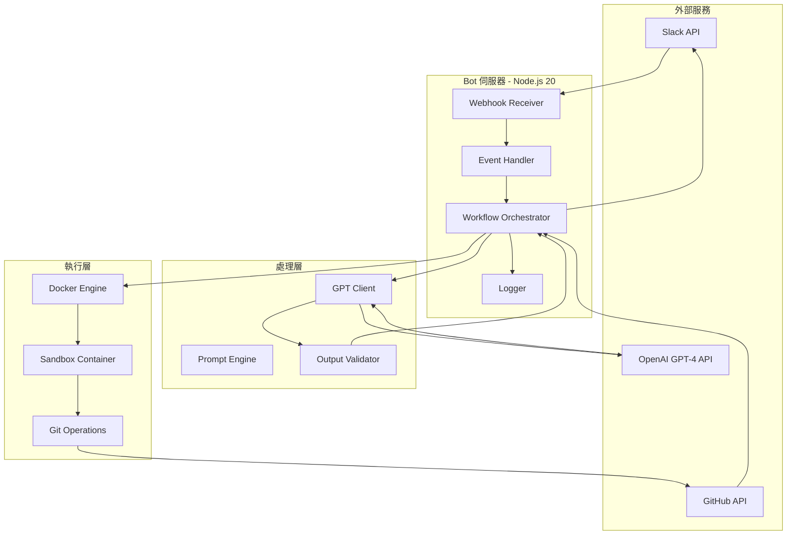

根據 Spec Bot 的規格，設計完整的技術實作計畫 (plan.md)：

**1. 系統架構設計**


**2. 技術棧選型**

| 類別 | 技術 | 版本 | 理由 |
|------|------|------|------|
| **Bot 框架** | Bolt for JavaScript | 3.x | 官方推薦，社群活躍 |
| **執行環境** | Node.js | 20 LTS | 穩定，套件豐富 |
| **LLM** | OpenAI GPT-4 Turbo | gpt-4-turbo-preview | 性能與成本平衡 |
| **版本控管** | GitHub API | v3 | 整合完善 |
| **容器化** | Docker | 24.x | 業界標準 |
| **文件轉換** | Pandoc | 3.x | 支援多格式轉換 |
| **圖表渲染** | Mermaid CLI | 10.x | 官方 CLI 工具 |
| **日誌** | Winston | 3.x | 結構化日誌 |
| **測試** | Jest | 29.x | 完整測試工具 |

**3. 資料模型**
```typescript
// Slack Event
interface SlackBRDUploadEvent {
  type: 'file_shared';
  channel: string;
  user: string;
  file: {
    id: string;
    name: string;
    url_private: string;
    size: number; // bytes
  };
  thread_ts?: string;
  ts: string;
}

// BRD Content
interface BRDContent {
  raw: string;
  projectName: string;
  objectives: string[];
  functionalRequirements: string[];
  nonFunctionalRequirements: string[];
  constraints: string[];
}

// SDD Output
interface SDDOutput {
  overview: string;
  architecture: string;
  dataModel: string;
  apiSpec: string;
  deployment: string;
  diagrams: {
    name: string;
    mermaidCode: string;
  }[];
}

// Workflow State
interface WorkflowState {
  id: string;
  status: 'pending' | 'processing' | 'completed' | 'failed';
  brdFile: string;
  channel: string;
  threadTs: string;
  branchName: string;
  prUrl?: string;
  error?: string;
  startedAt: Date;
  completedAt?: Date;
}
```

**4. API 端點設計**
```typescript
// Slack Webhook Endpoint
POST /slack/events
Request Body: SlackEvent
Response: { challenge?: string } // For URL verification

// Health Check
GET /health
Response: { status: 'ok', uptime: number }

// Manual Trigger (for testing)
POST /api/trigger
Request Body: { brdContent: string, channel: string }
Response: { workflowId: string }

// Workflow Status
GET /api/workflow/:id
Response: WorkflowState
```

**5. GPT Prompt 設計**
```typescript
const SYSTEM_PROMPT = `你是專業的系統分析師，擅長將 BRD 轉換為結構化的 SDD。

輸出規則：
1. 使用 Markdown 格式
2. 圖表使用 Mermaid 語法
3. 章節編號：1.x, 2.x, 3.x
4. 每個章節必須有清楚的標題
5. API 設計遵循 RESTful 原則
6. 資料庫設計符合正規化

必須包含章節：
- 1. 系統概述
- 2. 系統架構設計
- 3. 資料模型設計
- 4. API 規格
- 5. 部署方案`;

const USER_PROMPT_TEMPLATE = (brd: string) => `
請根據以下 BRD 生成完整的 SDD：

${brd}

---

要求：
1. 系統架構圖必須使用 graph TB 或 flowchart TB
2. 資料模型必須使用 erDiagram
3. API 流程使用 sequenceDiagram
4. 所有 Mermaid 語法必須正確可渲染
5. 技術選型需有明確理由

請輸出完整的 Markdown 文件。
`;
```

**6. Docker 沙箱設計**
```dockerfile
FROM node:20-alpine

# 安裝必要工具
RUN apk add --no-cache git bash

# 設定 Git 使用者
RUN git config --global user.name "Spec Bot" && \
    git config --global user.email "bot@company.com"

# 複製 speckit.sh（假設為自訂工具）
COPY speckit.sh /usr/local/bin/
RUN chmod +x /usr/local/bin/speckit.sh

WORKDIR /workspace

# 限制資源
# docker run --memory="512m" --cpus="1.0" --network=none
```

**7. GitHub 操作流程**
```typescript
async function createBranch(branchName: string): Promise<void> {
  // 1. 取得 main 分支的最新 commit SHA
  const mainRef = await octokit.git.getRef({
    owner, repo, ref: 'heads/main'
  });
  
  // 2. 建立新分支
  await octokit.git.createRef({
    owner, repo,
    ref: `refs/heads/${branchName}`,
    sha: mainRef.data.object.sha
  });
}

async function commitFiles(branchName: string, files: FileTree): Promise<void> {
  // 1. 建立 blobs
  const blobs = await Promise.all(
    files.map(f => octokit.git.createBlob({
      owner, repo,
      content: Buffer.from(f.content).toString('base64'),
      encoding: 'base64'
    }))
  );
  
  // 2. 建立 tree
  const tree = await octokit.git.createTree({
    owner, repo,
    tree: files.map((f, i) => ({
      path: f.path,
      mode: '100644',
      type: 'blob',
      sha: blobs[i].data.sha
    })),
    base_tree: baseTreeSha
  });
  
  // 3. 建立 commit
  const commit = await octokit.git.createCommit({
    owner, repo,
    message: 'feat: 新增 SDD 規格文件 by Spec Bot',
    tree: tree.data.sha,
    parents: [parentCommitSha]
  });
  
  // 4. 更新分支指向新 commit
  await octokit.git.updateRef({
    owner, repo,
    ref: `heads/${branchName}`,
    sha: commit.data.sha
  });
}

async function createPR(branchName: string): Promise<string> {
  const pr = await octokit.pulls.create({
    owner, repo,
    title: '🤖 自動生成：SDD 規格文件',
    head: branchName,
    base: 'main',
    body: `## 自動生成的 SDD

由 Spec Bot 根據 BRD 自動產生。

### 審核清單
- [ ] 系統架構合理
- [ ] 資料模型完整
- [ ] API 規格清楚
- [ ] 部署方案可行

請 PM/SA 審核後合併。`
  });
  
  return pr.data.html_url;
}
```

**8. GitHub Actions CI 流程**
```yaml
name: Convert SDD to Documents

on:
  pull_request:
    types: [closed]
    branches: [main]

jobs:
  convert:
    if: github.event.pull_request.merged == true
    runs-on: ubuntu-latest
    steps:
      - uses: actions/checkout@v4
      
      - name: Setup Pandoc
        run: |
          wget https://github.com/jgm/pandoc/releases/download/3.1.11/pandoc-3.1.11-1-amd64.deb
          sudo dpkg -i pandoc-3.1.11-1-amd64.deb
      
      - name: Setup Mermaid CLI
        run: npm install -g @mermaid-js/mermaid-cli
      
      - name: Render Diagrams
        run: find specs -name "*.mermaid" -exec mmdc -i {} -o {}.png \;
      
      - name: Convert to PDF
        run: pandoc specs/*.md -o SDD.pdf --toc --number-sections
      
      - name: Convert to DOCX
        run: pandoc specs/*.md -o SDD.docx --toc
      
      - name: Create Release
        uses: softprops/action-gh-release@v1
        with:
          files: |
            SDD.pdf
            SDD.docx
      
      - name: Notify Slack
        run: |
          curl -X POST ${{ secrets.SLACK_WEBHOOK_URL }} \
            -H 'Content-Type: application/json' \
            -d '{"text":"🎉 SDD 文件已發布！"}'
```

**9. 錯誤處理策略**
```typescript
class ErrorHandler {
  async handle(error: Error, context: WorkflowContext): Promise<void> {
    // 記錄錯誤
    logger.error('Workflow failed', {
      workflowId: context.id,
      error: error.message,
      stack: error.stack
    });
    
    // 通知 Slack
    await slackClient.chat.postMessage({
      channel: context.channel,
      thread_ts: context.threadTs,
      text: `❌ 處理失敗：${this.getUserFriendlyMessage(error)}`
    });
    
    // 根據錯誤類型決定是否重試
    if (this.isRetryable(error)) {
      await this.scheduleRetry(context);
    }
  }
  
  private getUserFriendlyMessage(error: Error): string {
    if (error instanceof GPTError) return 'GPT 生成失敗，請檢查 BRD 格式';
    if (error instanceof GitHubError) return 'GitHub 操作失敗，請檢查權限';
    if (error instanceof DockerError) return '沙箱執行失敗，請聯繫管理員';
    return '未知錯誤，請查看日誌';
  }
}
```

**10. 安全性設計**

- **Secrets 管理**：所有 API keys 透過環境變數注入，不寫入程式碼
- **沙箱隔離**：Docker 容器 `--network=none` 限制網路存取
- **權限最小化**：GitHub Token 僅授予必要權限（repo）
- **輸入驗證**：BRD 內容經過清理，防止 Prompt Injection
- **審計日誌**：所有操作記錄到 Winston，保留 30 天

**11. 效能優化**

- GPT API 使用 streaming 模式減少等待時間
- Docker 映像預先建置並快取
- GitHub API 使用 conditional requests 減少配額消耗
- Slack 訊息使用非同步發送

**12. 監控指標**
```typescript
const metrics = {
  workflowTotal: Counter,           // 總處理數
  workflowSuccess: Counter,         // 成功數
  workflowFailure: Counter,         // 失敗數
  workflowDuration: Histogram,      // 處理時長
  gptTokenUsage: Counter,           // GPT Token 使用量
  githubApiCalls: Counter,          // GitHub API 呼叫次數
};
```

請產出詳細的 plan.md，包含上述所有設計細節，並確保與 constitution.md 和 spec.md 一致。