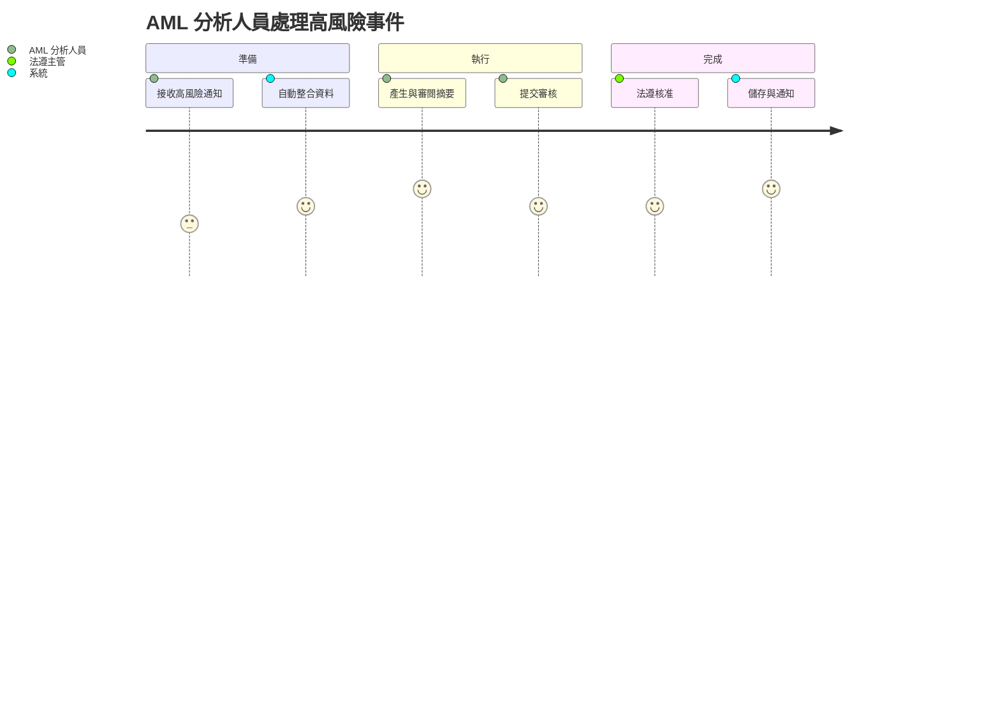

# 10_business - 業務目標與使用者情境

**建立日期**: 2025-11-14
**最後更新**: 2025-11-14
**文件版本**: 1.0.0
**關聯專案**: 參考 [00_meta.md](00_meta.md)
**輸入**: 使用者描述："客戶洗錢風險事件摘要模型 - 業務需求"

---

## 業務目標

### 主要業務目標

- 自動整合核心銀行、交易監控、KYC 與外部負面新聞資料，建立單一客戶洗錢風險事件視圖，縮短摘錄時間。
- 以可解釋 AI 模型生成標準化風險摘要，確保每筆案件都涵蓋監理要求的關鍵欄位並保有追溯性。
- 提供法遵、風控與管理層近即時的高風險客戶監控儀表板，支援預警決策與監理申報。

### 次要業務目標

- 累積風險事件與人工調整記錄作為知識庫，支援模型再訓練與新人訓練。
- 與監理申報、稽核系統共享標準化資料介面，降低跨部門重工。

---

## 問題與機會

### 當前痛點

**痛點 1**: 多系統資料蒐集與複製貼上耗時
- **影響範圍**: 洗錢防制分析人員、法遵部門
- **當前成本**: 每筆案件平均需 2.5 小時整合資料（占每日工時 60% 以上）
- **頻率**: 每日約 30-40 筆高風險事件需處理

**痛點 2**: 摘要品質不一致導致重工與稽核疑慮
- **影響範圍**: 法遵審核主管、稽核部門
- **當前成本**: 18% 案件需二次補件，稽核追查需額外 3-5 天
- **頻率**: 每週報告審核皆出現至少 5 筆需重寫的案件

**痛點 3**: 無法即時掌握高風險客戶趨勢
- **影響範圍**: 風控部門、資深管理層
- **當前成本**: 需至多 1 週才能彙整趨勢報表，錯過預警時機
- **頻率**: 月度風險委員會前需臨時加班彙整資料

### 業務機會

- 建立標準化摘要格式與 KPI，讓分析人員專注於高價值判斷。
- 將 AI 建議與人工決策並存，打造可解釋模型審查流程，加速監理核准。
- 即時儀表板提供跨部門共通語言，支援策略調整與客戶互動決策。

---

## KPI / 成功標準

### 量化指標

- **SC-001**: 單筆客戶風險摘要產出平均時間 ≤ 20 分鐘（自 150 分鐘 基準）
  - **衡量方式**: 以系統事件記錄「資料準備 → 提交審核」的時間差
  - **達成時間**: 2026 Q2 UAT 結束
  - **基準值**: 150 分鐘/件
  - **目標值**: 20 分鐘/件

- **SC-002**: 關鍵合規欄位覆蓋率 ≥ 95% 且缺漏率 < 5%
  - **衡量方式**: 由法遵 QA 每週抽樣 30 筆稽核必要欄位
  - **達成時間**: 上線後 1 個月內
  - **基準值**: 72% 覆蓋率
  - **目標值**: 95% 覆蓋率、<5% 缺漏

- **SC-003**: 提前預警高風險客戶事件比例 ≥ 90%
  - **衡量方式**: 比較模型預警時間與人工首次發現時間
  - **達成時間**: 上線後 3 個月
  - **基準值**: 40% 事件由人工提前發現
  - **目標值**: 90% 事件可在人工行動前被預警

### 質化指標

- 法遵部門 UAT 滿意度達「滿意」以上（Likert 4/5分） - 透過結案問卷確認。
- 模型治理委員會批准摘要模型與解釋報告 - 議會決議紀錄。
- 稽核部門可於 1 週內完成案件抽查且無重大缺失 - 稽核報告確認。

---

## 使用者角色定義

### 主要使用者

**角色 1: 洗錢防制分析人員（AML Analyst）**
- **職責**: 蒐集客戶資料、評估風險事件、撰寫摘要並建議措施
- **使用頻率**: 每日 6-8 小時
- **技術能力**: 中（熟悉 Excel/AML 系統）
- **主要需求**: 縮短資料彙整時間、獲得 AI 建議摘要、保留人工判斷空間
- **痛點**: 多系統切換與手動格式化導致延遲，資料缺漏難察覺

**角色 2: 法遵審核主管（Compliance Reviewer）**
- **職責**: 審核摘要品質、確認合規要點、核准監理申報
- **使用頻率**: 每日 2-4 小時、每週集中審核
- **技術能力**: 中
- **主要需求**: 快速掌握摘要差異、追蹤修改歷程、掌握審核佇列
- **痛點**: 收到的內容層次不一，需反覆釐清上下文，增加核簽時間

### 次要使用者

**角色 3: 風控策略 / 模型治理人員**
- **職責**: 監控風險趨勢、調整模型參數、回報管理層
- **使用頻率**: 每週/每月
- **技術能力**: 高（熟悉 BI / ML 工具）
- **主要需求**: 取得標準化資料、觀察趨勢與模型表現、掌握異常

---

## 使用者故事（User Stories）

### 使用者故事 1 - AI 摘要產出與人工審閱（優先級：P1）🎯 MVP

**角色**: 洗錢防制分析人員

**業務價值**: 將資料蒐集與摘要撰寫時間壓縮至 20 分鐘內，釋出人力處理更多個案。

**故事描述**:
作為 AML 分析人員，我想要系統自動整合資料並產生建議摘要，讓我可以在單一畫面審閱、補充理由並提交審核。

**為何是此優先級**: 沒有此能力即無法形成最小可行產品，亦無法證明自動化效益。

**獨立測試**: 以沙盒資料觸發單一案件，驗證 30 秒內出現摘要、可編輯、可保存，無須其他故事。

**前置條件**:
- 已存在經系統整合的客戶資料與交易事件
- 模型健康且具備最新參數

**驗收情境（Gherkin）**:

**情境 1.1**: 正常案件自動產出摘要
```gherkin
假設 分析人員開啟含完整資料的高風險事件
當 系統發送請求給 AI 模型
則 系統於 30 秒內顯示建議摘要與信心指標
  並且 分析人員可直接編輯任何段落
```

**情境 1.2**: 人工調整關鍵欄位並附註
```gherkin
假設 建議摘要已顯示
當 分析人員改寫「交易模式」段落並加入手動註記
則 系統保留原始 AI 版本與人工調整版本
  並且 於變更紀錄標出修改者與時間戳
```

**情境 1.3 (例外情況)**: 資料缺漏導致模型無法輸出
```gherkin
假設 高風險事件缺少最新 KYC 資料
當 系統請求模型而收到「insufficient data」錯誤
則 系統顯示可重試的提示並列出缺漏欄位
  並且 分析人員可改由手動摘要模板輸入
```

**可交付價值**:
- 單一畫面完成資料整合、摘要審閱與提交
- 自動保留 AI 與人工版本以利稽核追蹤

**UI/UX 要求**:
- 雙欄式呈現「資料視圖」與「摘要草稿」，支持快速切換段落
- 顯示模型信心百分比與資料來源標籤

**資料要求**:
- 核心資料：客戶基本資訊、帳戶、交易清單、KYC 結論
- 外部資料：制裁/負面新聞 API 回傳之結果摘要

---

### 使用者故事 2 - 法遵審核與回覆（優先級：P1）

**角色**: 法遵審核主管

**業務價值**: 以工作佇列管理審核，降低補件迴圈並確保合規。

**故事描述**:
作為法遵主管，我想要查看待審摘要、一次檢視 AI 與人工差異並加總審核意見，確保所有監理欄位完成。

**為何是此優先級**: 沒有審核流程，摘要無法正式生效，違背監理要求。

**獨立測試**: 以測試帳號提交 3 筆案件，驗證佇列顯示、批次核准/退回與意見留存。

**驗收情境（Gherkin）**:

**情境 2.1**: 核准完整案件
```gherkin
假設 審核主管登入並開啟待審案件
當 系統呈現 AI 與人工版本差異
則 主管可在同一畫面勾選核准、輸入審核意見
  並且 系統記錄審核結果與時間戳
```

**情境 2.2**: 補件退回
```gherkin
假設 審核主管發現關鍵資訊缺漏
當 主管點選「退回」並指定缺漏段落
則 系統將案件重新指派給原分析人員並通知原因
  並且 案件狀態顯示為「待補件」
```

**可交付價值**:
- 建立可追蹤的審核佇列與核准意見
- 減少補件往返時間並保留稽核軌跡

---

### 使用者故事 3 - 風險儀表板與趨勢監控（優先級：P2）

**角色**: 風控策略/模型治理人員

**業務價值**: 透過視覺化趨勢判斷策略是否需調整。

**故事描述**:
作為風控策略人員，我想要在儀表板檢視各客群的風險分布、模型信心與異常事件趨勢，以便預先調整門檻。

**為何是此優先級**: 雖非上線 MVP 必備，但為確保模型治理與策略迭代，需要在 Phase 1 完成。

**獨立測試**: 建立模擬資料集，確認儀表板可篩選期間、客群並輸出 CSV。

**驗收情境（Gherkin）**:

**情境 3.1**: 檢視月度趨勢
```gherkin
假設 儀表板已載入 6 個月資料
當 使用者選擇「高風險客戶」與「匯款類別」
則 圖表顯示該條件下的案件趨勢與平均模型信心
```

**可交付價值**:
- 快速了解模型表現與動態，提前調整風險政策

---

### 使用者故事 4 - 稽核追溯與查詢（優先級：P3）

**角色**: 稽核人員

**業務價值**: 在稽核周期可搜尋歷史摘要、比較版本並下載證跡。

**故事描述**:
作為稽核人員，我想搜尋客戶或案件編號並取得完整的摘要、審核與模型輸出歷程，以便佐證稽核報告。

**為何是此優先級**: 稽核需求重要但可於上線後數月導入，不影響日常作業。

**獨立測試**: 以匿名化資料進行查詢，驗證可下載 PDF 且敏感資訊符合遮罩規則。

**驗收情境（Gherkin）**:

**情境 4.1**: 尋找特定客戶的摘要紀錄
```gherkin
假設 稽核人員輸入客戶 ID 與日期區間
當 系統查詢歷史資料
則 顯示所有相關摘要、審核意見與模型版本
```

**可交付價值**:
- 確保上線後能快速回應稽核要求並降低人工蒐證

---

## 使用者旅程地圖

### 主要旅程：AML 分析人員處理高風險事件

**觸發條件**: 交易監控系統產生高風險事件並推送至摘要模型。

**步驟流程**:



**各步驟說明**:

1. **接收高風險通知**: 交易監控將事件推送至摘要系統。
   - 使用者動作: 接受通知並點擊案件
   - 系統回應: 顯示案件基本資料
   - 預期時間: 即時

2. **自動整合資料**: 系統整合核心/KYC/外部資料。
   - 使用者動作: 無，需要確認資料完整性
   - 系統回應: 產生資料整合狀態
   - 預期時間: < 30 秒

3. **產生與審閱摘要**: 引擎產出草稿，分析人員修訂。
   - 使用者動作: 編輯段落、補充觀察
   - 系統回應: 即時儲存草稿、顯示版本
   - 預期時間: 10-15 分鐘

4. **提交審核**: 選擇審核人並提交。
   - 使用者動作: 點擊提交並輸入備註
   - 系統回應: 產生審核任務
   - 預期時間: 1 分鐘

5. **法遵核准**: 法遵主管審核並核准或退回。
   - 使用者動作: 檢視摘要、留下意見
   - 系統回應: 更新狀態、寄出通知
   - 預期時間: 5-10 分鐘

6. **儲存與通知**: 系統歸檔並同步至監理報表。
   - 使用者動作: 被通知結果
   - 系統回應: 寄送完成通知與稽核紀錄
   - 預期時間: 即時

---

## 邊界與例外情況

### 邊界情況

**BC-001: 外部資料延遲**
- **觸發條件**: 制裁/負面新聞 API 逾時
- **系統行為**: 以最新快取資料填入並標註「待更新」
- **使用者體驗**: 在摘要段落顯示提醒，不阻斷流程
- **後續動作**: 系統完成補抓後自動通知分析人員重新審閱

**BC-002: 模型信心低於門檻**
- **觸發條件**: 模型信心 < 60%
- **系統行為**: 以黃色提示標註段落並建議人工重寫
- **使用者體驗**: 看到建議文案與信心得分
- **後續動作**: 分析人員需填寫人工判斷原因

### 例外處理

**EX-001: 摘要儲存失敗**
- **發生條件**: 後端儲存服務中斷
- **錯誤訊息**: 「伺服器暫時無法儲存，系統已保留草稿」
- **回復機制**: 使用瀏覽器本地快取並於服務恢復後自動重送
- **日誌記錄**: 記錄使用者 ID、案件 ID、失敗時間與錯誤碼

**EX-002: 權限不足訪問特定客戶**
- **發生條件**: 分析人員嘗試開啟未授權客戶
- **錯誤訊息**: 「您無存取此客戶摘要的權限」
- **回復機制**: 系統提供申請權限連結
- **日誌記錄**: 紀錄嘗試者、客戶 ID、動作與結果

---
