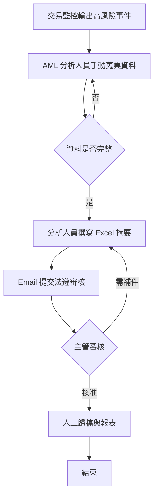
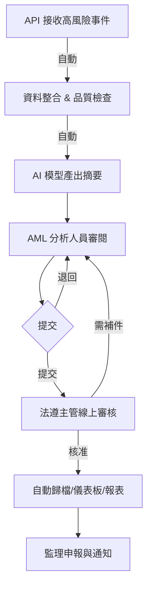
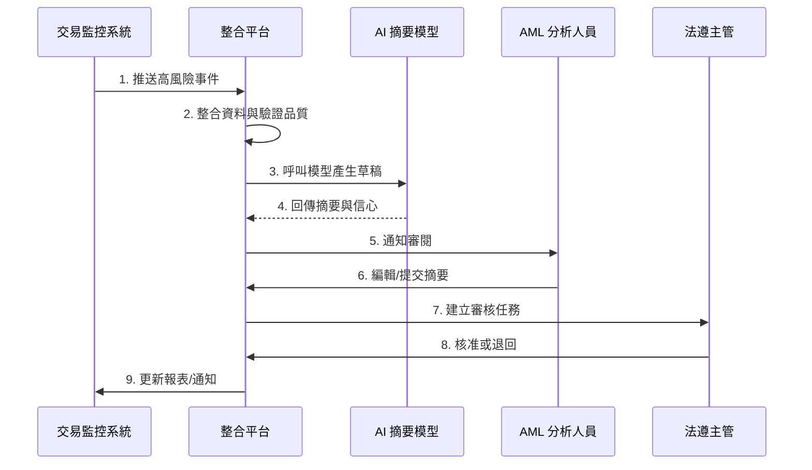
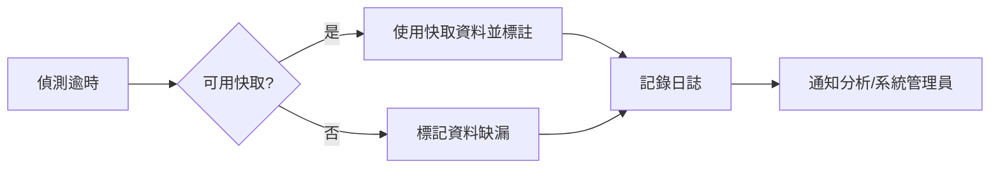
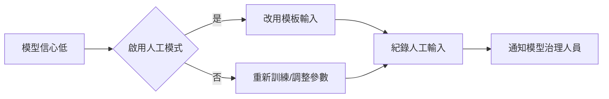
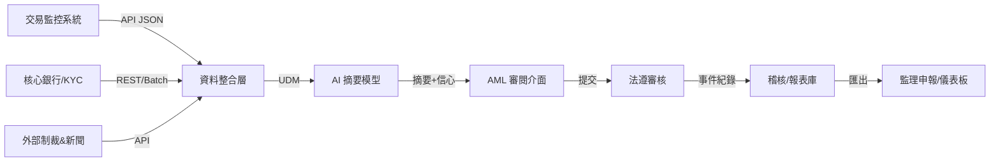

# 20_process - As-Is / To-Be 流程與例外

**建立日期**: 2025-11-14
**最後更新**: 2025-11-14
**文件版本**: 1.0.0
**關聯文件**:
- 專案元資料: [00_meta.md](00_meta.md)
- 業務目標: [10_business.md](10_business.md)
**輸入**: 使用者描述："客戶洗錢風險事件摘要模型 - 流程設計"

---

## 文件目的

本文件描述：
1. **As-Is 流程**: 當前客戶洗錢風險事件摘要的人工作業流程與痛點
2. **To-Be 流程**: 透過 AI 摘要模型與自動化整合後的目標流程設計
3. **例外與邊界**: 各種資料缺漏、模型異常與權限情境的處理方式
4. **資料流動與整合點**: 系統間如何交換資料、監控流程品質的指標

**與其他文件的關係**:
- **10_business.md** 定義業務目標與使用者故事，提供流程改善需求
- **20_process.md** 將目標轉為具體步驟、RACI 與例外處理
- 供後續 `spec.md` 與設計規格轉換為技術需求與 API/服務設計

---

## As-Is 流程（現況分析）

### 流程摘要

1. 交易監控系統每日產出高風險事件並以 Email/Excel 推送給法遵人員。
2. AML 分析人員登入核心銀行系統、KYC 系統與外部資料庫蒐集最新資料。
3. 分析人員以 Excel/Word 手動整理摘要、貼上交易明細與風險評語。
4. 摘要以 Email 附件形式送交法遵主管，並於 Teams/電話解說背景。
5. 法遵主管逐筆審閱並在文件上標註修改，再退回分析人員調整。
6. 完成後由法遵主管統整至月度監理報表，另以 PDF 歸檔並寄給稽核。

### 流程圖（As-Is）

**流程說明**:

| 步驟 | 執行者 | 動作 | 輸入 | 輸出 | 耗時 | 工具/系統 |
|------|--------|------|------|------|------|-----------|
| 1 | 交易監控系統 | 匯出每日高風險清單 | 交易監控規則結果 | Excel/Email | 30 分鐘 | TM 系統 |
| 2 | AML 分析人員 | 登入多套系統蒐集資料 | 客戶/帳戶資訊 | 散落的資料片段 | 60-90 分鐘 | 核心系統、KYC、外部 API |
| 3 | AML 分析人員 | 手動撰寫摘要 | Excel、Word | 初稿摘要 | 40 分鐘 | Office |
| 4 | AML 分析人員 | Email 提交 & 說明 | 摘要文件 | 審核請求 | 15 分鐘 | Email/IM |
| 5 | 法遵主管 | 審核與退回 | 摘要文件 | 核准或補件意見 | 30 分鐘/件 | Email、紙本 |
| 6 | 法遵主管 | 歸檔與報表 | 核准摘要 | PDF/報表 | 30 分鐘 | 檔案伺服器 |

### 關鍵痛點（問題分析）

**痛點 1: 多系統跳轉造成延遲**
- **問題描述**: 分析人員須登入 3-4 個系統並匯出檔案
- **發生頻率**: 每日針對所有高風險客戶
- **影響範圍**: 法遵與風控；造成回報延遲
- **後果**: 每日 4+ 小時耗在準備資料
- **根本原因**: 無集中整合層

**痛點 2: 一致性與稽核追蹤不足**
- **問題描述**: 每位分析人員摘要格式不同，難以比對
- **發生頻率**: 每週稽核抽查
- **影響範圍**: 稽核、監理申報
- **後果**: 18% 案件需補件
- **根本原因**: 無標準化模板與版本控制

**痛點 3: 報表與通知滯後**
- **問題描述**: 需人工合併資料產出報表
- **發生頻率**: 每週/月度報告
- **影響範圍**: 管理層、監理機關
- **後果**: 預警動作延遲至少 1 週
- **根本原因**: 無即時儀表板、資料需人工轉換

### 當前流程的限制與瓶頸

- **限制 1**: 資料散落在多系統（流程限制）
  - **影響**: 數據攔取需人工登出/登入，無法即時更新
- **限制 2**: 無標準化摘要模板（流程限制）
  - **影響**: 摘要品質不一，稽核無法快速驗證
- **限制 3**: 沒有版本控制與權限管理（工具限制）
  - **影響**: 難以追蹤誰修改、何時修改；存在資安風險

---

## To-Be 流程（目標設計）

### 流程摘要

1. 交易監控事件透過 API 推送至 AML 風險摘要平台。
2. 整合引擎自動聚合核心/KYC/外部資料並完成資料品質檢查。
3. AI 模型生成摘要草稿與風險評分，並標註資料來源信心。
4. 分析人員在單一畫面審閱、調整並提交。
5. 法遵主管在系統內審核、留下意見並核准/退回。
6. 核准後自動更新儀表板、通知相關人員並生成監理報表/稽核軌跡。

### 流程圖（To-Be）

**流程改善對照表**:

| 步驟 | As-Is 執行者 | To-Be 執行者 | 改善方式 | As-Is 耗時 | To-Be 耗時 | 節省時間 |
|------|-------------|-------------|---------|-----------|-----------|----------|
| 資料蒐集 | AML 分析 | 整合引擎/AI | 自動整合、資料品質檢查 | 60-90 分 | 2-3 分 | 58-87 分 |
| 摘要撰寫 | AML 分析 | AI + AML 分析 | AI 草稿 + 版本控制 | 40 分 | 10 分 | 30 分 |
| 審核/通知 | 法遵主管 | 系統+主管 | 線上審核、系統通知 | 30+15 分 | 10 分 | 35 分 |

**總計節省**: 約 2 小時/案件（>80% 時間節省）

### 主流程（Happy Path）

#### 泳道圖（Swimlane Diagram）

#### 詳細步驟說明

**步驟 1**: 事件接收
- **觸發條件**: 交易監控系統產生高風險事件
- **執行者**: 交易監控系統 → 整合平台
- **輸入**: 事件 ID、客戶 ID、告警原因
- **處理邏輯**: 以 REST API 推送並記錄
- **輸出**: 事件佇列
- **預期時間**: 即時 (<5 秒)
- **成功標準**: 事件佇列狀態 = RECEIVED

**步驟 2**: 資料整合與驗證
- **觸發條件**: 事件接收完成
- **執行者**: 整合平台
- **輸入**: 客戶 ID、事件 ID
- **處理邏輯**: 串接核心/KYC/外部 API，執行欄位驗證
- **輸出**: 統一資料模型（UDM）
- **預期時間**: <30 秒
- **成功標準**: QCheck 分數 ≥ 95

**步驟 3**: AI 摘要與評分
- **觸發條件**: UDM 建立
- **執行者**: AI 模型
- **輸入**: 結構化事件資料
- **處理邏輯**: 產生文字摘要、標註資料來源、輸出信心
- **輸出**: 摘要草稿、信心分數、可解釋特徵
- **預期時間**: <30 秒
- **成功標準**: 產生草稿 & 信心分數

**步驟 4**: 人工審閱與提交
- **觸發條件**: 草稿產生
- **執行者**: AML 分析人員
- **輸入**: 草稿摘要、資料來源
- **處理邏輯**: 審閱、編輯、補充備註
- **輸出**: 最終草稿、提交紀錄
- **預期時間**: 10-15 分鐘
- **成功標準**: 案件狀態變為「待審核」

**步驟 5**: 法遵審核與通知
- **觸發條件**: 案件進入待審核
- **執行者**: 法遵主管
- **輸入**: 提交摘要、差異視圖
- **處理邏輯**: 檢視差異、核准或退回
- **輸出**: 審核意見、核准/退回狀態
- **預期時間**: 5-10 分鐘
- **成功標準**: 案件狀態 = APPROVED，系統完成通知

### 角色與職責（RACI）

| 步驟 | AML 分析人員 | 法遵主管 | AI/整合平台 | 風控策略 | 說明 |
|------|--------------|----------|-------------|----------|------|
| 事件接收與整合 | I | I | R/A | C | 系統自動整合並通知 |
| AI 產出摘要 | C | I | R/A | C | 模型與平台負責 |
| 人工審閱與提交 | R/A | I | C | I | AML 分析對內容負責 |
| 法遵審核 | C | R/A | I | I | 主管最終核准 |
| 報表與通知 | I | A | R | C | 系統完成報表，法遵負責對外 |

---

## 例外情境處理

### 例外情境 E1: 外部制裁/新聞資料逾時

**描述**: 整合平台在 SLA 內未取得外部資料供模型使用。

**觸發條件**:
- API 回應 > 10 秒或 5xx
- 最新資料時間超過 24 小時

**處理流程**:

**詳細步驟**:
1. **偵測**: 整合平台記錄逾時與錯誤碼
2. **通知**: 發送警示給分析人員與系統管理員
3. **處理**: 使用快取資料或標記需人工補充
4. **回復**: 重試程序在 10 分鐘後自動執行
5. **記錄**: 儲存於事件日誌並標註於摘要

**影響範圍**: 影響步驟 2-3，可能降低信心
**預期頻率**: 每月 <2 次
**SLA**: 30 分鐘內解決或安排人工介入

### 例外情境 E2: 模型信心過低

**描述**: AI 模型輸出的信心 < 60%，無法提供可靠摘要。

**觸發條件**:
- 信心閾值判定
- 特徵缺失 > 20%

**處理流程**:

**詳細步驟**:
1. **偵測**: 模型回應時即檢查信心值
2. **通知**: 提示分析人員進入人工模式
3. **處理**: 以標準模板輸入資訊
4. **回復**: 系統標註此案件為人工摘要
5. **記錄**: 傳送報告給模型治理團隊

**影響範圍**: 影響步驟 3-4
**預期頻率**: <5% 案件
**SLA**: 立即切換人工模式，不得延遲

---

## 邊界情況處理

### 邊界情況 BC-001: 缺少最新 KYC 資料

- **情況說明**: KYC 週期逾期或資料尚未同步
- **系統行為**:
  - 主動偵測：比對 KYC 更新日期
  - 處理方式：標記為「KYC 過期」，暫停自動提交
  - 使用者提示：顯示需補件訊息
  - 回復機制：KYC 完成後自動解除
- **業務影響**: 案件需人工確認
- **處理優先級**: 高

### 邊界情況 BC-002: 並發案件暴增

- **情況說明**: 月結或稽核期間案件數暴增 > 2 倍
- **系統行為**:
  - 主動偵測：佇列超過 SLA
  - 處理方式：自動水平擴充執行個體並調整優先級
  - 使用者提示：儀表板顯示佇列狀況
  - 回復機制：情況緩解後縮減資源
- **業務影響**: 需確保 SLA 不失效
- **處理優先級**: 中

### 邊界情況 BC-003: 特殊客戶資料保護

- **情況說明**: VIP 或高度敏感客戶須限制存取
- **系統行為**:
  - 主動偵測：客戶屬性 = Restricted
  - 處理方式：僅允許白名單分析人員
  - 使用者提示：其他人看到遮罩提示
  - 回復機制：需主管授權後方可訪問
- **業務影響**: 避免未授權存取
- **處理優先級**: 高

---

## 資料流動

### 資料流程圖

### 資料對照表

| 資料項目 | 來源 | 格式 | 流經步驟 | 最終目的地 | 保留期限 |
|---------|------|------|---------|-----------|----------|
| 客戶主檔 | 核心系統 | JSON | TM→DI→MODEL→REVIEW | 事件儲存庫 | 7 年 |
| 交易事件明細 | 交易監控 | JSON/CSV | TM→DI→MODEL→REVIEW | 事件儲存庫 | 7 年 |
| AI 摘要文本 | AI 模型 | Markdown | MODEL→REVIEW→APPROVE | 歸檔儲存 | 7 年 |
| 審核意見 | 法遵主管 | JSON | REVIEW→APPROVE→ARCHIVE | 審核日誌 | 7 年 |

### 資料轉換規則

**轉換 1: 多來源資料 → 統一資料模型 (UDM)**
- **轉換邏輯**: 以客戶 ID 綁定，欄位映射並套用資料品質規則
- **驗證規則**: 欄位完整率 ≥ 95%，若缺漏則標註
- **錯誤處理**: 回寫告警並要求人工補件

**轉換 2: UDM → AI 摘要輸入特徵**
- **轉換邏輯**: 依模型 schema 建立特徵向量、文字 prompt
- **驗證規則**: 特徵值符合型別且無 null
- **錯誤處理**: 移除案件並套用人工模板

---

## 流程整合點

### 上游整合

**整合點 1: 交易監控系統 (TM)**
- **整合方式**: REST API + Kafka 訂閱
- **觸發條件**: 告警規則命中
- **資料格式**: JSON (事件頭、交易明細)
- **頻率**: 近即時
- **錯誤處理**: 重送佇列與死信佇列
- **負責單位**: 交易監控系統團隊

**整合點 2: KYC/核心系統**
- **整合方式**: API Gateway + 夜間批次補值
- **觸發條件**: 事件需最新客戶屬性
- **資料格式**: JSON/CSV
- **頻率**: 即時查詢 + 每日批次
- **錯誤處理**: 快取 + 缺漏標註
- **負責單位**: 資訊部核心系統團隊

### 下游整合

**整合點 3: 監理報表與稽核系統**
- **整合方式**: 批次匯出 CSV + API
- **觸發條件**: 案件核准或報表排程
- **資料格式**: CSV/JSON
- **頻率**: 核准即時觸發 + 日/週批次
- **錯誤處理**: 重試 3 次並告警
- **負責單位**: 法遵報表團隊

---

## 流程監控與指標

### 流程效能指標

| 指標 ID | 指標名稱 | 計算方式 | 目標值 | 監控頻率 | 負責人 |
|---------|----------|----------|--------|----------|--------|
| PM-001 | 單件平均處理時間 | (提交時間-事件接收時間) | ≤ 20 分鐘 | 即時 & 日報 | 法遵 PMO |
| PM-002 | 當日完成率 | 完成案件/總事件 | ≥ 95% | 每日 | AML 主管 |
| PM-003 | 例外觸發率 | 例外案件/總案件 | ≤ 5% | 每週 | 系統管理員 |

### 流程品質指標

| 指標 ID | 指標名稱 | 計算方式 | 目標值 | 監控頻率 | 負責人 |
|---------|----------|----------|--------|----------|--------|
| PQ-001 | 退回重做率 | 退回案件/提交案件 | < 5% | 每週 | 法遵主管 |
| PQ-002 | 使用者滿意度 | UAT 滿意度平均分 | ≥ 4/5 | 每季 | PMO |
| PQ-003 | 資料正確率 | 通過 QA 欄位/抽樣欄位 | ≥ 98% | 每週 | QA 團隊 |

---

## 流程改善效益評估

### 量化效益

| 效益項目 | As-Is 數值 | To-Be 目標 | 改善幅度 | 計算依據 |
|---------|-----------|-----------|---------|----------|
| 平均處理時間 | 150 分 | 20 分 | -87% | 30 案/月抽樣 |
| 人力成本 | 12 人時/日 | 3 人時/日 | -75% | 4 位分析人員工時 |
| 錯誤率 | 18% | 4% | -14pt | 補件比率 |
| 每日處理量 | 30 案 | 70 案 | +133% | 系統佇列統計 |

**年度預估效益**: 節省 ~1,800 人時/年，降低潛在罰鍰風險。

### 質化效益

- 強化跨部門協作，共享單一風險視圖
- 滿足監理要求的可追溯性，提升稽核信任
- 建立模型治理閉環，快速調整風險策略

---

## 流程風險

| 風險 ID | 風險描述 | 影響步驟 | 機率 | 影響 | 風險等級 | 應對措施 |
|---------|----------|----------|------|------|----------|----------|
| PR-001 | 外部資料延遲導致摘要資訊不完整 | 步驟 2-3 | 中 | 高 | 高 | 啟用快取、發送告警並安排人工補充 |
| PR-002 | 模型判斷偏差造成誤報 | 步驟 3-4 | 中 | 中 | 中 | 定期模型校驗、人工雙重審查 |
| PR-003 | 權限設定錯誤導致未授權存取 | 步驟 4-5 | 低 | 高 | 中 | RBAC、敏感客戶白名單、審計日誌 |

---

## 流程變更管理

### 流程版本控制

- **當前版本**: 1.0.0
- **變更審核**: 由法遵 PMO 與模型治理委員會共同審核
- **變更通知**: 透過每週例會與系統公告發佈
- **生效機制**: 更新 SOP 與系統設定後，簽核備忘錄生效

### 變更歷史

| 版本 | 日期 | 變更內容 | 變更原因 | 影響範圍 | 核准人 |
|------|------|----------|----------|----------|--------|
| 1.0.0 | 2025-11-14 | 初版建立 | 專案啟動 | 法遵/風控/資訊 | 法遵部主管 |

---

## 附錄

### 流程相關表單

- **AML 摘要補件申請單**: 供分析人員補件與追蹤
- **模型信心調整申請**: 模型治理提出門檻調整

### 流程相關系統

- **AML 風險摘要平台**: 主流程作業系統
- **監理報表系統**: 接收核准摘要並執行申報

### 參考文件

- [00_meta.md](00_meta.md) - 專案背景與時程
- [10_business.md](10_business.md) - 使用者故事與 KPI

---

## 產生記錄

### Session 2025-11-14 10:00
- 命令：`/speckit.process`
- 輸入：「客戶洗錢風險事件摘要模型流程」
- 參考文件：00_meta.md / 10_business.md
- 流程步驟數：As-Is 6 步驟, To-Be 6 步驟
- 例外情境：2 個
- 邊界情況：3 個
