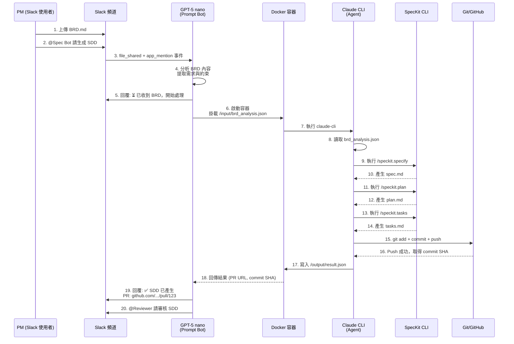

# Spec Bot 正確架構說明

**版本**: 2.0.0
**最後更新**: 2025-11-13
**狀態**: ✅ 已澄清 - 取代舊有 Python Bot 架構

---

## 架構概述

Spec Bot 採用 **三層協作架構**，結合 GPT-5 nano 的決策能力與 Claude CLI 的文件生成能力：

```
Slack 頻道 → GPT-5 nano (Prompt Bot) → Docker 容器 (Claude CLI + SpecKit) → GitHub
```

### 核心理念

1. **GPT-5 nano** 負責理解業務需求、協調決策、生成 Prompt
2. **Claude CLI** 作為 Agent 執行實際的 SpecKit 指令與文件操作
3. **GitHub SpecKit** 提供結構化的 SDD 生成框架
4. **Docker** 提供隔離的執行環境，確保安全性與可複製性

---

## 系統元件定義

### 1. GPT-5 nano (三重角色)

GPT-5 nano 在系統中扮演三個關鍵角色：

#### 1.1 Slack Bot (使用者介面層)
- **職責**: 監聽 Slack 事件（`file_shared`, `app_mention`）
- **輸入**: 使用者上傳的 BRD 檔案 + @Spec Bot 指令
- **輸出**: 即時狀態通知（⏳ 處理中、✅ 完成、❌ 錯誤）

#### 1.2 Prompt Generator (分析層)
- **職責**: 分析 BRD 內容，提取關鍵需求與上下文
- **能力**:
  - 識別功能需求 (Functional Requirements)
  - 提取非功能需求 (Non-Functional Requirements)
  - 辨識技術約束條件
  - 產生結構化的需求摘要

#### 1.3 Decision Coordinator (協調層)
- **職責**: 決定執行哪些 SpecKit 指令、傳遞哪些參數
- **決策邏輯**:
  ```
  if BRD 上傳 && @Spec Bot mention:
      → 執行 /speckit.specify (產生 spec.md)
      → 執行 /speckit.plan (產生 plan.md)
      → 執行 /speckit.tasks (產生 tasks.md)
      → 通知 Reviewer 審核
  ```

### 2. Docker 容器 (執行環境)

#### 2.1 容器結構
```dockerfile
FROM node:18-slim

# 安裝系統依賴
RUN apt-get update && apt-get install -y \
    git \
    python3.11 \
    python3-pip \
    curl

# 安裝 uv (Python 套件管理工具)
RUN curl -LsSf https://astral.sh/uv/install.sh | sh

# 安裝 Claude CLI
RUN npm install -g @anthropic-ai/claude-code

# 安裝 GitHub SpecKit
RUN uv tool install specify-cli --from git+https://github.com/github/spec-kit.git

# 建立非 root 使用者
RUN useradd -m -u 1000 specbot
USER specbot
WORKDIR /workspace

CMD ["bash"]
```

#### 2.2 容器內工具

| 工具 | 版本 | 用途 |
|------|------|------|
| **Claude CLI** | latest | Agent 執行 SpecKit 指令、修改文件 |
| **SpecKit CLI** | latest | `/speckit.specify`, `/speckit.plan`, `/speckit.tasks` 指令 |
| **Git** | 2.30+ | 版本控制、commit、push 操作 |
| **Node.js** | 18+ | Claude CLI 執行環境 |
| **Python** | 3.11+ | SpecKit 依賴 |
| **uv** | latest | Python 工具安裝器 |

### 3. Claude CLI (Agent 執行層)

#### 3.1 Agent 特性
- **自主性**: 可根據 GPT-5 nano 的 Prompt 自主決定執行步驟
- **文件修改權限**: 完全控制 `/workspace` 目錄下的所有文件
- **指令執行能力**: 執行 `/speckit.*` 指令、git 指令、檔案操作

#### 3.2 Claude CLI 工作流程
```bash
# 1. 接收 GPT-5 nano 的輸入
cat /input/brd_analysis.json

# 2. 執行 SpecKit 指令
/speckit.specify --input /input/brd_analysis.json

# 3. 產生 spec.md
# (Claude CLI 自動撰寫文件)

# 4. 執行後續指令
/speckit.plan
/speckit.tasks

# 5. Git 操作
git add specs/001-spec-bot-sdd-integration/*
git commit -m "feat: 新增 Spec Bot SDD 文件"
git push origin bot/spec-$(date +%s)

# 6. 輸出結果
cat /output/result.json
```

### 4. GitHub SpecKit (框架層)

#### 4.1 SpecKit 指令集

| 指令 | 輸入 | 輸出 | 說明 |
|------|------|------|------|
| `/speckit.specify` | BRD 分析結果 | `spec.md` | 產生功能規格書 |
| `/speckit.clarify` | `spec.md` | 澄清問題清單 | 識別模糊需求 |
| `/speckit.plan` | `spec.md` | `plan.md` | 產生實作計畫 |
| `/speckit.tasks` | `plan.md` | `tasks.md` | 產生任務清單 |

#### 4.2 SpecKit 安裝方式
```bash
# 使用 uv 從 GitHub 安裝
uv tool install specify-cli --from git+https://github.com/github/spec-kit.git

# 驗證安裝
specify --version
```

---

## 資料流程設計

### 端到端流程圖



### 關鍵介面定義

#### Interface 1: GPT-5 nano → Docker (輸入)

**檔案**: `/input/brd_analysis.json`

```json
{
  "correlation_id": "req-abc-123-xyz",
  "timestamp": "2025-11-13T10:30:00Z",
  "brd_content": "... 完整 BRD Markdown 內容 ...",
  "extracted_requirements": {
    "functional": [
      "PM 可透過 Slack 上傳 BRD 觸發自動化流程",
      "系統自動產生 spec.md, plan.md, tasks.md"
    ],
    "non_functional": [
      "處理時間 < 5 分鐘",
      "測試覆蓋率 ≥ 80%"
    ],
    "constraints": [
      "使用 Docker 隔離執行環境",
      "所有操作需結構化日誌記錄"
    ]
  },
  "suggested_commands": [
    "/speckit.specify",
    "/speckit.plan",
    "/speckit.tasks"
  ],
  "context": {
    "slack_channel": "C01ABC123",
    "slack_user": "U01XYZ789",
    "github_repo": "your-org/spec-bot"
  }
}
```

#### Interface 2: Docker → GPT-5 nano (輸出)

**檔案**: `/output/result.json`

```json
{
  "correlation_id": "req-abc-123-xyz",
  "status": "success",
  "execution_time_seconds": 142,
  "outputs": {
    "spec_md": {
      "path": "specs/001-spec-bot-sdd-integration/spec.md",
      "size_bytes": 15234,
      "checksum": "sha256:abc123..."
    },
    "plan_md": {
      "path": "specs/001-spec-bot-sdd-integration/plan.md",
      "size_bytes": 28901,
      "checksum": "sha256:def456..."
    },
    "tasks_md": {
      "path": "specs/001-spec-bot-sdd-integration/tasks.md",
      "size_bytes": 12456,
      "checksum": "sha256:ghi789..."
    }
  },
  "git_operations": {
    "branch": "bot/spec-1731491400",
    "commit_sha": "a1b2c3d4e5f6",
    "commit_message": "feat: 新增 Spec Bot SDD 文件\n\n由 GPT-5 nano 協調，Claude CLI 產生",
    "push_status": "success",
    "pr_url": "https://github.com/your-org/spec-bot/pull/123"
  },
  "logs": [
    {"level": "INFO", "message": "開始執行 /speckit.specify", "timestamp": "2025-11-13T10:30:05Z"},
    {"level": "INFO", "message": "spec.md 產生完成", "timestamp": "2025-11-13T10:31:20Z"},
    {"level": "INFO", "message": "開始執行 /speckit.plan", "timestamp": "2025-11-13T10:31:21Z"}
  ]
}
```

---

## 技術堆疊對照表

### 舊架構 (錯誤 ❌)

| 層級 | 技術選型 | 說明 |
|------|----------|------|
| Slack Bot | `slack-bolt` (Python) | Python Bolt 框架 |
| GitHub API | `PyGithub` | Python GitHub 客戶端 |
| GPT API | `openai` (Python SDK) | GPT-5 nano API（用於 BRD 分析） |
| 執行環境 | Python 3.11 + pip | Python 虛擬環境 |

### 新架構 (正確 ✅)

| 層級 | 技術選型 | 說明 |
|------|----------|------|
| Slack Bot | **GPT-5 nano API** | 直接作為 Prompt Bot |
| Agent 執行 | **Claude CLI** | Agent 執行 SpecKit 指令 |
| SDD 框架 | **GitHub SpecKit CLI** | `/speckit.*` 指令集 |
| 執行環境 | **Node.js 18 + Docker** | Claude CLI 執行環境 |
| 版本控制 | **Git CLI** | Claude CLI 直接執行 git 指令 |

---

## 安全與隔離設計

### Docker 容器限制

```yaml
# docker-compose.yml 範例
services:
  spec-bot-worker:
    image: spec-bot-sandbox:latest
    container_name: spec-bot-worker-${CORRELATION_ID}

    # 資源限制
    deploy:
      resources:
        limits:
          cpus: '2.0'
          memory: 4G

    # 網路限制 (僅允許 GitHub API)
    networks:
      - spec-bot-net

    # 檔案系統隔離
    volumes:
      - ./input:/input:ro              # 唯讀輸入
      - ./output:/output:rw             # 可寫輸出
      - ./workspace:/workspace:rw       # 工作區

    # 環境變數注入
    environment:
      - GITHUB_TOKEN=${GITHUB_TOKEN}   # 由外部注入
      - ANTHROPIC_API_KEY=${ANTHROPIC_API_KEY}
      - CORRELATION_ID=${CORRELATION_ID}

    # 生命週期管理
    restart: "no"
    stop_grace_period: 30s
```

### 權限最小化原則

1. **容器內使用者**: 非 root (UID 1000)
2. **檔案系統權限**:
   - `/input`: 唯讀
   - `/output`: 僅寫入
   - `/workspace`: 讀寫（Git 操作需要）
3. **網路存取**: 僅白名單 (GitHub API, Anthropic API)
4. **Secrets 管理**: 透過環境變數注入，日誌中使用 `[REDACTED]` 遮罩

---

## Claude CLI 指令執行範例

### 情境：執行完整 BRD → SDD 流程

```bash
#!/bin/bash
# 此腳本在 Docker 容器內執行，由 Claude CLI 自主決定步驟

set -e  # 遇到錯誤立即停止

CORRELATION_ID=$(cat /input/brd_analysis.json | jq -r '.correlation_id')
echo "[INFO] 開始處理請求: $CORRELATION_ID"

# 1. 切換到工作區
cd /workspace

# 2. 初始化 Git (如尚未初始化)
if [ ! -d .git ]; then
    git clone https://github.com/your-org/spec-bot.git .
fi

# 3. 建立新分支
BRANCH_NAME="bot/spec-$(date +%s)"
git checkout -b "$BRANCH_NAME"

# 4. 執行 SpecKit 指令
echo "[INFO] 執行 /speckit.specify"
/speckit.specify --input /input/brd_analysis.json --output specs/001-spec-bot-sdd-integration/spec.md

echo "[INFO] 執行 /speckit.plan"
/speckit.plan --input specs/001-spec-bot-sdd-integration/spec.md --output specs/001-spec-bot-sdd-integration/plan.md

echo "[INFO] 執行 /speckit.tasks"
/speckit.tasks --input specs/001-spec-bot-sdd-integration/plan.md --output specs/001-spec-bot-sdd-integration/tasks.md --mode tdd --no-parallel

# 5. Git 操作
git add specs/001-spec-bot-sdd-integration/
git commit -m "feat: 新增 Spec Bot SDD 文件

由 GPT-5 nano 協調，Claude CLI 產生
Correlation ID: $CORRELATION_ID"

git push origin "$BRANCH_NAME"

# 6. 建立 Pull Request (使用 gh CLI)
PR_URL=$(gh pr create \
    --title "feat: 新增 Spec Bot SDD 文件" \
    --body "由 GPT-5 nano 自動產生，請審核。Correlation ID: $CORRELATION_ID" \
    --base main \
    --head "$BRANCH_NAME" | grep -oP 'https://.*')

# 7. 輸出結果
cat > /output/result.json <<EOF
{
  "correlation_id": "$CORRELATION_ID",
  "status": "success",
  "git_operations": {
    "branch": "$BRANCH_NAME",
    "commit_sha": "$(git rev-parse HEAD)",
    "pr_url": "$PR_URL"
  }
}
EOF

echo "[INFO] 處理完成: $CORRELATION_ID"
```

---

## 常見問題 (FAQ)

### Q1: 為何不直接使用 Python Slack Bot 呼叫 GPT API？
**A1**: 因為需要 Claude CLI 的 Agent 能力來執行複雜的 SpecKit 指令與文件修改操作。GPT-5 nano 負責決策，Claude CLI 負責執行。

### Q2: GPT-5 nano 如何與 Claude CLI 通訊？
**A2**: 透過 Docker 容器的檔案系統：
- **輸入**: `/input/brd_analysis.json` (GPT-5 nano 寫入)
- **輸出**: `/output/result.json` (Claude CLI 寫入)

### Q3: SpecKit 是什麼？從哪裡安裝？
**A3**: SpecKit 是 GitHub 開發的 SDD 生成框架，安裝方式：
```bash
uv tool install specify-cli --from git+https://github.com/github/spec-kit.git
```

### Q4: 為何需要 Docker 容器？
**A4**:
1. **安全隔離**: 防止 Claude CLI 存取宿主機敏感資料
2. **環境一致性**: 確保所有執行環境相同
3. **資源限制**: CPU/Memory 限制，防止資源耗盡
4. **生命週期管理**: 任務完成後自動銷毀容器

### Q5: Claude CLI 能修改哪些文件？
**A5**: Claude CLI 在容器內擁有 `/workspace` 目錄的完整控制權，可以：
- 建立/修改/刪除文件
- 執行 git 指令（add, commit, push）
- 執行 SpecKit 指令
- 但無法存取容器外的檔案系統

---

## 後續行動項目

### 立即行動 (P0)
- [ ] 更新 `spec.md` 移除所有 Python Bot 參考
- [ ] 完全重寫 `plan.md` 技術堆疊章節
- [ ] 重寫 `tasks.md` 改為 Docker + Claude CLI 實作任務

### 短期行動 (P1)
- [ ] 建立 Dockerfile 測試 Claude CLI + SpecKit 安裝
- [ ] 實作 `brd_analysis.json` 格式驗證
- [ ] 撰寫 Docker 容器生命週期管理腳本

### 長期行動 (P2)
- [ ] 監控與日誌整合 (Correlation ID 追蹤)
- [ ] 錯誤處理與重試機制
- [ ] 效能優化 (容器預熱、快取)

---

## 版本歷史

| 版本 | 日期 | 變更說明 |
|------|------|----------|
| 2.0.0 | 2025-11-13 | 📝 建立新架構文件，澄清 GPT-5 nano + Claude CLI + SpecKit 架構 |
| 1.0.0 | 2025-11-12 | ❌ 舊架構 (Python Bot)，已廢棄 |

---

**文件狀態**: ✅ 已完成
**下一步**: 更新 spec.md, plan.md, tasks.md 以反映此架構
**負責人**: [填寫技術負責人]
**審核者**: [填寫審核者]
