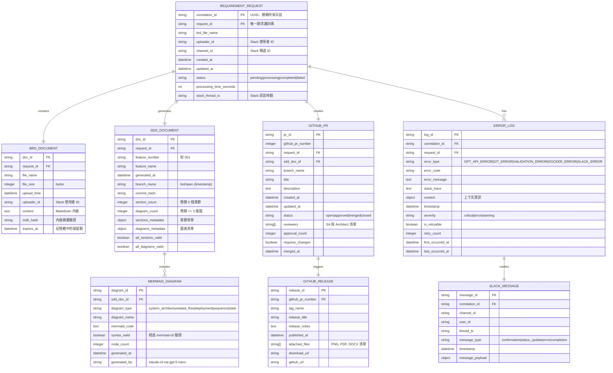
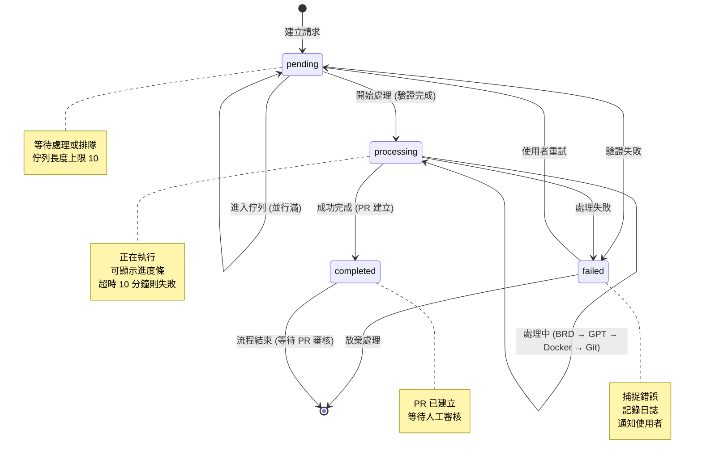
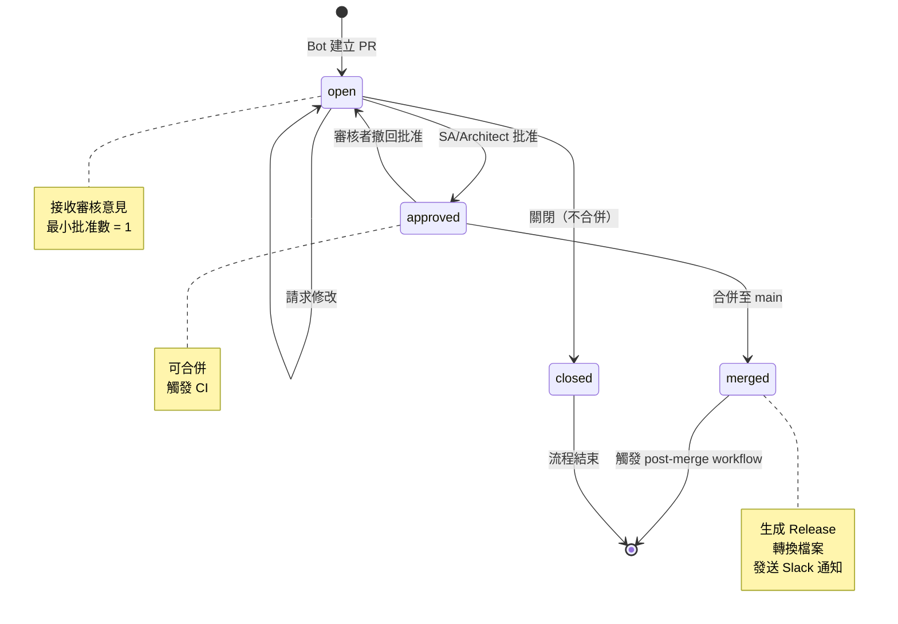
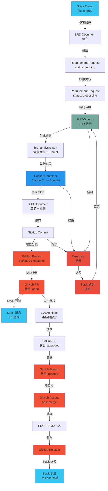

# 資料模型設計：Spec Bot

## 概述

Spec Bot 的資料模型設計遵循以下核心原則：

1. **無狀態設計**：所有持久化狀態儲存於 GitHub（commit history、PR 狀態、release 版本），系統本身無狀態
2. **結構化日誌**：所有事件與錯誤均以 JSON 格式記錄，便於追蹤與分析
3. **Correlation ID 追蹤機制**：每個需求請求分配唯一 ID，用於跨系統日誌關聯與除錯

## 實體關係圖



## 實體定義

### 1. BRD 文件 (BRD Document)

**用途**：儲存上傳的 BRD 檔案資訊及其內容

**屬性表**：

| 欄位名稱 | 型別 | 必填 | 說明 | 驗證規則 |
|---------|------|------|------|---------|
| doc_id | string | Y | 文件唯一識別碼 | UUID v4 格式 |
| request_id | string | Y | 所屬需求請求 ID | 外鍵，關聯 Requirement Request |
| file_name | string | Y | 檔案名稱 | 必須為 .md 副檔名，長度 1-255 字元 |
| file_size | integer | Y | 檔案大小（bytes） | 範圍 1-102400，不超過 100 KB |
| upload_time | datetime | Y | 上傳時間 | ISO 8601 格式 (UTC)，精確到秒 |
| uploader_id | string | Y | 上傳者 Slack 使用者 ID | 格式 U[A-Z0-9]{10}，必須在 Slack workspace 中有效 |
| content | string | Y | BRD 檔案內容 | Markdown 格式，必須包含指定章節 |
| md5_hash | string | Y | 內容 MD5 雜湊值 | 用於重複檢測與內容驗證 |
| expires_at | datetime | Y | 記憶體保留期限 | 建立時間 + 1 小時，之後內容可清除 |

**關聯**：
- 屬於一個「需求請求」(Requirement Request)
- 必須在建立對應的 Requirement Request 之後建立

**生命週期**：
- 建立：Slack 檔案上傳事件觸發（file_shared 事件）
- 驗證：檔案大小與格式驗證
- 使用：提交給 GPT API 進行 SDD 生成
- 銷毀：PR 合併後，內存中的內容於 expires_at 時間刪除；檔案副本保留於 Git history

**範例資料**：

```json
{
  "doc_id": "550e8400-e29b-41d4-a716-446655440000",
  "request_id": "req-20251113-143022",
  "file_name": "新功能_BRD.md",
  "file_size": 8192,
  "upload_time": "2025-11-13T14:30:22Z",
  "uploader_id": "U12345678AB",
  "content": "# 新功能 BRD\n\n## 需求概述\n...",
  "md5_hash": "5d41402abc4b2a76b9719d911017c592",
  "expires_at": "2025-11-13T15:30:22Z"
}
```

---

### 2. 需求請求 (Requirement Request)

**用途**：代表一個端對端的需求處理流程，從 BRD 上傳到 SDD 生成再到 PR 審核的完整生命週期

**屬性表**：

| 欄位名稱 | 型別 | 必填 | 說明 | 驗證規則 |
|---------|------|------|------|---------|
| request_id | string | Y | 需求請求唯一識別碼 | 格式 "req-{YYYYMMDD}-{HHmmss}"，必須唯一 |
| correlation_id | string | Y | 關聯追蹤 ID | UUID v4，用於跨系統日誌追蹤 |
| brd_file_name | string | Y | BRD 檔案名稱 | 參考欄位，便於查詢 |
| uploader_id | string | Y | 上傳者 Slack 使用者 ID | 格式 U[A-Z0-9]{10} |
| channel_id | string | Y | Slack 頻道 ID | 格式 C[A-Z0-9]{10} 或 G[A-Z0-9]{10}（群組） |
| created_at | datetime | Y | 請求建立時間 | ISO 8601 格式 (UTC) |
| updated_at | datetime | Y | 最後更新時間 | ISO 8601 格式 (UTC)，每次狀態變更時更新 |
| status | string | Y | 處理狀態 | 列舉值：pending, processing, completed, failed |
| processing_time_seconds | integer | N | 處理耗時（秒） | 僅在 status=completed/failed 時填入 |
| slack_thread_ts | string | Y | Slack 訊息執行緒時戳 | 用於回覆訊息，格式 "1234567890.123456" |
| queue_position | integer | N | 佇列位置 | 僅在 status=pending 且超過並行上限時填入 |
| estimated_wait_seconds | integer | N | 預估等待秒數 | 用於通知使用者 |

**狀態轉換流程**：

```
pending → processing → completed
         ├→ completed （成功）
         └→ failed （失敗，含重試）
```

**關聯**：
- 包含一個 BRD Document
- 生成一個 SDD Document（若成功）
- 建立一個 GitHub PR（若成功）
- 擁有零個或多個 Error Log（發生錯誤時）

**生命週期**：
- 建立：使用者在 Slack 上傳 BRD 並 mention Bot
- 處理：系統依序執行 BRD 驗證 → GPT 生成 → Docker 執行 → GitHub 提交
- 完成：PR 建立且通知使用者
- 失敗：捕捉錯誤，記錄日誌，通知使用者，支持重試

**範例資料**：

```json
{
  "request_id": "req-20251113-143022",
  "correlation_id": "550e8400-e29b-41d4-a716-446655440001",
  "brd_file_name": "新功能_BRD.md",
  "uploader_id": "U12345678AB",
  "channel_id": "C12345678AB",
  "created_at": "2025-11-13T14:30:22Z",
  "updated_at": "2025-11-13T14:33:42Z",
  "status": "completed",
  "processing_time_seconds": 200,
  "slack_thread_ts": "1731502222.000100",
  "queue_position": null,
  "estimated_wait_seconds": null
}
```

---

### 3. SDD 文件 (SDD Document)

**用途**：儲存自動生成的 System Design Document 的元資訊及結構驗證

**屬性表**：

| 欄位名稱 | 型別 | 必填 | 說明 | 驗證規則 |
|---------|------|------|------|---------|
| doc_id | string | Y | SDD 文件唯一識別碼 | UUID v4 格式 |
| request_id | string | Y | 所屬需求請求 ID | 外鍵，關聯 Requirement Request |
| feature_number | string | Y | 功能編號 | 格式 "001", "002" 等，與目錄結構對應 |
| feature_name | string | Y | 功能名稱 | 從 BRD 中提取，長度 1-255 字元 |
| generated_at | datetime | Y | SDD 生成時間 | ISO 8601 格式 (UTC) |
| branch_name | string | Y | GitHub 分支名稱 | 格式 "bot/spec-{timestamp}"，必須唯一 |
| commit_hash | string | Y | 初始 commit SHA | 第一次提交至分支的 commit hash，40 字元 |
| section_count | integer | Y | 章節數量 | 預期值 5（強制章節數） |
| diagram_count | integer | Y | 圖表數量 | 預期值 >= 3（系統架構、資料流、部署架構） |
| sections_metadata | object | Y | 章節元資訊 | JSON 陣列，包含每個章節的檔案路徑與驗證狀態 |
| diagrams_metadata | object | Y | 圖表元資訊 | JSON 陣列，包含每個圖表的檔案路徑、類型與語法驗證結果 |
| all_sections_valid | boolean | Y | 所有章節是否有效 | 檔案存在且非空 |
| all_diagrams_valid | boolean | Y | 所有圖表語法是否有效 | 經過 mermaid-cli 驗證 |

**強制章節清單**：

| 序號 | 章節名稱 | 檔案名稱 | 必填 |
|-----|---------|---------|------|
| 1 | 系統概述 | 01_系統概述.md | Y |
| 2 | 架構設計 | 02_架構設計.md | Y |
| 3 | 資料模型 | 03_資料模型.md | Y |
| 4 | API 規格 | 04_API規格.md | Y |
| 5 | 部署方案 | 05_部署方案.md | Y |

**強制圖表清單**：

| 圖表類型 | 推薦格式 | 最少數量 | 說明 |
|---------|---------|---------|------|
| 系統架構圖 | graph TD / graph LR / C4 Diagram | 1 | 顯示系統元件與互動 |
| 資料流程圖 | flowchart / sequenceDiagram | 1 | 顯示資料在系統中的流動 |
| 部署架構圖 | graph / C4 Diagram | 1 | 顯示部署環境與基礎設施 |

**關聯**：
- 由一個 BRD Document 生成
- 儲存於 GitHub 的新分支與 PR 中
- 包含一個或多個 Mermaid Diagram

**範例資料**：

```json
{
  "doc_id": "550e8400-e29b-41d4-a716-446655440002",
  "request_id": "req-20251113-143022",
  "feature_number": "001",
  "feature_name": "Spec Bot SDD 整合",
  "generated_at": "2025-11-13T14:32:00Z",
  "branch_name": "bot/spec-20251113-143022",
  "commit_hash": "abc1234567890def1234567890abcdef12345678",
  "section_count": 5,
  "diagram_count": 3,
  "sections_metadata": [
    {
      "section_number": 1,
      "section_name": "系統概述",
      "file_path": "specs/001-spec-bot-sdd-integration/01_系統概述.md",
      "file_size": 4096,
      "is_valid": true
    }
  ],
  "diagrams_metadata": [
    {
      "diagram_id": "diag-001",
      "diagram_type": "system_architecture",
      "diagram_name": "系統架構圖",
      "file_path": "specs/001-spec-bot-sdd-integration/diagrams/01_system_architecture.mermaid",
      "syntax_valid": true,
      "node_count": 8
    }
  ],
  "all_sections_valid": true,
  "all_diagrams_valid": true
}
```

---

### 4. GitHub Pull Request

**用途**：代表 GitHub 上的 PR，用於審核與合併 SDD

**屬性表**：

| 欄位名稱 | 型別 | 必填 | 說明 | 驗證規則 |
|---------|------|------|------|---------|
| pr_id | string | Y | PR 唯一識別碼 | UUID v4 格式 |
| github_pr_number | integer | Y | GitHub PR 編號 | 自動分配，全倉庫唯一 |
| request_id | string | Y | 所屬需求請求 ID | 外鍵，關聯 Requirement Request |
| sdd_doc_id | string | Y | SDD 文件 ID | 外鍵，關聯 SDD Document |
| branch_name | string | Y | 功能分支名稱 | 格式 "bot/spec-{timestamp}" |
| title | string | Y | PR 標題 | 格式 "feat: 新增 {功能名稱} SDD" |
| description | string | Y | PR 描述 | Markdown 格式，包含摘要與檢查清單 |
| created_at | datetime | Y | PR 建立時間 | ISO 8601 格式 (UTC) |
| updated_at | datetime | Y | PR 最後更新時間 | ISO 8601 格式 (UTC) |
| status | string | Y | PR 狀態 | 列舉值：open, approved, merged, closed |
| reviewers | array[string] | Y | 指派審核者清單 | CODEOWNERS 自動指派，可手動修改 |
| approval_count | integer | Y | 批准計數 | 需 >= 1 才能合併（GitHub branch protection rule） |
| requires_changes | boolean | Y | 是否需要修改 | Request Changes 標記 |
| merged_at | datetime | N | 合併時間 | 僅在 status=merged 時填入 |
| merged_by | string | N | 合併者 | GitHub 使用者名稱 |

**關聯**：
- 包含一個 SDD Document
- 對應一個 Requirement Request
- 合併後觸發一個 GitHub Release（若設定了 post-merge workflow）

**生命週期**：
1. **建立**：由 Bot 自動建立，狀態為 open
2. **審核**：SA/Architect 在 GitHub 上留言與審核，可 Request Changes
3. **批准**：至少 1 位 CODEOWNERS 批准，狀態變為 approved
4. **合併**：審核者或管理員點擊 Merge 按鈕
5. **閉合**：合併後或手動關閉

**PR 描述範本**：

```markdown
## BRD 摘要

{自動從 BRD 提取的 50-100 字摘要}

## SDD 章節清單

- [x] 01_系統概述.md
- [x] 02_架構設計.md
- [x] 03_資料模型.md
- [x] 04_API規格.md
- [x] 05_部署方案.md

## 圖表清單

- [x] 系統架構圖 (system_architecture.mermaid)
- [x] 資料流程圖 (data_flow.mermaid)
- [x] 部署架構圖 (deployment.mermaid)

## 審核檢查清單

- [ ] 需求完整性：是否涵蓋所有 BRD 需求
- [ ] 章節品質：所有章節文字清晰、結構完整
- [ ] 圖表品質：所有 Mermaid 圖表語法正確、內容準確
- [ ] 功能需求：FR-001 ~ FR-044 編號完整（如適用）
- [ ] 非功能需求：效能、安全性、可擴展性規格明確
- [ ] API 設計：API 契約格式符合 RESTful 標準（如適用）
- [ ] 技術可行性：架構設計技術可行且符合團隊技術棧

---

Generated by Spec Bot on {生成時間}
Correlation ID: {correlation_id}
```

**範例資料**：

```json
{
  "pr_id": "550e8400-e29b-41d4-a716-446655440003",
  "github_pr_number": 42,
  "request_id": "req-20251113-143022",
  "sdd_doc_id": "550e8400-e29b-41d4-a716-446655440002",
  "branch_name": "bot/spec-20251113-143022",
  "title": "feat: 新增 Spec Bot SDD 整合 SDD",
  "description": "## BRD 摘要\n\nSpec Bot 是一個自動化工具...",
  "created_at": "2025-11-13T14:32:15Z",
  "updated_at": "2025-11-13T15:00:00Z",
  "status": "approved",
  "reviewers": ["@team-sa", "@team-architect"],
  "approval_count": 1,
  "requires_changes": false,
  "merged_at": null,
  "merged_by": null
}
```

---

### 5. 錯誤日誌 (Error Log)

**用途**：詳細記錄系統處理過程中發生的所有錯誤，支援事後追蹤與分析

**屬性表**：

| 欄位名稱 | 型別 | 必填 | 說明 | 驗證規則 |
|---------|------|------|------|---------|
| log_id | string | Y | 日誌唯一識別碼 | UUID v4 格式 |
| correlation_id | string | Y | 關聯追蹤 ID | 與 Requirement Request 的 correlation_id 相同 |
| request_id | string | Y | 所屬需求請求 ID | 外鍵，關聯 Requirement Request |
| error_type | string | Y | 錯誤類型 | 列舉值：GPT_API_ERROR, GIT_ERROR, VALIDATION_ERROR, DOCKER_ERROR, SLACK_ERROR |
| error_code | string | Y | 錯誤代碼 | 系統內部編碼，便於定位（如 GPT_RATE_LIMIT） |
| error_message | string | Y | 錯誤訊息 | 人類可讀的錯誤描述，長度 < 500 字 |
| stack_trace | string | N | 堆疊追蹤 | 完整堆疊追蹤（如適用），用於技術除錯 |
| context | object | Y | 上下文資訊 | JSON 物件，包含 brd_file_name, user_id, file_size 等相關資訊 |
| timestamp | datetime | Y | 錯誤發生時間 | ISO 8601 格式 (UTC)，精確到毫秒 |
| severity | string | Y | 嚴重程度 | 列舉值：critical, error, warning |
| is_retryable | boolean | Y | 是否可重試 | 某些錯誤（如 rate limit）可重試 |
| retry_count | integer | Y | 重試次數 | 默認 0，重試後遞增 |
| first_occurred_at | datetime | Y | 首次發生時間 | 同類錯誤的第一次發生時間 |
| last_occurred_at | datetime | Y | 最後發生時間 | 同類錯誤的最近一次發生時間 |

**錯誤類型定義**：

| 錯誤類型 | 說明 | 範例 | 可重試 |
|---------|------|------|--------|
| GPT_API_ERROR | OpenAI GPT API 呼叫失敗 | 超時、rate limit、無效 API key | Y |
| GIT_ERROR | GitHub 操作失敗 | 分支衝突、權限不足、網路錯誤 | Y |
| VALIDATION_ERROR | 資料驗證失敗 | 檔案格式錯誤、大小超限 | N |
| DOCKER_ERROR | Docker 容器執行失敗 | 容器啟動失敗、逾時、資源不足 | Y |
| SLACK_ERROR | Slack API 呼叫失敗 | 發送訊息失敗、無效 token | Y |

**關聯**：
- 屬於一個 Requirement Request
- 可透過 correlation_id 與其他日誌關聯

**生命週期**：
- 建立：錯誤被捕捉時立即記錄
- 更新：重試時更新 retry_count 與 last_occurred_at
- 查詢：透過 correlation_id 關聯分析

**範例資料**：

```json
{
  "log_id": "550e8400-e29b-41d4-a716-446655440004",
  "correlation_id": "550e8400-e29b-41d4-a716-446655440001",
  "request_id": "req-20251113-143022",
  "error_type": "GPT_API_ERROR",
  "error_code": "GPT_RATE_LIMIT",
  "error_message": "OpenAI API rate limit exceeded. Please retry after 60 seconds.",
  "stack_trace": "File 'gpt_client.py', line 125, in call_gpt_api\n  response = client.chat.completions.create(...)\n  ...",
  "context": {
    "brd_file_name": "新功能_BRD.md",
    "uploader_id": "U12345678AB",
    "file_size": 8192,
    "gpt_model": "gpt-4-turbo",
    "request_tokens": 45000,
    "api_endpoint": "https://api.openai.com/v1/chat/completions"
  },
  "timestamp": "2025-11-13T14:31:30.500Z",
  "severity": "error",
  "is_retryable": true,
  "retry_count": 1,
  "first_occurred_at": "2025-11-13T14:31:30.500Z",
  "last_occurred_at": "2025-11-13T14:31:45.200Z"
}
```

---

### 6. GitHub Release

**用途**：代表合併 PR 後自動生成的版本發布物件，包含轉換後的 PNG、PDF、DOCX 檔案

**屬性表**：

| 欄位名稱 | 型別 | 必填 | 說明 | 驗證規則 |
|---------|------|------|------|---------|
| release_id | string | Y | Release 唯一識別碼 | UUID v4 格式 |
| github_pr_number | integer | Y | 對應的 PR 編號 | 外鍵，關聯 GitHub PR |
| tag_name | string | Y | Git Tag 名稱 | 格式 "sdd-v{YYYYMMDD}-{HHmmss}" |
| release_title | string | Y | Release 標題 | 格式 "SDD Release - {功能名稱} - {日期}" |
| release_notes | string | Y | Release 說明 | Markdown 格式，自動摘要 SDD 主要內容 |
| published_at | datetime | Y | 發布時間 | ISO 8601 格式 (UTC) |
| attached_files | array[object] | Y | 附件清單 | 包含 PNG、PDF、DOCX 檔案元資訊 |
| download_url | string | Y | Release 下載頁面 URL | GitHub Release 頁面 URL |
| github_url | string | Y | GitHub Release API URL | GitHub REST API 端點 |

**附件檔案格式**：

```json
{
  "file_name": "spec-bot-sdd-integration-20251113.pdf",
  "file_type": "application/pdf",
  "file_size": 2097152,
  "download_url": "https://github.com/...",
  "uploaded_at": "2025-11-13T14:35:00Z"
}
```

**附件包含內容**：

| 檔案類型 | 數量 | 說明 |
|---------|------|------|
| PNG 圖表 | >= 3 | 由 Mermaid 圖表轉換而來 |
| PDF 文檔 | >= 5 | 由 Markdown 章節轉換而來 |
| DOCX 文檔 | >= 5 | 由 Markdown 章節轉換而來 |
| 壓縮包 | 1 | 所有附件的 ZIP 壓縮檔 |

**關聯**：
- 由一個合併的 GitHub PR 觸發
- 包含來自對應 SDD Document 的所有檔案轉換結果

**生命週期**：
1. **觸發**：GitHub Actions 偵測到 PR merge 事件
2. **建立**：GitHub Actions 建立 git tag 與 release
3. **轉換**：執行 mermaid-cli、pandoc 等轉換工具
4. **上傳**：將轉換結果上傳至 GitHub Release
5. **通知**：向 Slack 發送完成通知

**範例資料**：

```json
{
  "release_id": "550e8400-e29b-41d4-a716-446655440005",
  "github_pr_number": 42,
  "tag_name": "sdd-v20251113-143035",
  "release_title": "SDD Release - Spec Bot SDD 整合 - 2025-11-13",
  "release_notes": "## SDD Release Notes\n\n### 功能名稱\nSpec Bot SDD 整合\n\n### 主要內容\n...",
  "published_at": "2025-11-13T14:35:00Z",
  "attached_files": [
    {
      "file_name": "01_system_architecture.png",
      "file_type": "image/png",
      "file_size": 65536,
      "download_url": "https://github.com/.../releases/download/sdd-v20251113-143035/01_system_architecture.png",
      "uploaded_at": "2025-11-13T14:35:00Z"
    },
    {
      "file_name": "01_系統概述.pdf",
      "file_type": "application/pdf",
      "file_size": 512000,
      "download_url": "https://github.com/.../releases/download/sdd-v20251113-143035/01_系統概述.pdf",
      "uploaded_at": "2025-11-13T14:35:00Z"
    }
  ],
  "download_url": "https://github.com/repo/releases/tag/sdd-v20251113-143035",
  "github_url": "https://api.github.com/repos/repo/releases/{release_id}"
}
```

---

## 狀態機

### 需求請求狀態轉換



### GitHub PR 狀態轉換



---

## 資料流向

### 總體資料流



### 完整時序圖

```mermaid
sequenceDiagram
    participant PM as 產品經理
    participant Slack as Slack<br/>Event API
    participant Bot as Spec Bot<br/>背景服務
    participant GPT as GPT-5 nano<br/>API
    participant Docker as Docker<br/>容器
    participant Claude as Claude CLI<br/>+ SpecKit
    participant GitHub as GitHub<br/>API
    participant SlackNotify as Slack<br/>通知

    PM->>Slack: 1. 上傳 BRD 檔案
    Slack->>Bot: 2. file_shared 事件

    Bot->>Bot: 3. 驗證 BRD（格式、大小）
    Bot->>Slack: 4. 回應確認訊息 (⏳ 處理中)

    Bot->>GPT: 5. 呼叫 GPT-5 nano<br/>分析 BRD
    GPT->>Bot: 6. 返回 brd_analysis.json<br/>(需求摘要 + Prompt)

    Bot->>Docker: 7. 啟動容器並掛載<br/>brd_analysis.json
    Docker->>Claude: 8. 執行 Claude CLI<br/>+ SpecKit 指令
    Claude->>Claude: 9. 生成 SDD 檔案結構<br/>(spec, plan, tasks)
    Claude->>Docker: 10. 返回 SDD 產出
    Docker->>Bot: 11. 返回結果

    Bot->>GitHub: 12. 建立分支<br/>bot/spec-timestamp
    Bot->>GitHub: 13. 提交檔案與 commit
    Bot->>GitHub: 14. 建立 PR

    GitHub->>Bot: 15. PR 建立成功
    Bot->>Slack: 16. 回應 PR 連結
    Bot->>SlackNotify: 17. 通知 SA/Architect

    SlackNotify->>PM: 18. GitHub PR 通知

    PM->>GitHub: 19. 等待審核...

    note over PM,SlackNotify
        ↓ 待審核者動作（獨立於 Bot）
    end note
```

---

## 驗證規則

### 1. BRD 檔案驗證

#### 1.1 檔案格式驗證

```javascript
// 檔案副檔名驗證
const isValidFormat = (fileName) => /\.md$/.test(fileName);
// ✓ 有效: "新功能_BRD.md", "feature_001.md"
// ✗ 無效: "新功能_BRD.txt", "BRD.docx", "BRD"
```

#### 1.2 檔案大小驗證

```javascript
// 檔案大小驗證（不超過 100 KB）
const MAX_FILE_SIZE = 102400; // 100 KB in bytes
const isValidSize = (fileSizeBytes) => fileSizeBytes > 0 && fileSizeBytes <= MAX_FILE_SIZE;
// ✓ 有效: 8192 (8 KB), 51200 (50 KB)
// ✗ 無效: 0, 102401 (100.1 KB)

// 錯誤訊息示例
if (!isValidSize(fileSize)) {
  return "❌ 檔案過大（上限 100 KB），請精簡 BRD 內容或移除不必要的章節";
}
```

#### 1.3 必填章節驗證

```javascript
// BRD 必填章節驗證
const REQUIRED_SECTIONS = [
  "需求概述",
  "功能需求",
  "非功能需求",
  "使用者場景"
];

const validateBRDSections = (content) => {
  const missingSection = REQUIRED_SECTIONS.find(
    section => !content.includes(`## ${section}`) && !content.includes(`# ${section}`)
  );

  if (missingSection) {
    return {
      valid: false,
      error: `❌ BRD 格式錯誤：缺少『${missingSection}』章節。請參考 BRD 模板：{模板連結}`
    };
  }
  return { valid: true };
};
```

### 2. Slack 使用者 ID 驗證

```javascript
// Slack 使用者 ID 格式驗證
const isValidSlackUserId = (userId) => /^U[A-Z0-9]{10}$/.test(userId);
// ✓ 有效: "U12345678AB", "UACDEFG123"
// ✗ 無效: "U1234567", "u12345678ab", "S12345678AB"

// Slack 頻道 ID 格式驗證
const isValidSlackChannelId = (channelId) => /^[CG][A-Z0-9]{10}$/.test(channelId);
// ✓ 有效: "C12345678AB" (公開頻道), "G12345678AB" (私人群組)
// ✗ 無效: "c12345678ab", "U12345678AB"
```

### 3. GitHub 分支名稱驗證

```javascript
// GitHub 分支名稱驗證
const generateBranchName = (timestamp) => {
  // 格式: bot/spec-YYYYMMDD-HHmmss
  // 範例: bot/spec-20251113-143022
  const date = new Date(timestamp);
  const formatted = date.toISOString()
    .replace(/[-T:.Z]/g, '')
    .slice(0, 15); // YYYYMMDDHHMMSS

  return `bot/spec-${formatted.slice(0, 8)}-${formatted.slice(8)}`;
};

const isValidBranchName = (branchName) => /^bot\/spec-\d{8}-\d{6}$/.test(branchName);
// ✓ 有效: "bot/spec-20251113-143022"
// ✗ 無效: "bot/spec-2025-1113-143022", "spec-20251113-143022"
```

### 4. Correlation ID 驗證

```javascript
// UUID v4 格式驗證
const isValidUUID = (uuid) =>
  /^[0-9a-f]{8}-[0-9a-f]{4}-4[0-9a-f]{3}-[89ab][0-9a-f]{3}-[0-9a-f]{12}$/i.test(uuid);

// 範例
const validUUID = "550e8400-e29b-41d4-a716-446655440000";
isValidUUID(validUUID); // true
```

### 5. 錯誤型別驗證

```javascript
// 錯誤型別白名單
const VALID_ERROR_TYPES = [
  "GPT_API_ERROR",
  "GIT_ERROR",
  "VALIDATION_ERROR",
  "DOCKER_ERROR",
  "SLACK_ERROR"
];

const isValidErrorType = (errorType) => VALID_ERROR_TYPES.includes(errorType);

// 錯誤嚴重程度驗證
const VALID_SEVERITY_LEVELS = ["critical", "error", "warning"];
const isValidSeverity = (severity) => VALID_SEVERITY_LEVELS.includes(severity);
```

### 6. API 回應狀態碼驗證

```javascript
// GitHub API 成功回應驗證
const isSuccessfulGitHubResponse = (statusCode) => statusCode >= 200 && statusCode < 300;

// GPT API 回應驗證
const isValidGPTResponse = (response) => {
  return response &&
         response.choices &&
         response.choices.length > 0 &&
         response.choices[0].message &&
         response.choices[0].message.content;
};
```

### 7. Mermaid 圖表語法驗證

```bash
# 使用 mermaid-cli 驗證圖表語法
# 安裝: npm install -g @mermaid-js/mermaid-cli

mermaid-cli validate < diagram.mermaid
# 成功: "✓ Diagram is valid"
# 失敗: "✗ Error: ..."

# 轉換為 PNG
mermaid-cli diagram.mermaid --output diagram.png

# 例子：
# ✓ 有效: graph TD; A[Start] --> B[Process]
# ✗ 無效: graph TD A[Start] --> B[Process] (缺少分號)
```

### 8. 佇列管理驗證

```javascript
// 佇列位置計算
const MAX_CONCURRENT_REQUESTS = 5;
const MAX_QUEUE_LENGTH = 10;

const calculateQueuePosition = (totalRequests) => {
  const processingCount = Math.min(totalRequests, MAX_CONCURRENT_REQUESTS);
  const queueCount = Math.max(0, totalRequests - MAX_CONCURRENT_REQUESTS);

  return {
    isProcessing: totalRequests <= MAX_CONCURRENT_REQUESTS,
    queuePosition: queueCount > 0 ? queueCount : null,
    isQueueFull: queueCount >= MAX_QUEUE_LENGTH,
    estimatedWaitSeconds: queueCount > 0 ? queueCount * 120 : 0 // 假設每個請求 2 分鐘
  };
};

// 範例
calculateQueuePosition(8);
// {
//   isProcessing: false,
//   queuePosition: 3,
//   isQueueFull: false,
//   estimatedWaitSeconds: 360 // 3 * 120
// }
```

---

## 資料完整性檢查清單

在資料寫入持久化儲存前，系統必須驗證以下項目：

### Requirement Request 完整性檢查

```javascript
const validateRequirementRequest = (request) => {
  const required = [
    'request_id',
    'correlation_id',
    'brd_file_name',
    'uploader_id',
    'channel_id',
    'created_at',
    'status',
    'slack_thread_ts'
  ];

  const missing = required.filter(field => !request[field]);
  if (missing.length > 0) {
    throw new Error(`Missing required fields: ${missing.join(', ')}`);
  }

  // 狀態值驗證
  const validStatuses = ['pending', 'processing', 'completed', 'failed'];
  if (!validStatuses.includes(request.status)) {
    throw new Error(`Invalid status: ${request.status}`);
  }

  return true;
};
```

### SDD Document 完整性檢查

```javascript
const validateSDDDocument = (sddDoc) => {
  // 驗證章節數量
  if (!sddDoc.sections_metadata || sddDoc.sections_metadata.length !== 5) {
    throw new Error(`SDD must contain exactly 5 sections, got ${sddDoc.sections_metadata?.length}`);
  }

  // 驗證圖表數量
  if (!sddDoc.diagrams_metadata || sddDoc.diagrams_metadata.length < 3) {
    throw new Error(`SDD must contain at least 3 diagrams, got ${sddDoc.diagrams_metadata?.length}`);
  }

  // 驗證圖表語法
  const invalidDiagrams = sddDoc.diagrams_metadata.filter(d => !d.syntax_valid);
  if (invalidDiagrams.length > 0) {
    throw new Error(`Invalid Mermaid diagrams: ${invalidDiagrams.map(d => d.diagram_name).join(', ')}`);
  }

  return true;
};
```

---

## 資料保留政策

| 資料型別 | 保留期限 | 備註 |
|---------|---------|------|
| BRD Document（內存） | 1 小時 | 處理完成後立即清除；歷史版本保留於 Git |
| Requirement Request | 90 天 | 用於稽核與分析，之後歸檔 |
| SDD Document | 永久 | GitHub 中保留完整歷史 |
| GitHub PR | 永久 | GitHub 中保留完整歷史 |
| Error Log | 30 天 | 用於監控與除錯，之後歸檔至冷儲存 |
| GitHub Release | 永久 | GitHub 中保留 |
| Slack Message | 7 天 | Slack 工作區內保留 |

