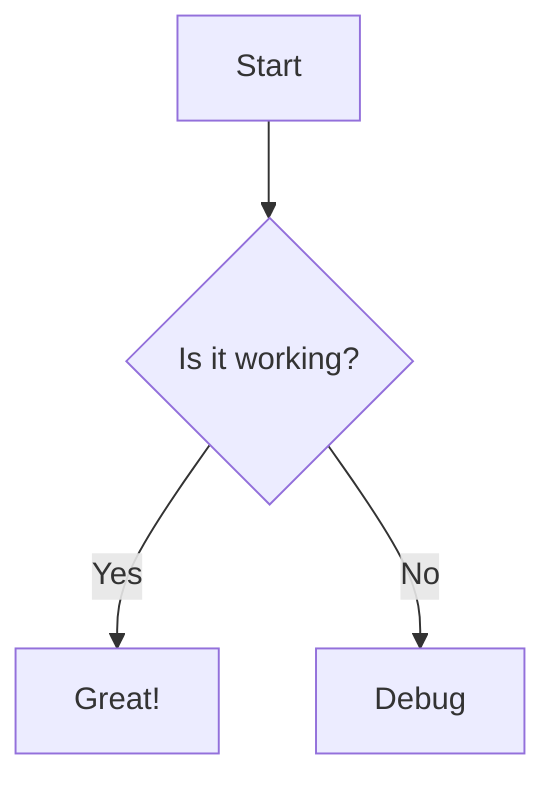
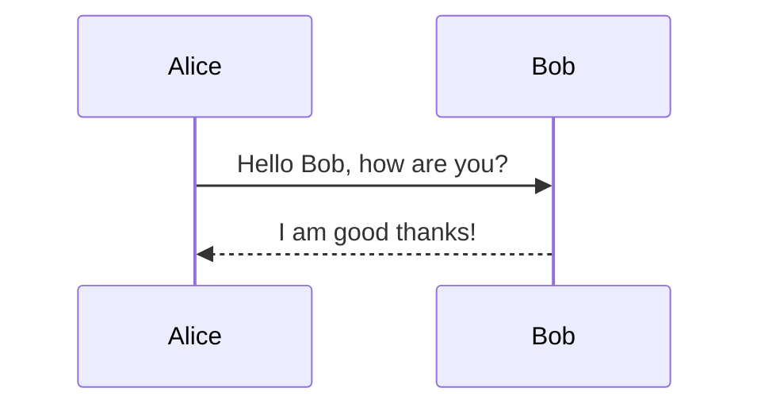

# Test Slide Generation

## Text Duplication Test

### Subheading Test
*   Bullet point 1
*   Bullet point 2 with **bold** text
*   Bullet point 3

## Mermaid Scaling Test

### Flowchart

### Sequence Diagram

